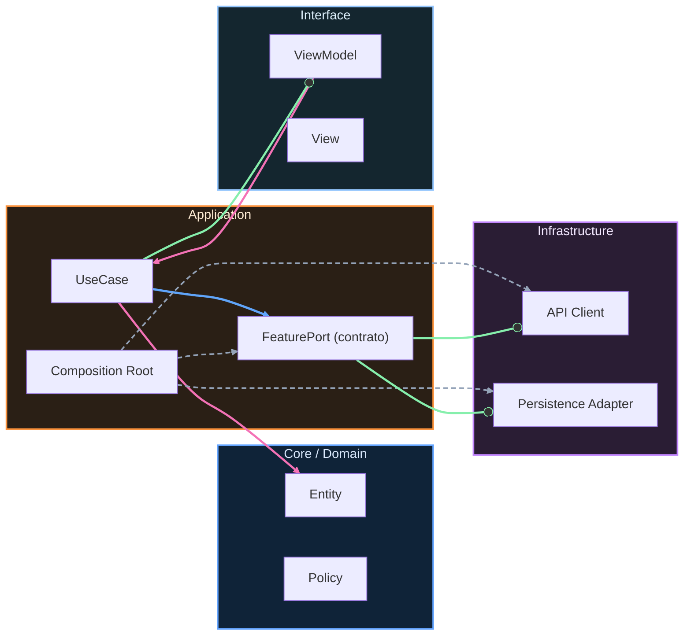

# Entregables de Nivel Midlevel

Este cierre valida la versión v2.0 de RuralGO FieldOps. El objetivo ya no es solo construir pantallas funcionales, sino demostrar que el sistema se mantiene estable cuando aparecen condiciones reales: red intermitente, conflictos de sincronización y necesidad de trazabilidad técnica.

La primera evidencia obligatoria es integración completa de offline-first. El flujo principal de tareas e incidencias debe poder operar sin red, conservar cambios locales y sincronizar cuando vuelve conectividad. No basta con cachear lectura: también se evalúa escritura diferida y reconciliación básica.

La segunda evidencia obligatoria es calidad de integración. Debes entregar pruebas que cubran los flujos críticos entre red, repositorio y persistencia local. El foco aquí es demostrar que el comportamiento de extremo a extremo se mantiene bajo escenarios de éxito y fallo.

La tercera evidencia obligatoria es trazabilidad de operación técnica. Debes incluir señales mínimas de observabilidad para entender por qué una sincronización falló, cuándo se recuperó y cuál fue el estado final del dato.

La cuarta evidencia obligatoria es primer baseline de rendimiento. Debes incluir una medición inicial reproducible y justificar al menos una decisión técnica tomada a partir de esa medición.

La quinta evidencia obligatoria es calidad automatizada en pipeline. Midlevel se considera completo cuando existe una validación automática que impida integrar cambios que rompan flujos críticos sin detección temprana.

```kotlin
package com.stackmyarchitecture.midlevel

data class MidlevelDelivery(
    val offlineSyncReady: Boolean,
    val integrationTestsReady: Boolean,
    val observabilityReady: Boolean,
    val performanceBaselineReady: Boolean,
    val ciQualityGateReady: Boolean
)

class MidlevelGate {
    fun isApproved(delivery: MidlevelDelivery): Boolean {
        return delivery.offlineSyncReady &&
            delivery.integrationTestsReady &&
            delivery.observabilityReady &&
            delivery.performanceBaselineReady &&
            delivery.ciQualityGateReady
    }
}
```

Este criterio evita una salida “a medias”. Si una pieza técnica crítica falta, Midlevel no está realmente cerrado aunque la app parezca funcionar en una demo corta.


<!-- auto-gapfix:layered-mermaid -->
## Diagrama de arquitectura por capas



La lectura del diagrama sigue esta semantica:
1. `-->` dependencia directa en runtime.
2. `-.->` wiring o configuracion.
3. `==>` contrato o abstraccion.
4. `--o` salida o propagacion de resultado.
