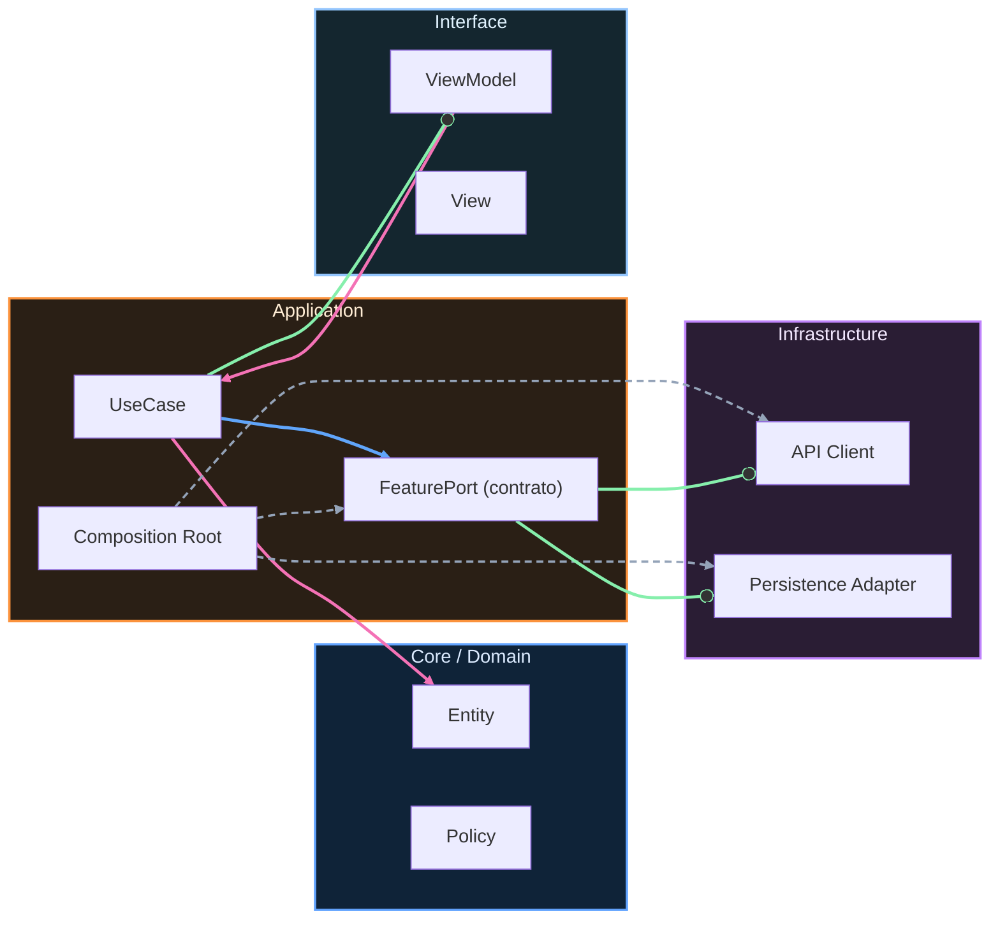

# Nivel Senior · 00 · Introducción: de construir features a operar producto real

> **Estado actual de FieldOps:** v2.0 en progreso — Retrofit/OkHttp + SyncWorker integrados, release buildType con minify/signing placeholder, proguard-rules.pro, módulos benchmark/baselineprofile creados. Pendiente: offline-first completo, observabilidad, CI ejecutado.
>
> **Objetivo de versión:** v3.0 (Senior) — Release strategy, rollback seguro, feature flags, observabilidad con SLOs, gobierno de calidad, adaptador Firebase opcional.
>
> **Comandos de verificación:**
> ```bash
> cd proyecto-android
> ./scripts/quality-gates.sh            # Gates completos (assemble + test + lint + instrumented)
> ./gradlew :benchmark:connectedCheck   # Performance
> ```
>
> **Proyecto:** ver [Brief FieldOps](../05-proyecto-final/00-brief-ruralgo-fieldops.md) · [Rúbrica](../05-proyecto-final/01-rubrica-empleabilidad.md) · [Evidencias obligatorias](../05-proyecto-final/02-evidencias-obligatorias.md)

Hasta aquí ya recorriste un camino que no es menor. Aprendiste a construir con orden, a proteger calidad en CI, a medir rendimiento y a evolucionar arquitectura sin romper todo cada dos semanas. Ese trabajo te dio base técnica sólida. Ahora viene el cambio de mentalidad que separa a quien implementa bien de quien sostiene productos en el tiempo.

En este nivel Senior el foco ya no es solo “que funcione”. El foco pasa a ser “que siga funcionando bajo presión”, con releases frecuentes, con incidentes reales, con deuda viva y con decisiones que impactan a más de un equipo.

Esa diferencia puede sonar abstracta, pero se siente muy concreta el día que una release sube errores en producción y tienes que decidir en minutos si haces rollback, parchado caliente o mitigación gradual. Ahí no te salva saber un API de memoria. Te salva tener criterio operativo.

---

## Qué cambia exactamente en este nivel

En los niveles anteriores el centro estaba en diseño e implementación. Aquí, sin abandonar eso, añadimos una capa crítica: operación y gobernanza técnica a escala. Vas a trabajar cómo se lanza software sin jugar a la ruleta, cómo se detecta una degradación antes de que explote soporte, cómo se prioriza cuando todo parece urgente y cómo se coordina arquitectura entre múltiples frentes sin bloquear el roadmap.

No vamos a perseguir “perfección académica”. Vamos a construir un sistema de decisiones que te permita avanzar con seguridad razonable en contextos reales.

---

## Cómo leer este bloque para sacarle valor de verdad

Si intentas leer este nivel como teoría aislada, se quedará en conceptos bonitos. La forma útil es leer cada lección pensando en tu proyecto vivo: dónde te dolería un rollback hoy, qué ruta crítica no te puedes permitir romper, qué métrica te avisaría tarde y cuál te avisaría a tiempo.

Cada tema está diseñado para responder a esa clase de pregunta práctica. Por eso verás menos “cómo usar X librería” y más “cómo decidir entre A y B cuando ambas parecen razonables, pero una te explota en dos sprints”.

---

## Qué tipo de madurez queremos que desarrolles

Queremos que termines este bloque pudiendo sostener conversaciones técnicas difíciles sin caer en dogmas. Que sepas justificar una decisión con evidencia y no con gustos personales. Que puedas decir “esto lo lanzamos detrás de feature flag por este riesgo” o “esto no sale hoy porque el costo de fallo supera el beneficio del release”.

Ese tipo de claridad es la que vuelve confiable a una persona senior en un equipo.

---

## Qué vas a construir en concreto

Vas a montar un marco operativo completo sobre la base Android que ya tienes: estrategia de releases, gestión de incidentes, rollback seguro, observabilidad orientada a decisión, gobierno de calidad con SLOs prácticos, y evolución modular sin fricción entre equipos.

Todo eso aterrizado en artefactos del proyecto, no en promesas. Lo iremos dejando en módulos, documentación y reglas ejecutables para que no dependa de memoria ni de héroes.

---

## Cierre de la introducción

Este nivel no trata de “hacer más cosas”. Trata de hacer que lo que ya haces se sostenga cuando el contexto se vuelve complejo. Si en Junior y Midlevel aprendiste a construir bien, en Senior vas a aprender a sostener bien.

Y esa diferencia, en Android real, vale oro.

En la siguiente lección arrancamos por la pieza que más impacto tiene en estabilidad del producto: estrategia de release y rollback seguro, para que cada despliegue deje de ser una apuesta y pase a ser una decisión controlada.
<!-- auto-gapfix:layered-mermaid -->
## Diagrama de arquitectura por capas



La lectura del diagrama sigue esta semantica:
1. `-->` dependencia directa en runtime.
2. `-.->` wiring o configuracion.
3. `==>` contrato o abstraccion.
4. `--o` salida o propagacion de resultado.
