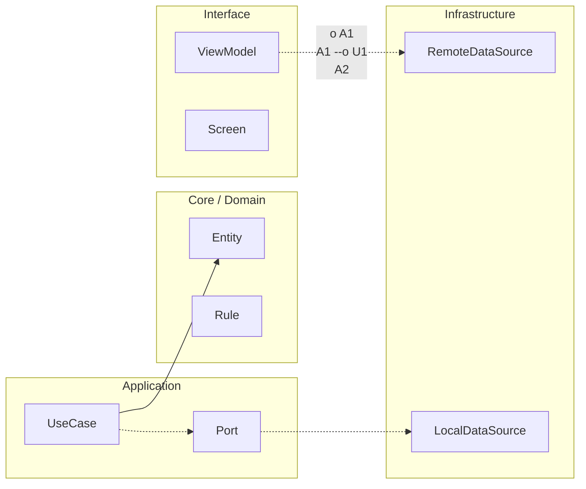

# Nivel Senior · 01 · Release strategy y rollback seguro en Android

Cuando una app empieza a tener usuarios reales, publicar deja de ser un acto técnico y pasa a ser un acto de responsabilidad. Mientras el proyecto está en etapa de aprendizaje, es fácil pensar que “si algo sale mal, lo corregimos y listo”. En producción, ese pensamiento te rompe la confianza del usuario, te genera ruido en soporte y te obliga a trabajar con presión innecesaria.

La idea de esta lección no es que memorices una receta de despliegue. La idea es que entiendas por qué una estrategia de release bien pensada reduce daño, acelera la recuperación cuando hay fallos y, sobre todo, evita convertir cada publicación en una moneda al aire.

## El problema real que resolvemos

Imagina que publicas una versión con una mejora en login y un pequeño ajuste en sincronización. Todo compila, los tests pasan y la review en QA fue razonable. A las dos horas, soporte empieza a recibir mensajes de usuarios con sesiones cerradas y pantallas congeladas al reconectar red. La versión “funcionaba en entorno controlado”, pero no resistió condiciones reales.

Si en ese momento tu único plan es “sacamos hotfix”, te quedas atrapado en una carrera contra el tiempo. En cambio, si diseñaste la release con mitigaciones, puedes frenar el impacto mientras investigas con calma: desactivar comportamiento riesgoso con feature flag, detener rollout, o volver a una versión estable según el tipo de incidente.

La diferencia entre ambos escenarios no es suerte. Es estrategia previa.

## Qué significa una estrategia de release madura

En una estrategia madura, publicar no es solo generar un APK o AAB. Publicar significa tomar una versión, introducirla de forma gradual, observar señales críticas y decidir si aceleras, pausas o reviertes. Esta forma de trabajar trata el release como experimento controlado, no como salto al vacío.

En Android, esta forma de control se apoya en varias piezas que ya conoces por separado y que ahora vamos a conectar como sistema: build reproducible, flags de comportamiento, rollout progresivo en Play Console, observabilidad útil para decisión y plan de rollback ensayado antes de necesitarlo.

## La base técnica del release no puede ser frágil

Si el build no es determinista, todo lo demás falla. Necesitas que la versión que testeaste sea realmente la que publicas. Para eso, la configuración de Gradle no puede depender de estados implícitos o de máquinas locales.

Un `build.gradle.kts` de módulo `app` con variantes claras suele verse así:

```kotlin
android {
    namespace = "com.stackmyarchitecture.fieldops"
    compileSdk = 36

    defaultConfig {
        applicationId = "com.stackmyarchitecture.fieldops"
        minSdk = 26
        targetSdk = 36
        versionCode = 10100
        versionName = "1.1.0"

        testInstrumentationRunner = "com.stackmyarchitecture.fieldops.HiltTestRunner"
    }

    buildTypes {
        getByName("debug") {
            isMinifyEnabled = false
            applicationIdSuffix = ".debug"
            versionNameSuffix = "-debug"
        }

        getByName("release") {
            isMinifyEnabled = true
            isShrinkResources = true
            proguardFiles(
                getDefaultProguardFile("proguard-android-optimize.txt"),
                "proguard-rules.pro"
            )
        }
    }
}
```

Aquí la decisión importante no es “activar minify porque sí”. La decisión importante es que `release` se comporte como release de verdad desde los pipelines de validación, para que no aparezcan sorpresas de ofuscación, recursos eliminados o trazas perdidas justo en el momento más caro.

## El release deja de ser binario cuando introduces feature flags

Hay una confusión muy común al empezar en entornos reales: pensar que publicar versión equivale a activar todo el comportamiento nuevo. Eso te obliga a elegir entre dos extremos: o no publicas nada por miedo, o publicas todo junto sin red de seguridad.

Feature flags rompe esa falsa dicotomía. Puedes enviar código dormido, activar por segmento y apagar rápido si detectas degradación. Esto no sustituye testing; lo complementa con control operativo.

Un contrato simple para flags puede quedar así:

```kotlin
interface FeatureToggleRepository {
    suspend fun isNewSessionFlowEnabled(): Boolean
    suspend fun isOfflineSyncV2Enabled(): Boolean
}
```

La gracia de este diseño es que la pantalla o el caso de uso no sabe de proveedor remoto, de Firebase, de JSON local ni de DataStore. Solo pregunta una intención de negocio. Eso permite probar comportamientos en unit tests y cambiar infraestructura sin tocar dominio.

En una pantalla de login, el uso fluido se ve así:

```kotlin
@HiltViewModel
class LoginViewModel @Inject constructor(
    private val loginUseCase: LoginUseCase,
    private val featureToggleRepository: FeatureToggleRepository
) : ViewModel() {

    private val _uiState = MutableStateFlow(LoginUiState())
    val uiState: StateFlow<LoginUiState> = _uiState.asStateFlow()

    fun submit(email: String, password: String) {
        viewModelScope.launch {
            val useNewFlow = featureToggleRepository.isNewSessionFlowEnabled()

            val result = if (useNewFlow) {
                loginUseCase.executeV2(email, password)
            } else {
                loginUseCase.executeV1(email, password)
            }

            _uiState.value = _uiState.value.copy(result = result)
        }
    }
}
```

Lo relevante aquí es que el `ViewModel` no hace magia. Hace algo muy terrenal: decide ruta de ejecución según bandera y deja trazable qué camino usó. En incidentes, esa trazabilidad te ahorra horas.

## Rollout progresivo: cómo bajar riesgo sin frenar entrega

En Play Console, el rollout escalonado te permite exponer la versión por porcentaje de usuarios. No es una formalidad. Es un mecanismo de amortiguación. Si algo sale mal al 5%, la onda expansiva es mucho menor que al 100%.

La estrategia práctica suele arrancar con un grupo pequeño, validar señales de salud y ampliar en tramos cuando no hay regresión significativa. El criterio no es “esperar una hora y subir porque sí”, sino mirar indicadores concretos de negocio y estabilidad.

Cuando el equipo mira solo crash-free rate y ignora métricas de flujo crítico, cae en una trampa frecuente: no hay crash, pero la gente no completa acciones clave. Por eso release sano no es solo “no rompe”, también es “sigue permitiendo uso normal”.

## Qué mirar durante un release para decidir con criterio

Si quieres decidir bien, necesitas señales que te hablen del producto, no solo del proceso. El proceso te dice si el pipeline pasó; el producto te dice si el usuario está sufriendo.

En esta etapa nos interesa observar, de forma mínima pero útil, estabilidad técnica, rendimiento en rutas críticas y salud funcional de los journeys más sensibles. Login, carga de catálogo, sync local-remoto y checkout (si existe) son buenos candidatos porque concentran valor y riesgo.

Para que esto no dependa del olfato de una sola persona, conviene formalizar una pequeña política de decisión en el repositorio. Un archivo como `docs/release-gates.md` deja explícito qué se considera aceptable antes de ampliar rollout y qué obliga a pausar.

## El rollback no se improvisa

Un error caro en equipos jóvenes es tratar rollback como una maniobra excepcional. Justo por eso suele fallar: se intenta por primera vez bajo presión. Lo correcto es asumir que rollback es parte normal de operación y tenerlo ensayado.

Cuando un incidente aparece, lo primero es clasificar daño. Si el impacto viene de un comportamiento controlable por flag, apagar el flag puede ser la respuesta más rápida y menos disruptiva. Si el daño está en código sin kill-switch o en cambio estructural profundo, probablemente tocará detener rollout y revertir versión.

La elección entre una vía y otra no es ideológica. Depende de tiempo de mitigación y riesgo residual.

## Integración con CI para no depender de memoria humana

La estrategia de release se vuelve confiable cuando la mayor parte del control está automatizado. Si cada publicación depende de que alguien recuerde diez comprobaciones manuales, tarde o temprano algo se escapa.

Un workflow de GitHub Actions para `release-candidate` puede validar build, pruebas, benchmark y reporte consolidado antes de habilitar promoción. Un ejemplo simple:

```yaml
name: release-candidate-quality

on:
  workflow_dispatch:
  push:
    branches:
      - release/*

jobs:
  verify:
    runs-on: ubuntu-latest

    steps:
      - uses: actions/checkout@v4

      - name: Set up JDK 17
        uses: actions/setup-java@v4
        with:
          distribution: temurin
          java-version: 17

      - name: Grant gradle permission
        run: chmod +x gradlew

      - name: Unit tests
        run: ./gradlew test

      - name: Instrumented tests
        run: ./gradlew connectedCheck

      - name: Build release bundle
        run: ./gradlew :app:bundleRelease

      - name: Macrobenchmark verification
        run: ./gradlew :benchmarks:connectedCheck
```

Este flujo no existe para “hacer CI bonito”. Existe para bloquear promociones de una release que todavía no merece salir. Esa pequeña fricción antes de publicar evita fricciones mucho más caras después.

## Una situación realista y cómo la resolveríamos

Supón que versión 1.1.0 salió al 10% y, sin subir crash grave, aparece aumento claro en latencia de primer render tras login junto con caída de sesiones completadas. Aquí no conviene discutir dos horas en abstracto. Lo útil es actuar en orden operativo.

Se pausa expansión del rollout para contener alcance. Se revisan eventos de observabilidad segmentados por versión para confirmar correlación. Si el comportamiento nuevo está detrás de `isNewSessionFlowEnabled`, se desactiva la bandera para ese segmento y se observa recuperación. Si la recuperación aparece, ya no estás a ciegas: tienes hipótesis fuerte y mitigación aplicada. A partir de ahí puedes abrir corrección técnica sin urgencia destructiva.

Eso es exactamente lo que buscamos con estrategia de release: reemplazar pánico por control.

## Cómo se conecta esto con tu arquitectura Android

Todo lo que trabajaste en capas, repositorios, casos de uso y UDF ahora demuestra su valor operativo. Sin contratos claros, apagar o desviar flujo en caliente sería una pesadilla. Sin separación de responsabilidades, un parche de mitigación tocaría media app. Sin pruebas, cualquier rollback lógico sería ruleta.

Cuando alguien dice que la arquitectura “es sobreingeniería”, casi siempre todavía no vivió un incidente serio en producción. En esos momentos, arquitectura no es elegancia. Es tiempo de recuperación.

## Cierre de la lección

Una release sana no se define por valentía, se define por diseño. Diseñas para poder observar, decides con señales, y te dejas margen para corregir sin incendiar al equipo.

Si te quedas con una sola idea de esta lección, que sea esta: publicar no es empujar código, es gestionar riesgo de producto.

En la siguiente lección vamos a aterrizar ese riesgo en un marco de respuesta a incidentes. Ahí veremos cómo transformar un problema en producción en un flujo de diagnóstico y recuperación que tu equipo pueda ejecutar incluso en un mal día.
<!-- auto-gapfix:layered-mermaid -->
## Diagrama de arquitectura por capas



La lectura del diagrama sigue esta semantica:
1. `-->` dependencia directa en runtime.
2. `-.->` contrato o abstraccion.
3. `-.o` wiring o composicion.
4. `--o` salida o propagacion de resultado.
