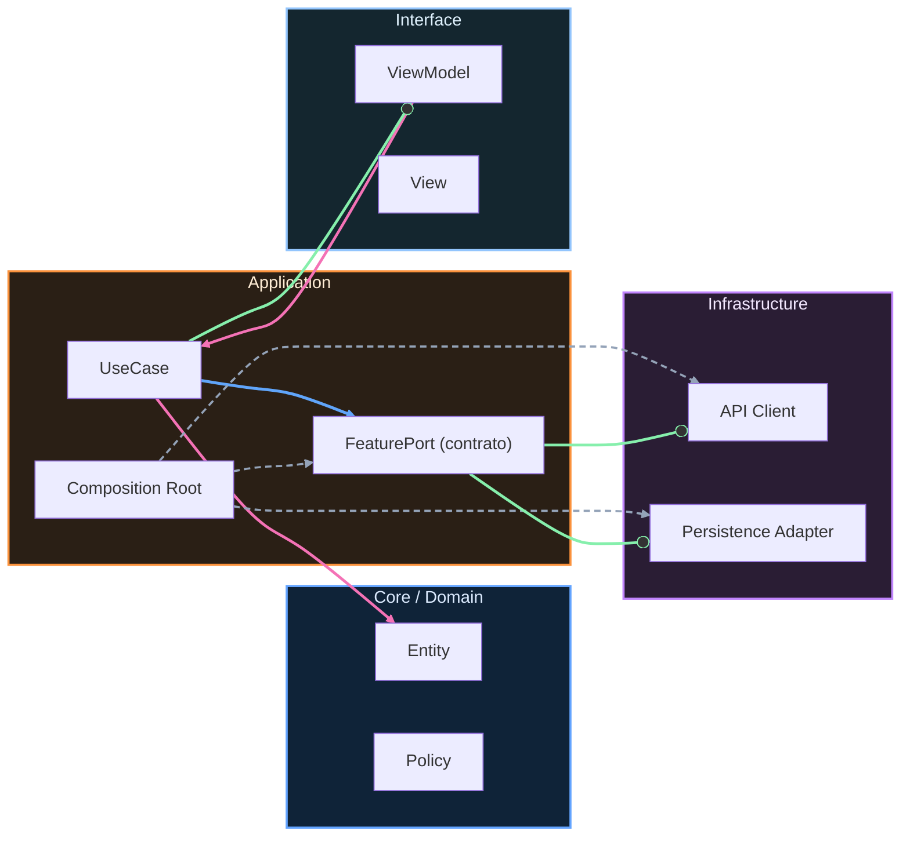

# Nivel Senior · 02 · Incident response y runbooks operativos en Android

Hay una escena que se repite en casi todos los equipos cuando no existe cultura de incidentes. Empiezan a llegar reportes de usuarios, alguien escribe “¿a alguien más le falla?” en el chat, aparecen cinco hipótesis distintas, cada persona mira una métrica diferente y, mientras tanto, el impacto sigue creciendo. No falta talento técnico. Falta sistema.

Esta lección va precisamente de eso: de convertir una reacción caótica en una respuesta operativa clara, incluso cuando la presión sube. Porque los incidentes no se evitan al 100%, pero sí puedes evitar que te arrastren.

## Qué es un incidente en producto real

No todo bug es incidente. Un incidente es un evento que degrada de forma significativa la experiencia o la operación del negocio. Puede ser un crash masivo tras release, una sincronización que deja datos inconsistente, un login que tarda demasiado y provoca abandono o un flujo crítico que se queda bloqueado sin cerrar la app.

Lo importante es entender que el incidente no se define por lo que tú sientes, se define por impacto observable. Por eso en Senior dejamos de discutir con intuiciones y empezamos a trabajar con señales concretas.

## El primer error que rompe equipos: confundir diagnosticar con opinar

Cuando no hay protocolo, se pierde tiempo discutiendo teorías. Una persona dice “seguro es red”, otra dice “esto es Room”, otra “debe ser Play Services”. Ese tipo de debate, sin estructura, no es diagnóstico: es ruido.

Incident response madura pone orden. Primero se confirma impacto, luego se acota alcance, después se mitiga y recién entonces se profundiza en causa raíz. Si inviertes ese orden, intentas hacer autopsia mientras el paciente sigue desangrándose.

## Necesitas roles mínimos, no jerarquía pesada

Un incidente bien gestionado no requiere burocracia, requiere claridad de responsabilidad. En la práctica suele bastar con tres funciones activas durante el evento: quien coordina la respuesta y mantiene foco, quien ejecuta mitigaciones técnicas y quien comunica estado para que el resto del equipo no entre en pánico informativo.

Ese reparto evita la trampa más común: diez personas tocando cosas a la vez sin visión global.

## Cómo se ve un flujo operativo que sí funciona

Cuando detectas una degradación real, el reloj empieza a correr. El objetivo inicial no es “explicar todo”, es reducir daño rápido y de forma segura. En Android, eso suele significar decisiones como detener expansión de rollout, apagar una bandera problemática, forzar comportamiento fallback o, si no hay otra salida, revertir versión.

Lo decisivo es que esa acción no dependa de memoria individual. Debe estar descrita en runbooks que cualquiera del equipo pueda ejecutar de forma consistente.

## Qué es un runbook y por qué evita errores caros

Un runbook no es documentación bonita para auditoría. Es una guía de ejecución para momentos donde pensar cuesta más por presión y fatiga. Si está bien hecho, te evita improvisar justo cuando improvisar sale caro.

Un runbook útil en este curso debe responder cuatro preguntas sin rodeos: cómo detectar el problema, cómo confirmar severidad, cómo mitigar rápido y cómo validar que la mitigación realmente funcionó.

## Estructura realista de un runbook en el repositorio

En vez de dispersar notas en chats, conviene tener runbooks versionados en el código. Un ejemplo de archivo `docs/runbooks/incident-login-freeze.md` podría verse así:

```md
# Incident Runbook · Login Freeze after Release

## Señales de activación
- Aumento sostenido de tiempo de primer render post-login
- Incremento de abandono en evento login_success_to_home_render
- Reportes de UI congelada en Android 13+ tras actualización

## Verificación rápida
1) Confirmar versión afectada en telemetría (app_version)
2) Confirmar porcentaje de usuarios afectados por cohorte
3) Revisar correlación con flag isNewSessionFlowEnabled

## Mitigación inmediata
- Pausar expansión de rollout en Play Console
- Desactivar flag isNewSessionFlowEnabled para cohorte afectada
- Monitorear recuperación durante 15 minutos

## Validación de recuperación
- Render p95 vuelve a rango objetivo
- Tasa de abandono vuelve a línea base
- No aparecen nuevas alertas críticas

## Escalada
Si no hay recuperación, activar rollback de versión en canal producción.
```

Observa que no está escrito “como libro”. Está escrito para ejecutar. Eso marca toda la diferencia.

## Integración técnica: incidentes también son arquitectura

Una respuesta rápida depende de decisiones de diseño que tomaste antes. Si tus flujos críticos no están detrás de contratos claros y flags desacopladas, mitigar se vuelve cirugía mayor. Si la observabilidad no incluye versión, cohorte y camino funcional, no puedes acotar alcance. Si no hay separación de capas, cada corrección urgente arriesga efectos laterales.

Por eso incident response no es un tema “de operaciones aparte”. Es consecuencia directa de tu arquitectura Android.

## Ejemplo práctico con un orquestador de mitigación

En situaciones frecuentes, conviene encapsular acciones de contención para no repartir lógica de emergencia por todo el código. Un servicio de operación simple podría ser así:

```kotlin
interface IncidentMitigationService {
    suspend fun pauseRollout(track: String)
    suspend fun disableFlag(flagKey: String, segment: String)
    suspend fun triggerRollback(targetVersionCode: Int)
}
```

Este contrato no sabe nada de proveedor concreto. Eso es importante porque en una organización real puedes usar distintas herramientas según entorno. Lo que el dominio operativo necesita es una capacidad, no una implementación acoplada.

Una coordinación de alto nivel podría vivir en un caso de uso de respuesta:

```kotlin
class LoginIncidentResponseUseCase(
    private val telemetryRepository: TelemetryRepository,
    private val incidentMitigationService: IncidentMitigationService
) {
    suspend fun execute(currentVersionCode: Int) {
        val impact = telemetryRepository.getLoginFreezeImpact(versionCode = currentVersionCode)

        if (impact.isCritical.not()) return

        incidentMitigationService.pauseRollout(track = "production")
        incidentMitigationService.disableFlag(
            flagKey = "isNewSessionFlowEnabled",
            segment = "android_13_plus"
        )
    }
}
```

Aquí la decisión técnica resuelve un problema operativo muy concreto. Primero confirmas criticidad con señal objetiva. Después aplicas mitigación mínima eficaz. No saltas a rollback si una contención más barata devuelve estabilidad. Eso evita tanto sobre-reacción como pasividad.

## Comunicación durante incidente: técnica y humana

Un punto que muchos equipos subestiman es la comunicación interna. Si no hay mensajes claros y periódicos, el vacío lo llena la ansiedad. Y la ansiedad en ingeniería suele traducirse en cambios impulsivos.

La comunicación útil durante incidente no necesita discursos. Necesita estado corto y verificable: qué sabemos, qué estamos haciendo, qué esperamos ver para declarar recuperación y cuándo volvemos a actualizar. Esa cadencia mantiene alineado al equipo y protege foco.

## Qué pasa después de mitigar: postmortem sin culpa

Cuando el fuego baja, llega el momento más valioso para madurar. El postmortem no debe buscar culpables, debe buscar aprendizaje accionable. Si se convierte en juicio personal, la gente oculta errores. Si se convierte en análisis de sistema, el equipo mejora.

Un buen postmortem responde con honestidad tres cosas. Qué falló en el producto. Qué faltó en la detección o mitigación. Qué cambio concreto haremos para que el mismo patrón no vuelva a repetir daño.

Ese último punto es clave: cada incidente debería dejar una mejora permanente en código, pruebas, observabilidad o runbooks.

## Llevar esto al día a día del curso

A partir de esta lección, cada módulo crítico que implementes en Senior debería venir acompañado de su criterio de incidente: qué señal te avisa, cómo contienes y cómo validas recuperación. No porque esperes fallar siempre, sino porque diseñar para recuperación te vuelve más rápido y más confiable.

Cuando haces esto bien, el equipo deja de vivir incidentes como caos y empieza a tratarlos como parte gestionable de operar software real.

## Cierre de la lección

La madurez no se demuestra cuando todo va bien. Se demuestra cuando algo va mal y aun así respondes con cabeza fría, impacto acotado y aprendizaje concreto.

Eso es incident response bien hecho. No heroísmo. No pánico. Sistema.

En la siguiente lección vamos a conectar esta práctica con un marco de SLOs y error budgets para que la prioridad técnica deje de depender de quién habla más fuerte y pase a depender de objetivos de fiabilidad compartidos por todo el equipo.
<!-- auto-gapfix:layered-mermaid -->
## Diagrama de arquitectura por capas



La lectura del diagrama sigue esta semantica:
1. `-->` dependencia directa en runtime.
2. `-.->` wiring o configuracion.
3. `==>` contrato o abstraccion.
4. `--o` salida o propagacion de resultado.
