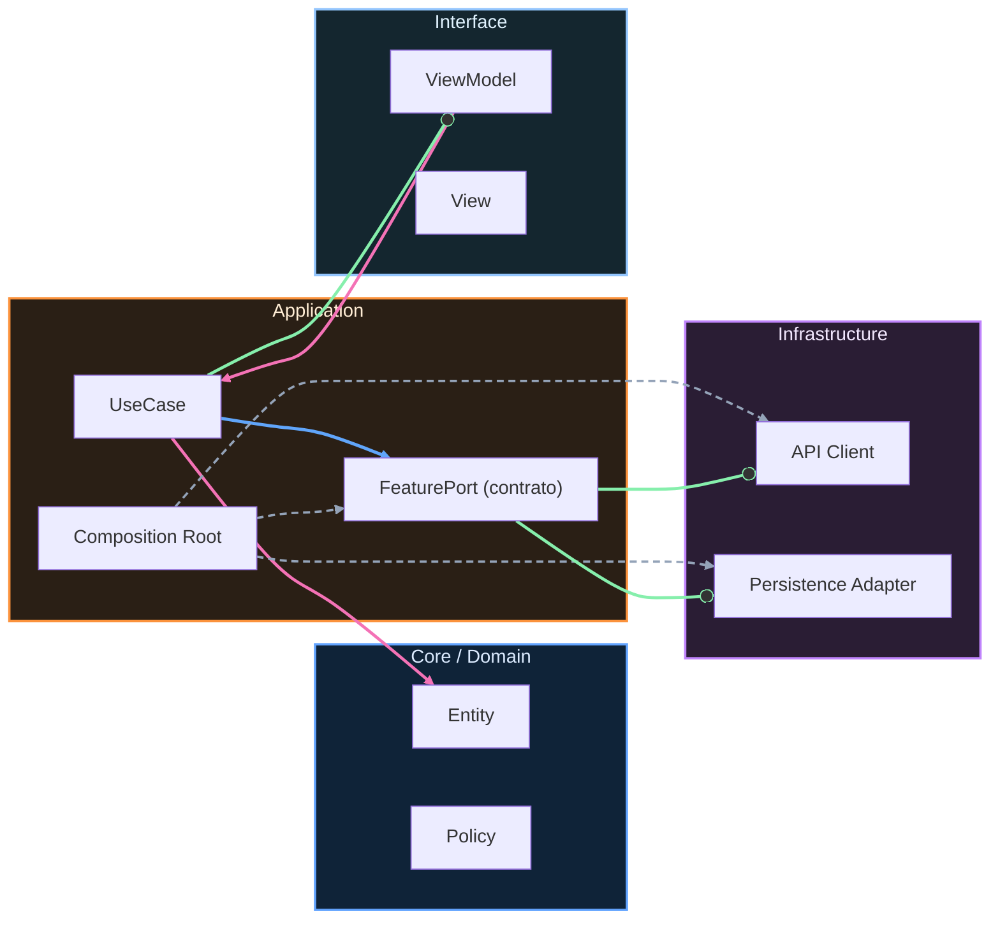

# Nivel Senior · 03 · SLOs, error budgets y priorización real de fiabilidad en Android

Después de una lección de incidentes suele aparecer una sensación engañosa: “ya está, con responder rápido estamos cubiertos”. En realidad, responder bien a un problema es solo una parte del juego. La parte que cambia de verdad la salud del producto es decidir bien antes de que el siguiente problema llegue. Y para decidir bien necesitas un marco compartido.

Ahí entran los SLOs y los error budgets. No como jerga de moda, sino como una forma simple de responder una pregunta incómoda que todo equipo serio enfrenta tarde o temprano: ¿seguimos metiendo features o tenemos que frenar y estabilizar?

Si no tienes una respuesta objetiva, esa discusión se vuelve política. Si sí la tienes, se vuelve ingeniería.

## El problema que resuelve este marco

Imagina que en dos semanas lanzaste tres mejoras en onboarding. Producto está feliz porque aumentó conversión inicial, pero soporte reporta más tickets de tiempos muertos y el equipo Android siente que la app “está al límite”. Sin un marco de fiabilidad, cada área defenderá su verdad. Y todas tendrán algo de razón.

SLO y error budget no eliminan ese conflicto, pero lo vuelven negociable con evidencia. Dejas de discutir “me parece” y empiezas a discutir “nos queda este margen de error para este objetivo de servicio”.

## Qué es un SLO en lenguaje real

Un SLO es un objetivo de comportamiento observable del sistema durante una ventana concreta. No describe intención, describe resultado medible para la experiencia del usuario.

Por ejemplo, para un flujo Android crítico, no te sirve “la app debe ser rápida”. Te sirve algo como “el 99% de logins completa render de Home en menos de 2.5 segundos durante 28 días”. Esa frase, aunque parezca más dura, te da una ventaja enorme: se puede medir, se puede vigilar y se puede usar para decidir.

## Qué papel juega el error budget

Si defines un SLO, implícitamente aceptas que no existe cero fallos. Si exiges perfección absoluta, el equipo se paraliza. El error budget es precisamente el margen de fallo permitido sin romper el objetivo acordado.

Cuando ese margen está sano, tienes libertad para experimentar más. Cuando se consume demasiado rápido, el sistema te está diciendo que necesitas invertir en fiabilidad antes de seguir apretando entrega.

No es castigo, es control de riesgo.

## Llevarlo a Android sin burocracia

Este curso busca practicidad, así que no vamos a montar una torre de procesos. Vamos a dejar un marco pequeño, accionable y versionado en el repo para que cualquier persona del equipo pueda entender qué se está protegiendo y por qué.

Un contrato simple en `docs/reliability/slo-login.md` puede ser suficiente para empezar:

```md
# SLO · Login to Home Render

Servicio observado: flujo login -> home render
Ventana: 28 días móviles
Objetivo: 99.0% de eventos con latencia <= 2500 ms
SLI: login_home_render_latency_ms
Segmentación: app_version, android_api_level, network_type

Política de decisión:
- Si presupuesto de error restante >= 50%, se permite roadmap normal
- Si presupuesto entre 20% y 50%, priorizar mitigaciones de riesgo medio
- Si presupuesto < 20%, congelar cambios de alto riesgo en login hasta recuperar
```

Lo importante de este documento no es el formato. Lo importante es que define una frontera de decisión visible para todo el equipo. Sin eso, cada sprint vuelve al debate infinito.

## Cómo instrumentarlo en código sin acoplarte a una herramienta

En módulos anteriores ya trabajaste contratos de observabilidad. Aquí los reutilizamos con foco de fiabilidad. El objetivo es que registrar un SLI no dependa de una SDK concreta para poder evolucionar infraestructura sin romper dominio.

Un contrato de telemetría orientado a SLI puede quedar así:

```kotlin
interface ReliabilityTelemetry {
    suspend fun recordLoginRenderLatency(
        durationMs: Long,
        appVersion: String,
        androidApiLevel: Int,
        networkType: String
    )
}
```

Y en el caso de uso que coordina login + navegación, registras la señal justo donde tiene significado de producto:

```kotlin
class CompleteLoginFlowUseCase(
    private val authRepository: AuthRepository,
    private val reliabilityTelemetry: ReliabilityTelemetry,
    private val clock: Clock
) {
    suspend fun execute(email: String, password: String): Result<Unit> {
        val start = clock.millis()

        val loginResult = authRepository.login(email, password)
        if (loginResult.isFailure) return Result.failure(loginResult.exceptionOrNull()!!)

        val end = clock.millis()
        val duration = end - start

        reliabilityTelemetry.recordLoginRenderLatency(
            durationMs = duration,
            appVersion = BuildConfig.VERSION_NAME,
            androidApiLevel = Build.VERSION.SDK_INT,
            networkType = "unknown"
        )

        return Result.success(Unit)
    }
}
```

Aquí hay una decisión técnica que suele pasarse por alto. Medimos en el caso de uso porque representa un límite funcional entendible por negocio. Si mides demasiado abajo, obtienes números técnicamente precisos pero operativamente ambiguos. Y eso no ayuda a priorizar.

## Qué cambia en la planificación cuando usas error budget

Sin error budget, el backlog se ordena por presión del momento. Con error budget, el backlog incorpora estado de fiabilidad como restricción explícita. Eso obliga a una conversación más adulta: si el margen de error está casi agotado, no tiene sentido meter una épica de alto riesgo en el flujo que ya está degradado.

No significa frenar innovación siempre. Significa dosificar riesgo según salud real del sistema.

Una guía práctica en `docs/reliability/error-budget-policy.md` evita que esto dependa de interpretación personal:

```md
# Error Budget Policy

Si el budget de un SLO crítico cae por debajo de 20%:
- No se aceptan cambios de alto riesgo en ese flujo
- Se priorizan fixes de latencia, estabilidad y mitigación
- Se exige validación adicional en release candidate

Cuando el budget se recupera por encima de 40%:
- Se permite reanudar cambios evolutivos gradualmente
```

Fíjate que no estamos “prohibiendo features para siempre”. Estamos introduciendo gobernanza de riesgo basada en datos.

## Cómo conectar esto con incident response

Lo que vimos en la lección anterior te ayuda a apagar fuegos. SLO y error budget te ayudan a reducir la frecuencia con la que el fuego aparece. Son capas complementarias.

Cuando ocurre un incidente, además de mitigar, deberías revisar si alteró el budget de un SLO crítico. Si lo hizo, la planificación siguiente tiene que reflejar ese impacto. Si no lo reflejas, el equipo vuelve a operar como si nada hubiera pasado y repite patrones.

## Un escenario realista de decisión

Supongamos que tu SLO de login tiene objetivo 99.0% y llevas dos semanas con degradación intermitente en Android 14 bajo red móvil inestable. Producto propone lanzar una nueva variante de onboarding que toca el mismo flujo. Técnica detecta que el budget restante cayó al 18%.

Sin marco, la decisión se politiza. Con marco, la conversación cambia: el equipo acuerda mantener el lanzamiento de bajo riesgo en otras áreas, pero pospone la variante en login y dedica un sprint corto a recuperación del SLO crítico. No porque “gane backend” o “gane Android”, sino porque el sistema ya te dijo que estás sin colchón.

Esa es la madurez que buscamos.

## Qué debes evitar para que esto no se vuelva teatro

Hay dos trampas muy típicas. La primera es definir SLOs que nadie mira. La segunda es definir objetivos tan optimistas que se incumplen siempre y se vuelven irrelevantes. En ambos casos, el marco muere por desconexión con la realidad.

Empieza con pocos SLOs, en flujos verdaderamente críticos, y revísalos con periodicidad fija. Si un SLO no influye decisiones, ajusta o elimina. Fiabilidad útil es fiabilidad que cambia cómo priorizas.

## Cierre de la lección

SLO y error budget no son un lujo de grandes empresas. Son una forma simple de proteger al producto y al equipo de decisiones impulsivas bajo presión.

Cuando incorporas este marco en Android, el roadmap deja de ser una pelea de opiniones y se convierte en una secuencia de apuestas controladas por evidencia.

En la siguiente lección vamos a aterrizar esa evidencia en un tablero operativo de fiabilidad con métricas mínimas, alertas accionables y rituales de revisión que sí se pueden sostener sprint tras sprint.
<!-- auto-gapfix:layered-mermaid -->
## Diagrama de arquitectura por capas



La lectura del diagrama sigue esta semantica:
1. `-->` dependencia directa en runtime.
2. `-.->` wiring o configuracion.
3. `==>` contrato o abstraccion.
4. `--o` salida o propagacion de resultado.
