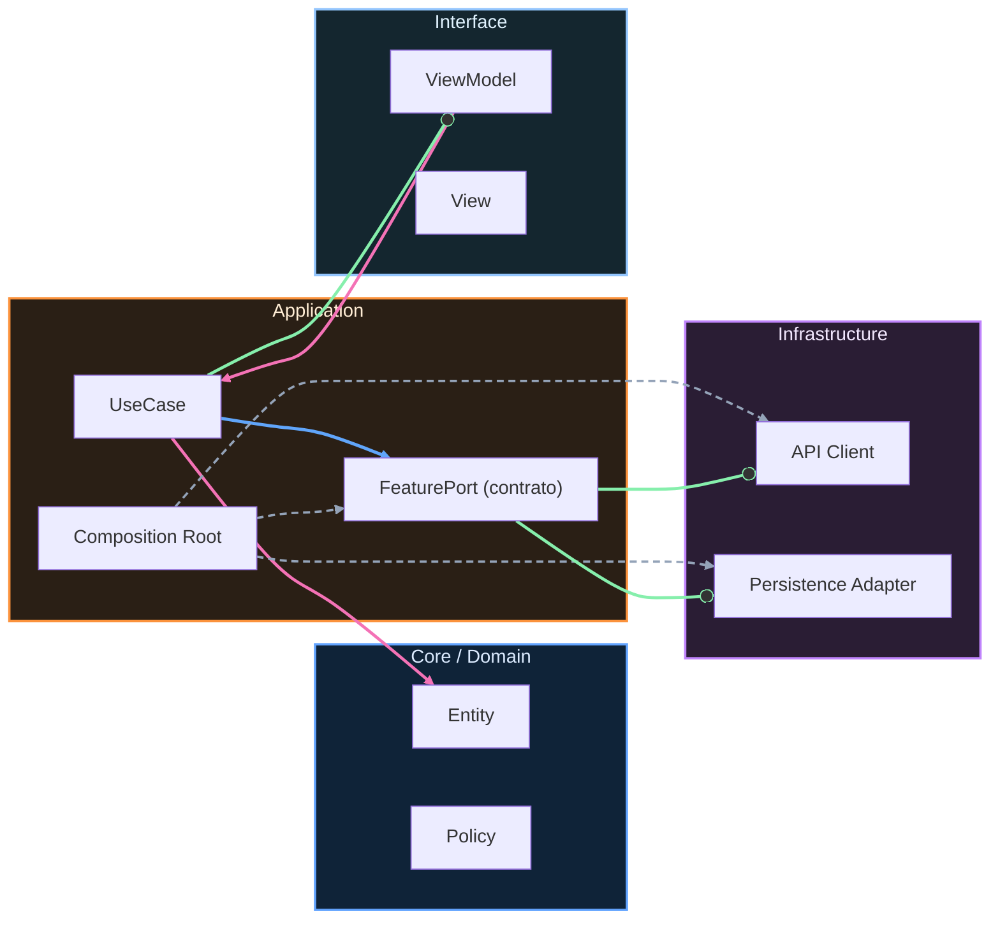

# Nivel Senior · 05 · Gobernanza técnica de sprint: decidir con evidencia cuando roadmap y fiabilidad chocan

Hay un momento en casi todos los equipos Android donde la discusión de sprint se vuelve cansada y repetitiva. Producto siente que ingeniería frena. Ingeniería siente que producto empuja sin mirar el riesgo operativo. Cada planning parece empezar desde cero, como si no existiera memoria de lo que pasó el sprint anterior. Cuando eso ocurre de forma sostenida, no falta talento. Falta sistema de decisión.

Esta lección trata exactamente de construir ese sistema. No para burocratizar el trabajo, sino para evitar decisiones impulsivas que hoy parecen rápidas y dentro de dos semanas se traducen en regresiones, incidentes y desgaste de confianza.

## El problema real que queremos resolver

Si una app tiene tráfico, usuarios en distintas versiones y flujos críticos sensibles como login, sync o checkout, cada release compite por una misma capacidad de riesgo. El equipo no decide si arriesga o no arriesga; eso ya está implícito en cada cambio. Lo que sí decide es si ese riesgo se gestiona con método o con intuición.

En módulos anteriores ya levantaste piezas potentes: métricas, SLOs, error budget, runbooks y alertas más accionables. Lo que todavía faltaba era unirlas en una capa de gobernanza de sprint que traduzca señales operativas en decisiones de alcance.

## Por qué una policy escrita en repositorio cambia el juego

Cuando la regla vive solo en conversaciones, se deforma según urgencia y memoria de cada persona. Cuando vive versionada en el repo, se convierte en parte del sistema técnico. Eso permite revisar cambios en la policy igual que revisas cambios de código, discutir supuestos con trazabilidad y aprender sprint a sprint sin perder contexto.

Un documento como `docs/governance/sprint-reliability-policy.md` no debe ser un texto largo de compliance. Debe ser corto, claro y ejecutable por el equipo en planning y en revisión de mitad de sprint.

```md
# Sprint Reliability Policy

El equipo decide capacidad de sprint usando salud operativa actual.

Si los SLOs críticos tienen margen amplio y no hubo incidente severo reciente,
el sprint puede dedicar más capacidad a roadmap.

Si el margen es intermedio o hubo señal de degradación relevante,
la planificación se mueve a un reparto equilibrado entre entrega y fiabilidad.

Si el margen es bajo o existe degradación activa en flujo core,
el sprint prioriza recuperación de fiabilidad antes de introducir cambios de alto riesgo.

La decisión se revisa en planning y se revalida a mitad de sprint con datos frescos.
```

La decisión de no fijar porcentajes rígidos en la policy no es una omisión. Es una elección consciente para evitar que el equipo cumpla un número y viole el espíritu de la regla cuando cambia el contexto operativo.

## Traducir señales técnicas a una recomendación concreta

Para que el planning no dependa de percepciones sueltas, conviene sintetizar estado operativo en un snapshot pequeño y legible. El objetivo no es reemplazar el juicio humano, sino abrir conversación desde una base compartida.

```kotlin
data class SprintReliabilitySnapshot(
    val loginBudgetRemaining: Double,
    val syncBudgetRemaining: Double,
    val hasRecentHighSeverityIncident: Boolean,
    val isCriticalDegradationActive: Boolean
)

interface ReliabilityGovernanceRepository {
    suspend fun getSnapshot(): SprintReliabilitySnapshot
}
```

Este contrato resuelve un problema muy habitual: cada área llega al planning con su propio relato de “cómo estamos”. Con snapshot común, la discusión arranca en hechos observables.

Ahora puedes introducir un evaluador que entregue una recomendación inicial de modo de capacidad.

```kotlin
enum class SprintCapacityMode {
    ROADMAP_HEAVY,
    BALANCED,
    RELIABILITY_HEAVY
}

class SprintCapacityEvaluator(
    private val governanceRepository: ReliabilityGovernanceRepository
) {
    suspend fun evaluate(): SprintCapacityMode {
        val snapshot = governanceRepository.getSnapshot()

        if (snapshot.isCriticalDegradationActive) {
            return SprintCapacityMode.RELIABILITY_HEAVY
        }

        val criticalBudget = minOf(
            snapshot.loginBudgetRemaining,
            snapshot.syncBudgetRemaining
        )

        if (criticalBudget < 0.20) {
            return SprintCapacityMode.RELIABILITY_HEAVY
        }

        if (snapshot.hasRecentHighSeverityIncident) {
            return SprintCapacityMode.BALANCED
        }

        if (criticalBudget < 0.50) {
            return SprintCapacityMode.BALANCED
        }

        return SprintCapacityMode.ROADMAP_HEAVY
    }
}
```

Aquí hay varias decisiones técnicas que conviene explicar con calma. Tomar el `minOf` entre login y sync evita que un flujo sano esconda otro que está frágil. Separar la condición de incidente severo del umbral de budget evita mezclar señales de naturaleza distinta. Y devolver un modo, en lugar de un porcentaje exacto, deja espacio para negociación consciente sin perder consistencia.

## Cómo se usa esta recomendación en una reunión real

Supón que el evaluador devuelve `BALANCED`. Esa salida no significa “mitad y mitad” de forma automática. Significa que el equipo no debería aprobar en el mismo sprint dos cambios de alto riesgo sobre el mismo flujo crítico, y que cualquier apuesta fuerte de roadmap debe acompañarse de mitigación explícita y verificación intermedia.

Esa diferencia es importante porque evita una lectura simplista de la herramienta. El evaluador orienta, pero el equipo decide con contexto de negocio y coste de oportunidad.

## Cerrar la brecha entre producto e ingeniería

Sin gobernanza, la conversación suele sonar así: “esto tiene que salir” contra “esto no se puede tocar”. Con gobernanza madura, la conversación cambia de forma y de calidad. Pasa a algo como: “estamos en modo balanced por budget intermedio; podemos lanzar esta parte de onboarding que no toca login crítico y mover la parte sensible al siguiente sprint con condición de recuperación”.

Ese tipo de frase mantiene avance de negocio sin negar señales técnicas. Y, sobre todo, deja trazabilidad para revisar después si la apuesta fue correcta.

## Excepciones sin romper el sistema

Toda policy útil necesita flexibilidad, pero flexibilidad no significa puerta abierta permanente. Cuando se aprueba una excepción, debe quedar documentada con motivo, duración y condición de salida. Así la excepción no se convierte en norma oculta.

Puedes materializarlo en un registro simple dentro de `docs/governance/` con fecha, contexto, riesgo asumido y criterio de reversión. Esa práctica protege al equipo de repetir excepciones por inercia.

## Verificar si la gobernanza funcionó de verdad

La evaluación no termina cuando acaba planning. Termina cuando comparas intención y resultado al final del sprint. Si apostaste por más roadmap y el flujo crítico empeoró, tu marco necesita ajuste. Si priorizaste fiabilidad y recuperaste margen operativo sin frenar todo, hay una señal de que el sistema está calibrado.

La clave está en tratar la policy como software vivo. Se itera, se corrige y se mejora con evidencia, igual que cualquier pieza crítica de la app.

## Cierre de la lección

La gobernanza técnica de sprint no está para ganar discusiones internas. Está para que el equipo tome decisiones repetibles bajo presión, con equilibrio entre velocidad y estabilidad.

Cuando esta capa se instala de verdad, el sprint deja de depender del estado de ánimo de la semana y empieza a apoyarse en un marco claro. Ese es el salto que prepara el terreno para la simulación del siguiente módulo, donde vas a aplicar este sistema completo en un escenario con tensión real.

<!-- auto-gapfix:layered-mermaid -->
## Diagrama de arquitectura por capas



La lectura del diagrama sigue esta semantica:
1. `-->` dependencia directa en runtime.
2. `-.->` wiring o configuracion.
3. `==>` contrato o abstraccion.
4. `--o` salida o propagacion de resultado.
