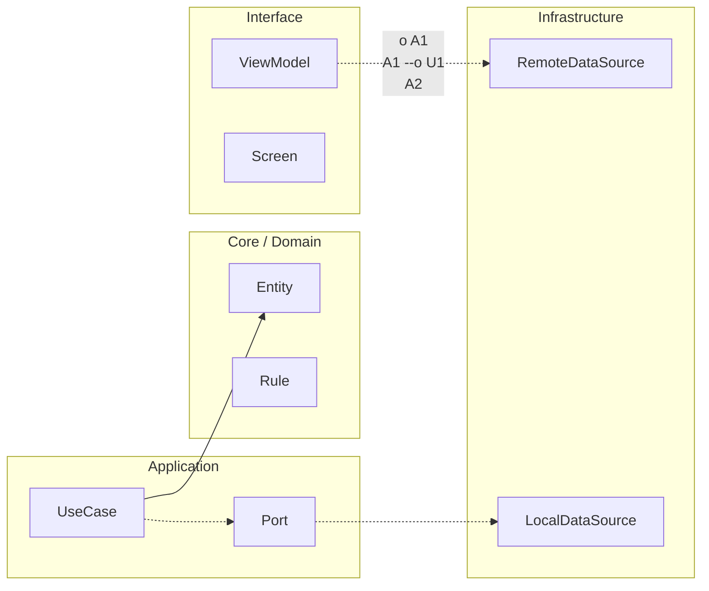

# Nivel Senior · 06 · Simulación completa de sprint bajo presión: cómo decidir sin improvisar

Ya tienes las piezas técnicas del bloque Senior: sabes medir salud operativa, conoces error budgets, tienes runbooks y levantaste una policy de gobernanza para orientar capacidad. El reto real ahora no es aprender otra pieza aislada. El reto es usarlas juntas cuando todo llega a la vez: presión de negocio, señales de degradación y miedo a que una mala apuesta dispare incidentes.

Esta lección es una simulación integral para entrenar ese momento.

## Escenario realista de entrada al planning

Es lunes por la mañana y el equipo Android abre planning con tres tensiones activas. Producto quiere liberar una mejora de onboarding comprometida con marketing. Soporte reporta aumento de quejas de lentitud en login para parte de usuarios Android 14. El panel operativo muestra degradación intermitente en `login_success_to_home_render` y el budget de login está en 19%.

No estás en modo crisis total, pero tampoco estás en un estado sano. Ese matiz importa porque es justo el tipo de contexto donde un equipo sin marco suele cometer errores caros: o bloquea todo por miedo, o ignora señales por urgencia comercial.

## Qué ocurre si el equipo decide por intuición

Si no existe método, la reunión se vuelve una puja de prioridades. Quien trae presión más visible inclina la balanza. El resultado puede ser un sprint aparentemente ambicioso que añade riesgo al flujo más frágil, o un sprint excesivamente conservador que frena valor de negocio sin un criterio proporcional al riesgo real.

Ambas salidas son ineficientes porque no transforman datos en decisión. Solo transforman tensión en reacción.

## Aplicar el marco de gobernanza del módulo anterior

La simulación arranca con una regla básica: antes de discutir historias, se fija el modo de capacidad del sprint con estado operativo actual. Con budget crítico en 19% y degradación activa en flujo core, la recomendación cae en `RELIABILITY_HEAVY`.

Aquí aparece una decisión adulta que suele faltar en equipos jóvenes: separar objetivo de negocio en entregables de riesgo distinto. La mejora de onboarding no se cancela completa; se divide. La parte que no toca login crítico puede avanzar. La parte que altera el camino sensible se condiciona a recuperación de margen operativo.

Eso protege dos cosas al mismo tiempo: la confianza del usuario y la credibilidad del roadmap.

## Traducir la decisión a un plan de sprint ejecutable

Con ese modo de capacidad, el sprint queda diseñado en torno a tres líneas que se apoyan mutuamente. La primera es estabilización del flujo degradado, con acciones técnicas medibles en p95 y tasa de éxito de login. La segunda es avance de producto en cambios de riesgo medio o bajo fuera del cuello de botella actual. La tercera es refuerzo de observabilidad para detectar recaídas temprano durante rollout posterior.

La clave aquí no es repartir tareas por porcentaje rígido. La clave es que cada bloque tenga una hipótesis clara de impacto y una señal de verificación.

## Dejar trazabilidad explícita de la decisión

Para que esta gobernanza sobreviva a cambios de personas y memoria de sprint, conviene registrar decisión y condición de salida en un artefacto versionado.

```md
# Sprint 12 Decision Record

Contexto operativo
- Budget de login: 19%
- Degradación activa en login_success_to_home_render (p95)
- Incidente severo reciente en últimos 14 días

Decisión de capacidad
- Modo: RELIABILITY_HEAVY

Alcance del sprint
- Recuperación de login: optimización de render + endurecimiento de fallback de sesión
- Roadmap: onboarding parcial sin cambios en camino crítico de login

Condición para reabrir cambios de alto riesgo en login
- Budget de login > 35%
- 7 días sin alerta crítica sostenida en login
```

Este registro resuelve un problema muy común: dos sprints después nadie recuerda por qué se partió una entrega. Con decision record, el equipo puede auditar coherencia entre lo que prometió y lo que realmente observó.

## Mitad de sprint: revalidar o corregir rumbo

El error más caro en este tipo de planificación es decidir el lunes y no volver a mirar señales hasta la retrospectiva. Por eso la simulación incluye una revisión de mitad de sprint donde se compara tendencia real frente a hipótesis inicial.

Puedes modelar esta revisión con un caso de uso pequeño que avise si hay que escalar recuperación.

```kotlin
class MidSprintReliabilityCheckUseCase(
    private val governanceRepository: ReliabilityGovernanceRepository
) {
    suspend fun shouldEscalateRecovery(): Boolean {
        val snapshot = governanceRepository.getSnapshot()

        val criticalBudget = minOf(
            snapshot.loginBudgetRemaining,
            snapshot.syncBudgetRemaining
        )

        return snapshot.isCriticalDegradationActive || criticalBudget < 0.15
    }
}
```

La decisión de usar `minOf` mantiene foco en el punto más débil del sistema. El umbral `< 0.15` no es mágico ni universal; es un guardrail inicial para evitar seguir asumiendo riesgo cuando el margen ya es muy estrecho. Lo correcto es calibrarlo con histórico del producto.

## Qué hacer si la tendencia no mejora

Si la revisión de mitad de sprint muestra que login sigue degradado o el budget sigue cayendo, el equipo no espera al cierre para reaccionar. Reduce riesgo adicional, prioriza mitigación más agresiva y renegocia alcance de roadmap con base en la condición acordada al inicio.

Esta parte es crítica porque convierte la gobernanza en sistema vivo y no en ritual inicial.

## Qué hace que esta simulación sea realmente senior

La diferencia no está en usar palabras como SLO o budget. La diferencia está en el comportamiento del equipo bajo tensión: decidir con contexto compartido, registrar supuestos, revisar señales en tiempo y corregir sin drama político.

Cuando eso ocurre, fiabilidad y roadmap dejan de vivirse como guerra de áreas. Se convierten en una negociación técnica-profesional sostenida por evidencia.

## Cierre de la lección

Esta simulación deja un aprendizaje operativo muy concreto. En Android real no gana el equipo que “siempre entrega rápido” ni el que “siempre juega seguro”. Gana el que sabe mover el peso entre entrega y estabilidad según salud del sistema, con reglas claras y capacidad de ajuste.

Ese criterio es el puente natural hacia Maestría, donde ahora vas a escalar estas mismas decisiones al nivel de varios dominios y varios equipos coordinándose sin perder autonomía.

<!-- auto-gapfix:layered-mermaid -->
## Diagrama de arquitectura por capas



La lectura del diagrama sigue esta semantica:
1. `-->` dependencia directa en runtime.
2. `-.->` contrato o abstraccion.
3. `-.o` wiring o composicion.
4. `--o` salida o propagacion de resultado.
