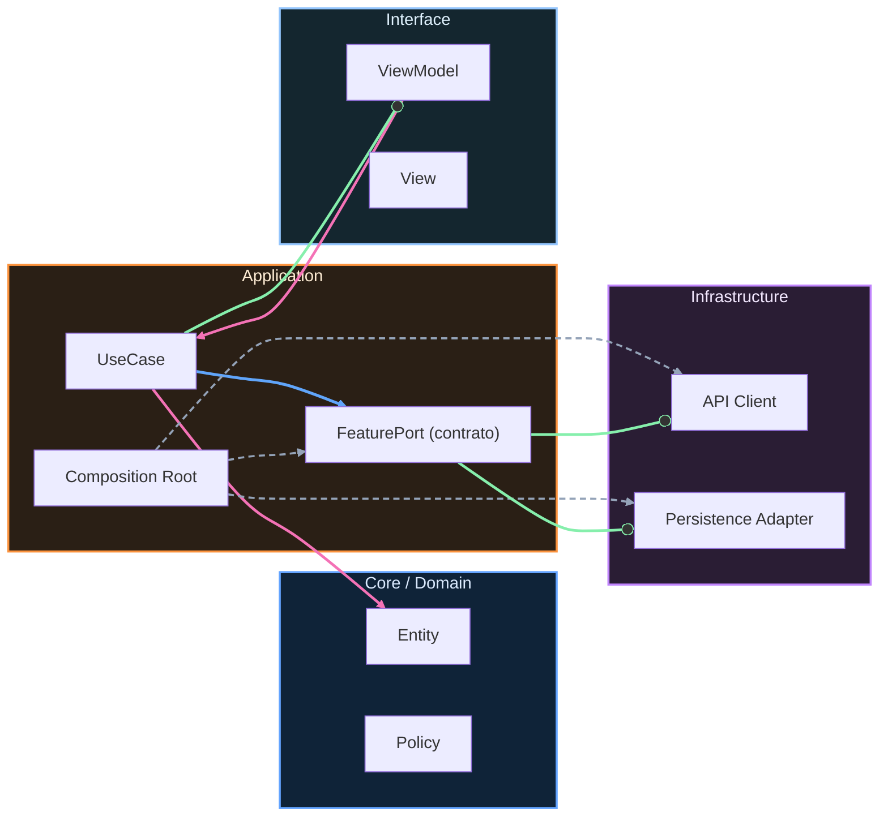

# Nivel Senior · 07 · Cierre de Senior: consolidar capacidades antes de escalar a Maestría

Cerrar Senior no es “acabar una unidad”. Es comprobar si lo aprendido ya cambió de verdad la forma en la que tu equipo decide, entrega y reacciona cuando algo se degrada. Si ese cambio no quedó institucionalizado, al entrar en Maestría solo vas a añadir complejidad encima de una base inestable.

Esta lección existe para evitar justamente eso: que el salto a temas de mayor escala ocurra sin cimientos operativos sólidos.

## La diferencia entre entender Senior y operar en Senior

Entender Senior significa que puedes explicar qué es un SLO, cómo funciona un runbook o por qué un error budget importa. Operar en Senior significa algo más exigente: frente a presión real de roadmap, ya no tomas decisiones por impulso ni por jerarquía informal, sino por señales compartidas y reglas explícitas.

Ese matiz parece pequeño, pero cambia toda la dinámica del equipo. Deja de haber heroísmo reactivo y empieza a haber fiabilidad sostenible.

## Señales de que el bloque está realmente consolidado

Si quieres evaluar este cierre con honestidad, no mires solo si “se publicaron lecciones”. Mira si en el repositorio y en la práctica diaria existen evidencias vivas. Una policy de releases que se usó en decisiones reales. Runbooks enlazados a alertas verdaderas. Decisiones de sprint trazadas contra estado de budget. Revisiones de mitad de sprint donde se corrigió rumbo con datos, no con intuición.

Cuando esas evidencias aparecen de forma repetida, Senior dejó de ser teoría.

## Lo que todavía no debemos hacer al pasar a Maestría

El riesgo más frecuente en esta transición es confundir madurez con sofisticación. Si al entrar en Maestría empiezas a multiplicar capas, contratos y lenguaje técnico sin mejorar claridad de decisión, no estás escalando arquitectura; estás escalando fricción.

Por eso el criterio de entrada no debe ser “sabemos más”. Debe ser “somos capaces de mantener control cuando la complejidad sube”.

## Baseline operativo antes del salto

Para proteger esa transición conviene fijar un baseline explícito. No para auditar personas, sino para alinear expectativa técnica de entrada al siguiente bloque.

```md
# Senior Baseline (pre-Maestría)

La base mínima esperada para escalar arquitectura es esta:

Tenemos política de release y rollback usada en producción,
no solo documentada en abstracto.

Tenemos runbooks críticos versionados y conectados a alertas,
de forma que la respuesta no dependa de memoria individual.

Tenemos SLOs y error budgets en flujos core,
y esos datos influyen en la planificación de sprint.

Tenemos un marco de capacidad que permite ajustar riesgo
sin convertir cada planning en una guerra entre áreas.
```

Este documento es útil porque evita una ilusión muy común: pensar que el equipo está listo para escalar solo porque ya “habla lenguaje senior”.

## Cómo usar este cierre para preparar Maestría

La mejor forma de usar esta lección es convertir el baseline en una revisión real de estado. Si detectas que alguna capacidad está “en papel” pero no en operación, esa brecha no es fracaso; es trabajo pendiente claro antes de exigir decisiones inter-dominio más complejas.

Si, en cambio, la base ya funciona en ciclo real, entonces Maestría se vuelve una progresión natural: pasar de gobernar un flujo o un equipo a gobernar evolución entre varios dominios autónomos que deben integrarse sin bloquearse.

## Qué te llevas de Senior como columna vertebral

Hay una idea que conviene conservar con fuerza. La fiabilidad ya no es un tema separado de producto. Es parte de cómo se diseña roadmap, cómo se negocian alcances y cómo se decide cuándo acelerar o desacelerar riesgo.

Cuando esa integración ocurre, el equipo gana algo muy valioso: previsibilidad bajo presión. Y esa previsibilidad es exactamente el activo que necesitas para entrar en Maestría sin perder velocidad ni calidad.

## Cierre del bloque

Senior termina aquí como etapa didáctica, pero su sistema operativo queda activo para todo lo que viene. Release con criterio, incidentes con método, planificación con gobernanza y retroalimentación basada en evidencia.

Con esa base sí tiene sentido abrir Maestría, donde vas a extender este mismo nivel de disciplina al terreno de contratos evolutivos, límites de contexto y coordinación de cambios transversales a escala.

<!-- auto-gapfix:layered-mermaid -->
## Diagrama de arquitectura por capas



La lectura del diagrama sigue esta semantica:
1. `-->` dependencia directa en runtime.
2. `-.->` wiring o configuracion.
3. `==>` contrato o abstraccion.
4. `--o` salida o propagacion de resultado.
