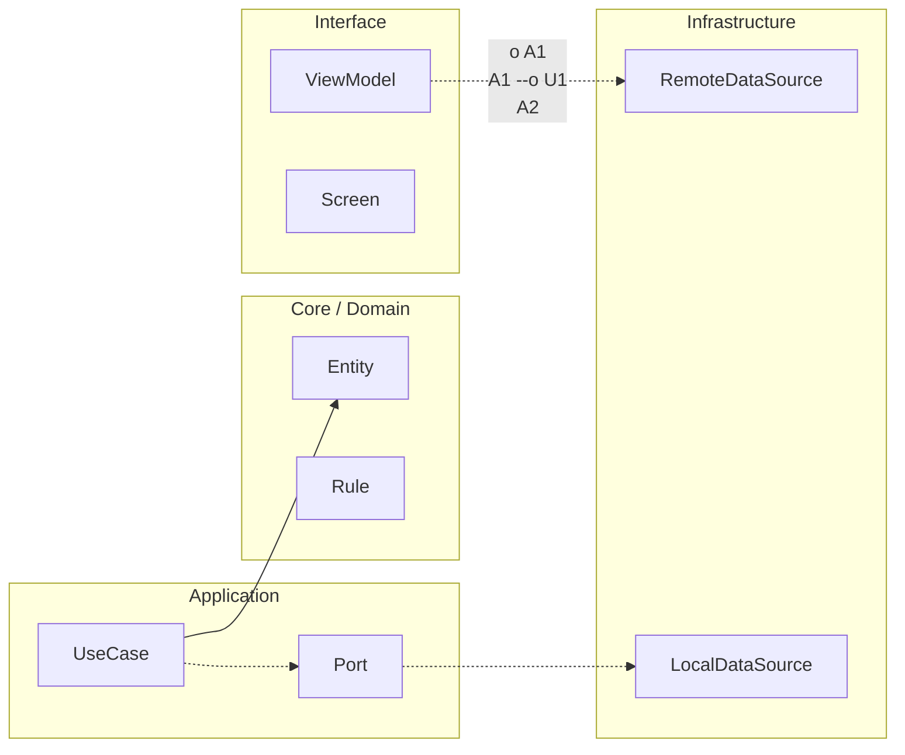

# Nivel Maestría · 00 · Introducción: escalar sin perder claridad

> **Estado actual de FieldOps:** v3.0 pendiente — Release buildType configurado con minify/signing. Pendiente: feature flags, observabilidad real, SLOs, runbooks operativos.
>
> **Objetivo de versión:** v4.0 (Maestría) — Gobernanza a escala, contratos evolutivos entre dominios, mantenibilidad a largo plazo, defensa técnica de decisiones.
>
> **Comandos de verificación:**
> ```bash
> cd proyecto-android
> ./scripts/quality-gates.sh            # Gates completos
> ./gradlew :benchmark:connectedCheck   # Performance
> ```
>
> **Proyecto:** ver [Brief FieldOps](../05-proyecto-final/00-brief-ruralgo-fieldops.md) · [Rúbrica](../05-proyecto-final/01-rubrica-empleabilidad.md) · [Evidencias obligatorias](../05-proyecto-final/02-evidencias-obligatorias.md)

Llegar a Maestría no significa que ahora todo se vuelve más difícil por obligación. Significa algo más interesante y más desafiante: empiezas a tomar decisiones cuyo impacto ya no se queda en una sola feature ni en un solo sprint. Lo que diseñes aquí afecta cómo colaboran equipos, cómo evolucionan contratos durante meses y cómo se sostiene el producto cuando cambia el negocio.

Por eso, esta etapa no trata de “más patrones” por acumular. Trata de aprender a escalar complejidad sin perder legibilidad, velocidad ni fiabilidad.

## Qué cambia respecto a Senior

En Senior trabajaste muy fuerte la operación: releases controlados, incidentes con método, SLOs, alertas accionables y gobernanza de capacidad. Esa base fue clave porque te enseñó a sostener producto real sin entrar en caos.

En Maestría, esa base no se reemplaza. Se amplifica. La pregunta deja de ser “cómo sostengo este flujo crítico” y pasa a ser “cómo sostengo un sistema de equipos y dominios que evolucionan en paralelo sin bloquearse entre sí”.

Este cambio de escala es sutil pero profundo. Ya no basta con que tu módulo esté bien. Necesitas que el conjunto siga siendo comprensible y evolucionable.

## El riesgo principal de esta etapa

Cuando un equipo empieza a escalar arquitectura, aparece un riesgo muy conocido: confundir sofisticación con madurez. Surgen capas, abstracciones y vocabulario avanzado, pero la entrega real se vuelve más lenta y la coordinación más frágil.

Eso no es Maestría. Eso es complejidad desordenada.

La Maestría que buscamos en este curso es la que simplifica decisiones difíciles, no la que las esconde detrás de más estructura.

## Qué vas a practicar en este bloque

Vas a trabajar cómo evolucionar contratos entre dominios sin congelar equipos, cómo diseñar límites de contexto que reduzcan acoplamiento real, cómo gobernar cambios transversales sin romper autonomía local y cómo mantener trazabilidad técnica cuando el sistema crece.

También vas a ver cómo sostener calidad de arquitectura a largo plazo sin caer en burocracia que mate el ritmo del roadmap.

## Cómo estudiar Maestría para que realmente te transforme

Si lees este bloque como teoría de “arquitecto ideal”, no te servirá. Te va a servir si lo aterrizas constantemente a decisiones concretas del proyecto: qué contrato está frenando a dos equipos, qué dependencia cruzada está generando regresiones repetidas, qué parte de la arquitectura se volvió opaca y necesita rediseño incremental.

La clave está en traducir cada concepto a una decisión de diseño que puedas defender con consecuencias claras.

## El criterio central que guiará todo el bloque

Cada decisión de arquitectura que hagamos en Maestría se va a evaluar con una pregunta sencilla y exigente: ¿esto mejora la capacidad del sistema para evolucionar sin perder estabilidad?

Si la respuesta es sí, vamos bien. Si la respuesta es “se ve elegante pero complica entrega”, entonces no estamos diseñando para producto, estamos diseñando para ego técnico.

## Cierre de la introducción

Entrar a Maestría no es subir un escalón académico. Es asumir responsabilidad de largo horizonte. Vas a pensar menos en “cómo resolver esta tarea” y más en “qué sistema de decisiones dejo para que el producto siga creciendo con salud técnica”.

Esa es la diferencia entre construir software y construir capacidad de evolución.

En la siguiente lección abrimos el bloque con contratos evolutivos entre dominios Android, porque ahí es donde suele empezar la fricción silenciosa que, si no se cuida, termina frenando a todo el equipo.
<!-- auto-gapfix:layered-mermaid -->
## Diagrama de arquitectura por capas



La lectura del diagrama sigue esta semantica:
1. `-->` dependencia directa en runtime.
2. `-.->` contrato o abstraccion.
3. `-.o` wiring o composicion.
4. `--o` salida o propagacion de resultado.

<!-- auto-gapfix:layered-snippet -->
## Snippet de referencia por capas

```kotlin
interface FeaturePort {
    suspend fun fetch(): List<String>
}

class FeatureUseCase(
    private val port: FeaturePort
) {
    suspend operator fun invoke(): List<String> = port.fetch()
}

class FeatureViewModel(
    private val useCase: FeatureUseCase
) : ViewModel() {

    private val _items = MutableStateFlow<List<String>>(emptyList())
    val items: StateFlow<List<String>> = _items

    fun load() {
        viewModelScope.launch {
            _items.value = runCatching { useCase() }.getOrDefault(emptyList())
        }
    }
}
```
