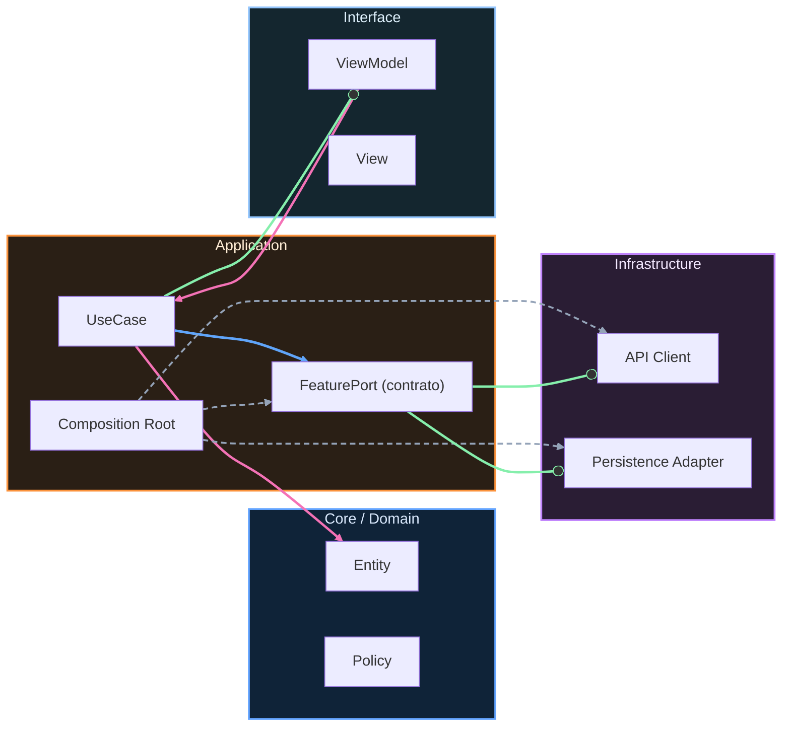

# Nivel Maestría · 01 · Contratos evolutivos entre dominios Android

Cuando un proyecto Android crece por features, llega un momento en el que cada equipo deja de pelear solo con su código y empieza a pelear con los límites entre equipos. Casi nunca se rompe por una clase mal escrita. Se rompe por contratos que nacieron para ir rápido y luego se volvieron rígidos.

Esta lección va justo a ese punto: cómo diseñar contratos entre dominios para que puedan evolucionar sin frenar la entrega ni provocar rupturas en cadena.

## El problema que aparece cuando el producto escala

Imagina que el dominio de catálogo expone un modelo que consume checkout. Al principio funciona perfecto porque ambos equipos se coordinan de cerca. Pasa el tiempo, catálogo necesita agregar nuevas reglas de precio y checkout mantiene supuestos antiguos sobre estructura de datos. El resultado típico: cada cambio en catálogo obliga a tocar checkout, y cada release empieza a depender de sincronización manual entre squads.

No es solo incomodidad. Es pérdida de velocidad organizacional.

## Qué es un contrato entre dominios en práctica

Un contrato entre dominios no es solo un DTO compartido. Es un acuerdo explícito sobre comportamiento, versión y compatibilidad en un punto de integración. Si ese acuerdo no existe, lo que tienes realmente es acoplamiento implícito.

El objetivo no es congelar el modelo para siempre. El objetivo es permitir cambio con compatibilidad controlada.

## El error más común: compartir modelos internos

Una de las decisiones que más deuda genera es exportar directamente modelos internos de un dominio para “evitar mapeos”. Al principio parece eficiente, pero en cuanto un dominio cambia su lógica interna, arrastra a todos los consumidores.

En Maestría, esa optimización deja de ser rentable. Conviene pagar el costo pequeño de mapear y ganar independencia evolutiva.

## Diseñar un contrato con intención de evolución

Un contrato evolutivo debería separar claramente el modelo público del modelo interno. El público existe para integración estable; el interno puede cambiar con libertad mientras mantenga la promesa externa.

Un ejemplo simple entre dominio `catalog` y dominio `checkout`:

```kotlin
package com.stackmyarchitecture.catalog.contract

data class CatalogItemContractV1(
    val id: String,
    val title: String,
    val priceCents: Long,
    val currency: String,
    val isAvailable: Boolean
)

interface CatalogReadContractV1 {
    suspend fun getItemById(itemId: String): CatalogItemContractV1?
}
```

Aquí hay una decisión importante. El contrato está versionado desde el inicio. No porque quieras sobre-diseñar, sino porque asumir evolución futura te evita migraciones traumáticas.

## Cómo evoluciona sin romper consumidores

Supongamos que catálogo necesita exponer precio promocional y origen fiscal. En vez de romper `V1`, introduces `V2` y mantienes compatibilidad durante una ventana acordada.

```kotlin
package com.stackmyarchitecture.catalog.contract

data class CatalogItemContractV2(
    val id: String,
    val title: String,
    val basePriceCents: Long,
    val finalPriceCents: Long,
    val currency: String,
    val taxRegion: String,
    val isAvailable: Boolean
)

interface CatalogReadContractV2 {
    suspend fun getItemById(itemId: String): CatalogItemContractV2?
}
```

La clave aquí no es solo crear `V2`. La clave es sostener convivencia temporal con política explícita de deprecación para que checkout migre sin bloqueo de release.

## Implementación interna: adaptadores en vez de acoplamiento directo

Dentro del dominio productor, implementas ambos contratos desde un adaptador que traduce modelo interno a cada versión pública.

```kotlin
class CatalogContractAdapter(
    private val repository: CatalogRepository
) : CatalogReadContractV1, CatalogReadContractV2 {

    override suspend fun getItemById(itemId: String): CatalogItemContractV1? {
        val item = repository.findById(itemId) ?: return null

        return CatalogItemContractV1(
            id = item.id,
            title = item.title,
            priceCents = item.finalPriceCents,
            currency = item.currency,
            isAvailable = item.isAvailable
        )
    }

    override suspend fun getItemById(itemId: String): CatalogItemContractV2? {
        val item = repository.findById(itemId) ?: return null

        return CatalogItemContractV2(
            id = item.id,
            title = item.title,
            basePriceCents = item.basePriceCents,
            finalPriceCents = item.finalPriceCents,
            currency = item.currency,
            taxRegion = item.taxRegion,
            isAvailable = item.isAvailable
        )
    }
}
```

Este patrón resuelve un problema organizacional real: permite que el productor avance internamente y que los consumidores migren a su ritmo dentro de una ventana acordada.

## Consumidor: migrar sin frenar sprint completo

En checkout, la migración puede hacerse incremental. Primero se integra `V2` detrás de un camino controlado, se valida en entorno real y luego se retira `V1` cuando la adopción está completa.

Si además conectas esta transición con observabilidad, puedes medir qué porcentaje de tráfico sigue pasando por `V1` y decidir retiro con evidencia en lugar de fechas arbitrarias.

## Política de deprecación: lo que evita contratos zombis

Sin política clara, las versiones antiguas nunca mueren y el sistema acumula carga cognitiva. Con política clara, cada versión tiene ciclo de vida conocido.

Un documento como `docs/contracts/catalog-read-lifecycle.md` puede fijar algo sencillo y efectivo:

```md
# Catalog Read Contract Lifecycle

V1
- Estado actual: Deprecated
- Soporte garantizado hasta: 2026-06-30
- Consumidores pendientes: checkout-legacy

V2
- Estado actual: Active
- Requerido para nuevas integraciones desde: 2026-03-01

Regla de retirada
- V1 se elimina cuando no haya consumidores activos durante 2 releases consecutivas
```

No parece sofisticado, pero evita una gran cantidad de fricción entre equipos.

## Qué cambia en la gobernanza técnica con este enfoque

Cuando los contratos son evolutivos, la conversación entre dominios deja de ser “me has roto” y pasa a ser “cómo planificamos migración sin bloquear roadmap”. Ese cambio de lenguaje refleja un cambio de madurez.

Ya no dependes de sincronización perfecta entre squads en una misma semana. Dependes de acuerdos explícitos de compatibilidad y ventanas de transición.

## Riesgos que conviene vigilar

El principal riesgo es versionar por reflejo sin criterio, creando demasiadas variantes innecesarias. Versionar bien no significa crear V2 para cualquier detalle menor. Significa versionar cuando cambia semántica de integración o contrato funcional.

Otro riesgo es no retirar versiones antiguas. Un contrato evolutivo sano tiene entrada y salida, no solo entrada.

## Cierre de la lección

La evolución entre dominios no tiene por qué ser dolorosa si el contrato está diseñado como acuerdo de compatibilidad y no como exposición de internals.

Cuando haces esto bien, cada dominio conserva autonomía sin convertir la integración en una fuente constante de regresiones.

En la siguiente lección vamos a profundizar en límites de contexto y ownership técnico para que esa autonomía no se quede solo en contratos, sino que también se refleje en organización de código, decisiones y responsabilidad operativa.
<!-- auto-gapfix:layered-mermaid -->
## Diagrama de arquitectura por capas



La lectura del diagrama sigue esta semantica:
1. `-->` dependencia directa en runtime.
2. `-.->` wiring o configuracion.
3. `==>` contrato o abstraccion.
4. `--o` salida o propagacion de resultado.
