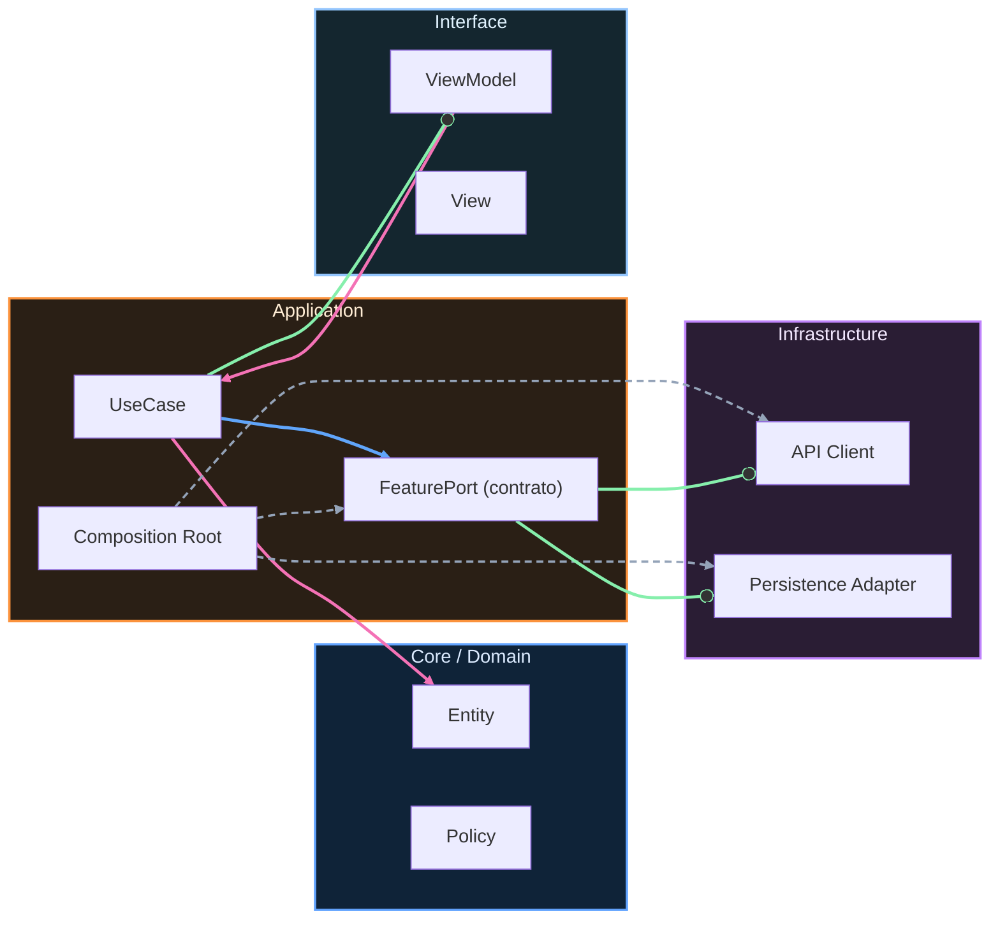

# Nivel Maestría · 02 · Bounded Contexts y ownership técnico en Android real

Cuando un proyecto Android crece de verdad, el problema principal deja de ser "cómo escribir esta pantalla" y pasa a ser "quién decide sobre qué parte del sistema". Si esa frontera no está clara, empiezan las fricciones silenciosas: cambios que rompen otras features, PRs eternos porque nadie sabe quién debe aprobar, y una sensación constante de que todo está conectado con todo.

La idea de Bounded Context entra justo para resolver eso. No es una moda de arquitectura. Es una forma de poner límites concretos para que cada equipo pueda avanzar sin pisar a los demás.

## El síntoma de que necesitas contextos explícitos

Imagina una app con tres áreas fuertes: catálogo, checkout y perfil. Al principio todo vive feliz dentro del mismo módulo `app` y parece práctico. Pero en cuanto catálogo cambia la lógica de precios, checkout falla tests. Luego perfil necesita leer estado de sesión y termina importando utilidades que también usan catálogo y checkout. En pocos meses tienes una telaraña.

El problema no es solo técnico. También es de responsabilidad. Si un bug nace en checkout pero se manifiesta en catálogo, ¿quién lo arregla? Si nadie lo sabe con claridad, el sistema ya perdió ownership.

## Qué significa bounded context en este curso

En este curso vamos a usar bounded context como una frontera de lenguaje, código y decisiones. Lenguaje, porque un término puede significar cosas diferentes según el dominio. Código, porque cada contexto debería poder evolucionar con cambios internos sin forzar refactor en cadena. Decisiones, porque hay un equipo dueño que mantiene reglas y contratos de esa zona.

No buscamos aislamiento absoluto. Buscamos autonomía con integración gobernada.

## Una estructura de proyecto que refleja ownership

Cuando el ownership técnico está bien diseñado, la estructura del repo te lo cuenta incluso antes de abrir una clase.

```text
stack-my-architecture-android/
  app/
  core/
    ui/
    network/
    persistence/
  features/
    catalog/
      domain/
      application/
      infrastructure/
      presentation/
      contract/
    checkout/
      domain/
      application/
      infrastructure/
      presentation/
      contract/
    profile/
      domain/
      application/
      infrastructure/
      presentation/
      contract/
```

Aquí hay una decisión clave: cada feature importante se trata como un contexto con fronteras claras, y `core` queda para capacidades transversales técnicas, no para reglas de negocio mezcladas.

## Qué entra y qué no entra en cada contexto

Un contexto de catálogo decide cómo interpreta disponibilidad, precio base, precio final y reglas de visibilidad de ítems. Checkout decide cómo compone una compra, valida stock en el flujo de pago y calcula restricciones de confirmación. Perfil decide identidad, preferencias y estado de sesión del usuario desde su propia perspectiva.

Si checkout necesita datos de catálogo, no entra a sus tablas ni a sus modelos internos. Consume contrato. Eso protege a ambos lados. Catálogo mantiene libertad interna y checkout obtiene estabilidad en integración.

## Ownership técnico no es solo "equipo responsable"

Ownership técnico también significa capacidad real de gobernar cambios. Si dices que catálogo es owner, pero cualquier equipo puede modificar sus clases críticas sin revisión de catálogo, ese ownership es decorativo.

Por eso, ownership sano combina tres cosas. La primera es frontera de código visible. La segunda es contrato de integración versionado, como viste en la lección anterior. La tercera es regla de cambio: las decisiones que rompen semántica del contexto pasan por su owner.

## Un ejemplo concreto de anti-patrón y su reparación

Veamos una situación habitual. Checkout accede a una entidad interna de catálogo porque "así evitamos duplicar campos".

```kotlin
package com.stackmyarchitecture.checkout.infrastructure

import com.stackmyarchitecture.catalog.infrastructure.local.CatalogEntity

class CheckoutCatalogBridge {
    fun toLineItem(entity: CatalogEntity): CheckoutLineItem {
        return CheckoutLineItem(
            id = entity.id,
            title = entity.title,
            unitPriceCents = entity.finalPriceCents,
            available = entity.visible && entity.stock > 0
        )
    }
}
```

Este código parece inocente, pero está acoplado al almacenamiento interno de catálogo. Si catálogo cambia su esquema local o redefine visibilidad, checkout hereda el impacto sin negociación.

La reparación pasa por mover la integración a contrato público.

```kotlin
package com.stackmyarchitecture.checkout.infrastructure

import com.stackmyarchitecture.catalog.contract.CatalogItemContractV2

class CheckoutCatalogBridge {
    fun toLineItem(item: CatalogItemContractV2): CheckoutLineItem {
        return CheckoutLineItem(
            id = item.id,
            title = item.title,
            unitPriceCents = item.finalPriceCents,
            available = item.isAvailable
        )
    }
}
```

Lo importante aquí no es el mapper en sí. Lo importante es lo que evita: que checkout se convierta en rehén de internals de catálogo.

## Cómo se ve el ownership en decisiones de API interna

Cuando un contexto expone un caso de uso para otros dominios, no debería filtrar su estructura interna en la firma. Debería exponer intención de negocio.

```kotlin
package com.stackmyarchitecture.catalog.contract

interface CatalogReadContractV2 {
    suspend fun getItemById(itemId: String): CatalogItemContractV2?
    suspend fun searchItems(query: String, limit: Int): List<CatalogItemContractV2>
}
```

Estas dos funciones hablan en lenguaje de consumo de catálogo, no en lenguaje de base de datos local ni de DTO remoto. Esa diferencia protege al contrato de cambios de implementación.

## Qué papel juega Hilt en bounded contexts

Hilt no define tus contextos, pero sí puede reforzar sus límites. Si cada contexto registra sus bindings en módulos propios y exporta solo interfaces de contrato, reduces el riesgo de acoplamientos accidentales.

```kotlin
package com.stackmyarchitecture.catalog.di

import com.stackmyarchitecture.catalog.contract.CatalogReadContractV2
import com.stackmyarchitecture.catalog.infrastructure.CatalogContractAdapter
import dagger.Binds
import dagger.Module
import dagger.hilt.InstallIn
import dagger.hilt.components.SingletonComponent
import javax.inject.Singleton

@Module
@InstallIn(SingletonComponent::class)
abstract class CatalogContractModule {

    @Binds
    @Singleton
    abstract fun bindCatalogReadContractV2(
        impl: CatalogContractAdapter
    ): CatalogReadContractV2
}
```

Este tipo de binding deja claro qué se exporta como frontera pública de catálogo. El resto de clases del contexto pueden seguir siendo internas al módulo.

## Errores organizacionales que rompen el diseño aunque el código "compila"

Hay una trampa muy común en equipos en crecimiento: definir contextos en diagramas, pero no reflejarlos en reglas de revisión ni en ownership operativo. El código queda "bonito", pero en la práctica cualquier cambio urgente atraviesa fronteras sin control y la arquitectura se degrada sprint tras sprint.

Si quieres que bounded contexts funcionen, tienen que existir también en el proceso de trabajo. Cuando una integración cambia semántica, esa conversación no se cierra solo con un PR. Se cierra con acuerdo de contrato, ventana de transición y plan de retiro.

## Cómo saber si tus contextos están sanos

Un contexto está sano cuando puede cambiar internals sin romper consumidores que respetan contrato. Está sano cuando una incidencia se enruta a un owner claro sin debate eterno. Está sano cuando la conversación entre equipos es sobre evolución acordada y no sobre "quién rompió qué" en caliente.

Si no tienes eso, no pasa nada: no significa que el proyecto esté perdido. Significa que toca invertir en límites y ownership antes de seguir agregando features al ritmo actual.

## Cierre de la lección

Bounded contexts no son un lujo para empresas gigantes. Son una necesidad práctica en cualquier producto que ya superó la etapa de una sola feature y un solo equipo tomando todas las decisiones.

Cuando defines bien esos límites en Android, no solo mejoras arquitectura. Mejoras coordinación, velocidad de entrega y calidad de decisiones técnicas en el tiempo.

En la siguiente lección vamos a llevar esta idea un paso más allá con un mapa de dependencias entre contextos y una estrategia concreta para reducir acoplamiento circular sin frenar roadmap.

## Profundización: cómo sostener límites cuando llega la presión transversal

Hasta aquí vimos la parte estructural del problema, pero en proyectos reales el punto crítico aparece cuando llega una entrega con fecha fija que toca varios dominios a la vez. Es justo ahí donde muchos equipos rompen fronteras con la excusa de “solo esta vez”, y esa excepción termina convirtiéndose en deuda recurrente.

Para evitarlo, necesitas una regla que sea simple de entender y difícil de malinterpretar: si un cambio requiere conocimiento interno de otro contexto, ese cambio no está listo para implementación directa. Primero hay que negociar contrato o capacidad compartida explícita.

Esta regla no existe para ralentizar. Existe para proteger la autonomía de los contextos en escenarios de prisa, que es cuando más fácil es degradar arquitectura.

## Qué ownership técnico debe quedar explícito en el repositorio

Una frontera de contexto no se sostiene solo con carpetas. Se sostiene cuando el equipo puede responder sin dudas quién decide semántica de contrato, quién aprueba cambios de integración y quién responde ante degradaciones que nazcan en ese borde.

Puedes reflejar ese ownership con un documento de contexto por feature donde quede claro alcance, contrato exportado y responsables de evolución. Lo importante no es el formato exacto, sino que la responsabilidad no quede implícita.

```md
# Context Ownership · catalog

Alcance
Catalog es responsable de disponibilidad, estructura de producto y semántica de precios publicados.

Contrato exportado
CatalogReadContractV2

Regla de cambio
Cambio semántico de contrato requiere ventana de transición y aprobación del owner de catalog.

Incidentes de frontera
Si un consumidor interpreta mal un campo contractual, catalog y consumidor abren corrección conjunta con decisión registrada.
```

Este tipo de artefacto evita una discusión muy costosa: “yo pensé que ese campo significaba otra cosa”. En arquitectura avanzada, reducir ambigüedad semántica vale más que agregar utilidades nuevas.

## Cómo gobernar excepciones sin abrir una grieta permanente

Hay casos donde un equipo necesita saltarse temporalmente la frontera para resolver un incidente de negocio urgente. Negar eso de forma absoluta no es realista. Lo peligroso no es la excepción puntual; lo peligroso es la excepción sin caducidad.

Una excepción bien gobernada debería incluir cuatro datos mínimos: motivo, alcance técnico exacto, fecha de retiro y responsable de corrección. Si falta alguno, lo más probable es que esa excepción se quede viva durante meses.

## Traducir ownership a revisión de código y CI

Si quieres que el ownership sea operativo, los cambios de frontera deben ser visibles desde PR. Cuando un diff toca contrato de `catalog`, el proceso de revisión debería exigir validación del owner del contexto y evidencia de compatibilidad con consumidores activos.

Esto se puede reforzar con quality gates que detecten importaciones prohibidas entre módulos de features. No para castigar al equipo, sino para que el sistema avise temprano cuando un atajo amenaza la autonomía acordada.

## Qué observar para saber si tu modelo de contextos funciona

No basta con que compile. Lo que importa es el comportamiento del sistema y del equipo en el tiempo. Si los cambios internos de un contexto se vuelven frecuentes y los consumidores no se rompen, es buena señal. Si las incidencias en integraciones se resuelven rápido porque ownership está claro, es buena señal. Si cada entrega transversal vuelve a abrir discusiones de semántica básica, hay una brecha de diseño que todavía no se cerró.

## Conclusión accionable de la lección

Bounded contexts aportan valor cuando dejan de ser una idea de arquitectura y se convierten en una práctica diaria de decisión. Eso implica frontera técnica, contrato versionado, ownership explícito y gobernanza de excepciones.

Si al terminar esta lección quieres validar aplicación real en tu proyecto, haz una prueba sencilla: toma una integración entre dos features y verifica si puedes identificar contrato, owner y regla de evolución sin preguntar en chat interno. Si no puedes, ya sabes exactamente dónde empezar a mejorar.

<!-- auto-gapfix:layered-mermaid -->
## Diagrama de arquitectura por capas



La lectura del diagrama sigue esta semantica:
1. `-->` dependencia directa en runtime.
2. `-.->` wiring o configuracion.
3. `==>` contrato o abstraccion.
4. `--o` salida o propagacion de resultado.
