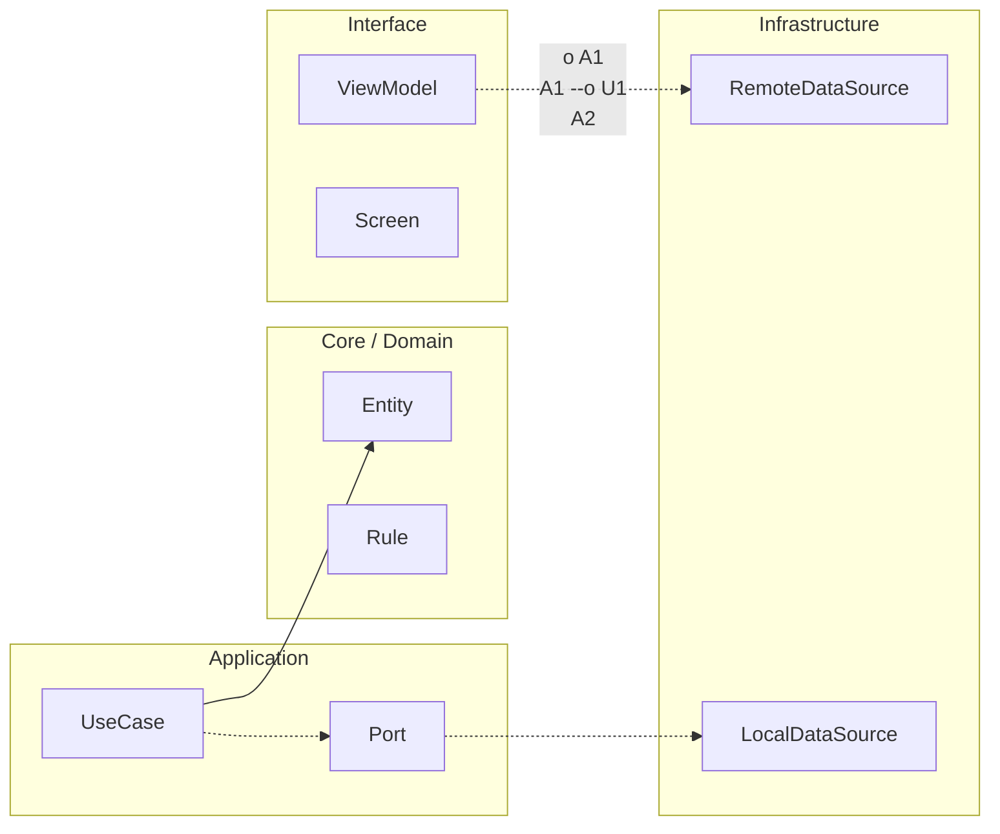

# Nivel Maestría · 03 · Mapa de dependencias y acoplamiento circular en Android

Cuando un sistema Android llega a cierto tamaño, el código deja pistas muy claras de su salud arquitectónica. Una de las más importantes es el patrón de dependencias entre contextos. Si ese mapa está limpio, el equipo evoluciona con ritmo. Si ese mapa se vuelve una red circular, cada cambio pequeño empieza a sentirse caro.

En esta lección vamos a aterrizar un problema que casi todos los equipos viven tarde o temprano: el acoplamiento circular entre features. No vamos a tratarlo como teoría abstracta. Lo vamos a ver como un problema de entrega diaria, de tiempos de revisión y de regresiones que parecen "misteriosas" hasta que miras el grafo de dependencias.

## Qué pasa cuando el acoplamiento circular aparece

Imagina que `catalog` depende de `checkout` para conocer reglas de compra rápida, `checkout` depende de `profile` para restricciones por tipo de usuario y `profile` depende de `catalog` para preferencias de contenido mostrable. Ninguna dependencia parece grave por separado. El problema real aparece cuando juntas las tres.

Desde fuera, lo notas como una cadena de efectos secundarios: cambias una interfaz en `profile`, se recompilan módulos inesperados, fallan tests en `checkout`, y luego `catalog` rompe en runtime por un supuesto que nadie sabía que existía. Eso no es mala suerte. Es la consecuencia natural de un ciclo.

## El ciclo no rompe solo compilación, rompe ownership

Cuando hay ciclo, nadie es realmente autónomo. Aunque tengas owners por contexto en papel, en la práctica cada equipo necesita coordinarse con demasiada frecuencia para tocar su propio dominio. El resultado es una falsa sensación de avance: se cierran PRs, pero la capacidad de evolucionar baja sprint a sprint.

Aquí aparece una idea clave de Maestría: el diseño de dependencias es diseño de capacidad organizacional. No es un detalle técnico aislado.

## Un ejemplo realista de ciclo en módulos Android

Supongamos esta estructura en `settings.gradle.kts`:

```kotlin
include(
    ":app",
    ":core:ui",
    ":features:catalog",
    ":features:checkout",
    ":features:profile"
)
```

Ahora mira estas dependencias simplificadas:

```kotlin
// features/catalog/build.gradle.kts
dependencies {
    implementation(project(":features:checkout"))
}

// features/checkout/build.gradle.kts
dependencies {
    implementation(project(":features:profile"))
}

// features/profile/build.gradle.kts
dependencies {
    implementation(project(":features:catalog"))
}
```

Aunque Gradle detecte parte del problema en build, el daño arquitectónico ya empezó antes. Los contextos dejaron de estar delimitados y ahora están atrapados en una dependencia mutua que se autoalimenta.

## Cómo romper el ciclo sin parar el roadmap

La salida no suele ser "reescribir todo". La salida práctica es identificar qué información cruza fronteras y convertir ese cruce en contrato estable o en capacidad compartida neutral.

Si `catalog` necesita una validación que hoy vive en `checkout`, probablemente no necesita todo `checkout`. Necesita una abstracción concreta de esa validación. Esa abstracción puede vivir en un módulo de contrato o en un `core` de capacidades de dominio transversal, según el caso.

Lo importante es que la dirección de dependencia vuelva a ser clara y acíclica.

## Reencuadre de dependencias con contratos

Vamos a mover la integración hacia interfaces para evitar dependencia directa entre features.

```kotlin
package com.stackmyarchitecture.checkout.contract

interface PurchaseEligibilityContract {
    suspend fun canBuy(userId: String, itemId: String): Boolean
}
```

Ahora `catalog` ya no depende del módulo completo de checkout. Depende de un contrato mínimo que expresa intención, no implementación.

```kotlin
package com.stackmyarchitecture.catalog.application

class CatalogQuickBuyUseCase(
    private val eligibilityContract: PurchaseEligibilityContract
) {
    suspend fun isQuickBuyEnabled(userId: String, itemId: String): Boolean {
        return eligibilityContract.canBuy(userId = userId, itemId = itemId)
    }
}
```

Fíjate en lo que esto resuelve de fondo. `catalog` obtiene la capacidad que necesita, pero no arrastra casos de uso internos, modelos locales ni reglas de infraestructura de `checkout`.

## Dónde implementar cada lado para preservar límites

El contrato vive como frontera. La implementación concreta vive en el owner del dominio que sabe resolver esa lógica. En este caso, checkout implementa `PurchaseEligibilityContract` y la registra por DI.

```kotlin
package com.stackmyarchitecture.checkout.infrastructure

class PurchaseEligibilityAdapter(
    private val riskRules: CheckoutRiskRules,
    private val profileReadContract: ProfileReadContractV2
) : PurchaseEligibilityContract {

    override suspend fun canBuy(userId: String, itemId: String): Boolean {
        val profile = profileReadContract.getUserProfile(userId) ?: return false
        return riskRules.isEligible(profile = profile, itemId = itemId)
    }
}
```

Este diseño tiene una consecuencia muy buena para el día a día. Si checkout cambia internals de `riskRules`, catálogo no debería enterarse mientras el contrato siga estable.

## Cómo detectar ciclos antes de que te exploten en sprint

Esperar a que falle CI es tarde. Lo útil es tratar el grafo de dependencias como señal de salud continua. Cuando un equipo propone una nueva dependencia entre features, hay que revisar si realmente expresa necesidad de negocio o si está encubriendo una fuga de frontera.

Una regla simple y poderosa es esta: una feature no importa otra feature por conveniencia. Si necesita capacidad ajena, consume contrato explícito. Si necesita UI compartida, usa `core:ui`. Si necesita utilidades técnicas puras, usa un módulo core técnico. Lo que no vale es cruzar fronteras de dominio para atajos.

## Integrarlo en quality gates de CI

Para que esto no dependa de memoria humana, conviene automatizar un control que falle pipeline cuando detecta dependencias prohibidas o ciclos. Puedes hacerlo con plugins especializados de arquitectura o con una verificación custom sobre una matriz de dependencias permitidas.

Lo esencial aquí no es la herramienta exacta. Es que la regla sea executable. Si la regla vive solo en un documento, tarde o temprano se rompe bajo presión de entrega.

## El equilibrio que hay que cuidar

Hay un riesgo al endurecer estas reglas: caer en burocracia y bloquear cambios legítimos. Por eso la gobernanza madura no dice solo "no". También da una ruta de excepción temporal, con caducidad y plan de corrección.

Esa combinación permite mantener ritmo sin sacrificar dirección arquitectónica.

## Cierre de la lección

El acoplamiento circular no es un accidente menor. Es una señal de que los contextos están perdiendo autonomía y de que el sistema está empezando a pagar intereses de diseño.

Cuando conviertes dependencias implícitas en contratos explícitos, y cuando automatizas la validación del grafo en CI, recuperas algo más valioso que una build verde: recuperas capacidad de evolución sostenida.

En la siguiente lección vamos a llevar esto al terreno operativo de cambios transversales, viendo cómo coordinar migraciones entre varios contextos sin convertir cada release en una negociación de alto estrés.

## Profundización: leer el grafo como señal de riesgo evolutivo

Cuando un equipo madura, deja de mirar dependencias como un tema de compilación y empieza a mirarlas como un tema de capacidad futura. Un ciclo hoy puede no romper nada visible. Pero mañana encarece cada cambio porque obliga a tocar demasiados puntos a la vez. Esa es la razón por la que el grafo no se revisa solo cuando falla build: se revisa como parte de salud arquitectónica continua.

Una forma práctica de empezar es clasificar cada dependencia nueva según su intención real. Si la dependencia aporta una capacidad de dominio ajena, debería entrar por contrato. Si aporta infraestructura técnica compartida, debería vivir en core técnico. Si no encaja en ninguno de esos caminos, probablemente estás frente a un atajo que mañana será deuda.

## Qué información falta cuando solo miras “qué módulo importa a cuál”

El mapa de dependencias gana valor cuando también incluye semántica de relación. No es lo mismo una dependencia de API contractual estable que una dependencia a implementación concreta de infraestructura. Ambas pueden verse similares en Gradle, pero su impacto evolutivo es muy distinto.

Por eso conviene acompañar la revisión del grafo con una pregunta fija: esta arista, ¿conecta por intención de negocio explícita o por conveniencia técnica temporal? La respuesta cambia completamente la decisión.

## Guardrails de CI que bloquean ciclos sin frenar el ritmo del equipo

La automatización no debe ser una barrera ciega. Debe actuar como red de seguridad temprana. Un guardrail útil detecta ciclos y dependencias prohibidas, pero permite un mecanismo de excepción temporal con trazabilidad, fecha de retiro y owner responsable.

Puedes modelarlo con una configuración versionada de reglas permitidas, donde cada excepción requiera ticket y caducidad. Así evitas el caos de excepciones eternas y, al mismo tiempo, no paralizas una corrección urgente.

```yaml
# docs/architecture/dependency-rules.yml
allowed:
  - from: features:catalog
    to: core:ui
  - from: features:catalog
    to: features:checkout:contract

temporary_exceptions:
  - from: features:profile
    to: features:catalog
    reason: "Incidente INC-4821 en flujo legacy"
    owner: "team-profile"
    expires_on: "2026-03-15"
    ticket: "ARCH-219"
```

La decisión de separar `allowed` y `temporary_exceptions` resuelve un problema operativo muy concreto: distinguir arquitectura objetivo de deuda controlada. Sin esa distinción, todo termina mezclado y nadie sabe qué limpiar primero.

## Cómo cerrar el ciclo de mejora después de detectar un acoplamiento

Detectar una arista problemática es solo el principio. Lo que marca la diferencia es cerrar el ciclo con una migración concreta. Eso implica definir contrato de reemplazo, mover consumidores gradualmente y eliminar dependencia antigua con fecha realista pero exigente.

Si la detección no viene acompañada de plan de salida, el grafo mejora en teoría y empeora en práctica.

## Conclusión accionable de la lección

Si quieres aplicar esta lección mañana en tu proyecto, toma una dependencia nueva propuesta en el sprint actual y sométela a este filtro simple: intención, frontera, alternativa por contrato y plan de retiro si requiere excepción temporal. Con ese ejercicio único ya empiezas a convertir arquitectura en sistema de decisión, no en decoración documental.

Ese hábito es el que prepara el siguiente paso: coordinar migraciones transversales entre varios contextos sin perder control ni ritmo de entrega.

<!-- auto-gapfix:layered-mermaid -->
## Diagrama de arquitectura por capas



La lectura del diagrama sigue esta semantica:
1. `-->` dependencia directa en runtime.
2. `-.->` contrato o abstraccion.
3. `-.o` wiring o composicion.
4. `--o` salida o propagacion de resultado.
