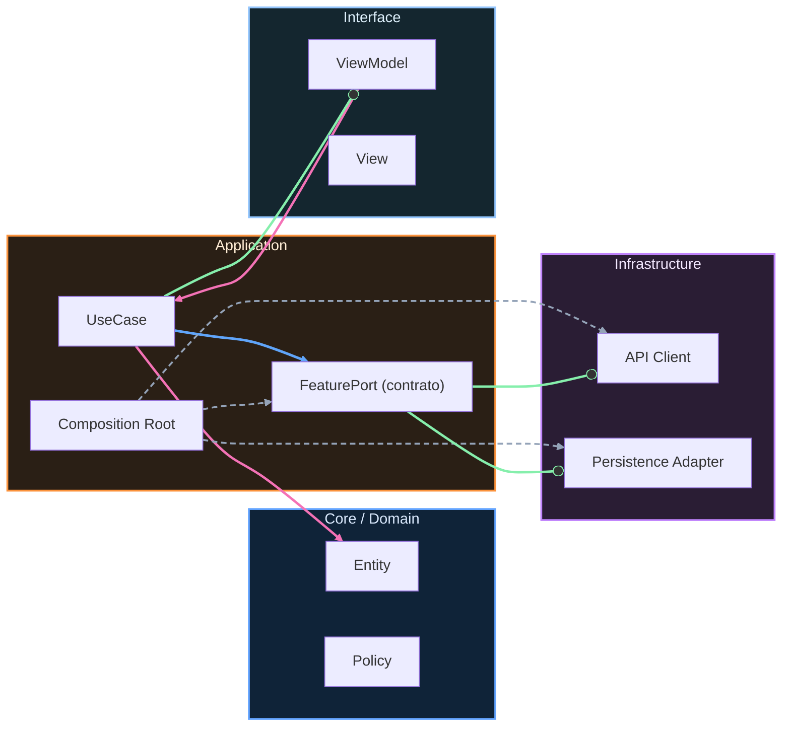

# Nivel Maestría · 04 · Migraciones transversales sin bloqueo en Android

Hay un momento muy delicado en la vida de una app Android. No ocurre cuando todo está roto, sino cuando la app funciona, crece, tiene usuarios y, precisamente por eso, ya no puedes cambiar nada grande “de golpe” sin arriesgarte a romper algo crítico. En ese punto aparecen las migraciones transversales: cambios que tocan varios contextos a la vez, como autenticación, contratos internos, persistencia o navegación.

Esta lección existe para resolver ese problema con criterio real de producción. La pregunta de fondo no es cómo hacer una migración técnicamente posible, sino cómo hacerla sin frenar al equipo, sin congelar el roadmap y sin convertir cada release en una apuesta peligrosa.

Cuando hablamos de migración transversal, hablamos de un cambio que cruza fronteras de equipos y de módulos. Puede ser mover un contrato de `v1` a `v2`, sustituir una política de caché, cambiar la semántica de un identificador, o introducir una nueva ruta de navegación compatible con deep links antiguos. Lo común en todos los casos es que hay consumidores en estados distintos de madurez, y no puedes exigir que todos migren el mismo día.

En la práctica, los equipos que se bloquean suelen caer en el mismo patrón. Diseñan la versión nueva, la publican y esperan adopción inmediata. Cuando eso no pasa, empiezan los parches: adaptadores improvisados, excepciones sin fecha de retiro, y una convivencia caótica entre formas viejas y nuevas de hacer lo mismo. El sistema sigue “vivo”, pero cada semana es más caro entenderlo.

La salida madura no es prohibir la evolución, sino diseñar la migración como producto interno. Eso implica pensar en compatibilidad temporal, observabilidad de adopción y retirada explícita de legado. No se trata de escribir más documentos; se trata de diseñar el cambio para que el equipo pueda seguir entregando mientras migra.

Imagina que `checkout` va a consumir un contrato de perfil nuevo porque necesita más contexto de riesgo para aprobar una compra. Hoy consume `ProfileReadContractV1`. El nuevo contrato, `ProfileReadContractV2`, trae un modelo más rico y permite decisiones mejores, pero no puedes apagar la versión anterior sin dejar a varios consumidores fuera de juego.

Lo correcto es abrir una fase de convivencia controlada. Esa convivencia no significa “dejarlo todo para siempre”, sino crear una ventana temporal donde `v1` y `v2` coexisten con reglas claras, instrumentación de uso y fecha de salida.

```kotlin
package com.stackmyarchitecture.profile.contract

data class ProfileSummaryV1(
    val userId: String,
    val accountLevel: String
)

data class ProfileSummaryV2(
    val userId: String,
    val accountLevel: String,
    val riskTier: String,
    val kycCompleted: Boolean
)

interface ProfileReadContractV1 {
    suspend fun getUserProfile(userId: String): ProfileSummaryV1?
}

interface ProfileReadContractV2 {
    suspend fun getUserProfile(userId: String): ProfileSummaryV2?
}
```

Aquí la decisión clave es obvia cuando la conectas con el problema real. No estamos duplicando por capricho. Estamos dando a los equipos consumidores una rampa de salida. `v2` expresa el futuro y `v1` sostiene el presente durante un tiempo corto y gobernado.

El siguiente movimiento importante es evitar que cada consumidor implemente su propio puente. Si cada equipo traduce `v1` a `v2` por su cuenta, tienes muchas conversiones distintas y una probabilidad alta de comportamientos inconsistentes. Por eso conviene centralizar el adaptador mientras dura la transición.

```kotlin
package com.stackmyarchitecture.profile.contract

class ProfileV1ToV2Adapter(
    private val v1: ProfileReadContractV1
) : ProfileReadContractV2 {

    override suspend fun getUserProfile(userId: String): ProfileSummaryV2? {
        val legacy = v1.getUserProfile(userId) ?: return null

        return ProfileSummaryV2(
            userId = legacy.userId,
            accountLevel = legacy.accountLevel,
            riskTier = "unknown",
            kycCompleted = false
        )
    }
}
```

Fíjate en la intención. Este adaptador no pretende ser “la verdad del negocio”. Pretende evitar bloqueo de equipos mientras todavía no todos consumen datos enriquecidos. Por eso usa valores de compatibilidad como `riskTier = "unknown"`. Es una degradación controlada, explícita, que te deja avanzar sin mentirte sobre la calidad de datos.

Ahora viene una decisión que separa un proceso sano de un proceso frágil: cómo inyectas uno u otro contrato sin desplegar builds especiales para cada equipo. La forma más limpia es resolverlo por configuración de migración en runtime o por feature flag, de modo que puedas encender `v2` gradualmente y revertir rápido si detectas efectos no previstos.

```kotlin
package com.stackmyarchitecture.checkout.infrastructure

class CheckoutProfileGateway(
    private val contractV2: ProfileReadContractV2,
    private val migrationConfig: MigrationConfig
) {

    suspend fun readProfile(userId: String): ProfileSummaryV2? {
        return if (migrationConfig.useProfileContractV2) {
            contractV2.getUserProfile(userId)
        } else {
            contractV2.getUserProfile(userId)
        }
    }
}
```

Puede parecer raro que ambos caminos llamen al mismo tipo en este ejemplo, pero justo ahí está la idea: `contractV2` puede ser implementación nativa o adaptada desde `v1` según composición en DI. El consumidor no necesita conocer esa diferencia. Así reduces complejidad local y controlas la migración desde la composición global.

Cuando este patrón se hace bien, el tablero operativo cambia de conversación. En vez de discutir opiniones, el equipo mira adopción real. Qué porcentaje de tráfico ya usa `v2`, en qué escenarios, con qué error rate y con qué latencia. Esa observabilidad convierte la migración en una operación medible, no en una narrativa subjetiva.

```kotlin
package com.stackmyarchitecture.core.observability

interface MigrationTelemetry {
    fun trackContractUsage(contractName: String, version: String)
    fun trackFallback(contractName: String, reason: String)
}
```

Cuando un flujo cae a comportamiento legacy, no lo escondes. Lo trazas. Ese dato sirve para priorizar a quién ayudar primero en la migración y para decidir si ya puedes apagar `v1` sin riesgo real.

Hay otro punto crítico: la retirada. Mucha deuda no nace al introducir compatibilidad; nace al no retirarla. Por eso cada migración transversal debería arrancar con fecha de corte prevista y criterio objetivo de cierre. Si no hay criterio de cierre, no hay migración, hay convivencia indefinida.

Un criterio de cierre realista suele combinar adopción funcional y estabilidad operativa. Por ejemplo, que el 100% del tráfico crítico de compra esté en `v2` durante dos ventanas de release consecutivas sin aumento de fallo ni degradación de latencia. Cuando eso se cumple, retirar `v1` deja de ser un salto de fe.

En Android, esta disciplina reduce una clase de incidentes muy típica: cambios que en local parecen correctos pero en producción rompen por consumidores rezagados. El problema no era el código “malo”; era un plan de migración incompleto.

Si conectas esta lección con las anteriores, verás el hilo completo de Maestría. Primero delimitamos ownership y bounded contexts. Luego limpiamos el mapa de dependencias para evitar ciclos. Ahora aprendemos a cambiar piezas transversales sin bloquear la entrega. Todo forma parte de la misma competencia: evolucionar sistemas vivos sin perder control.

En la siguiente lección vamos a bajar este enfoque a un caso operativo aún más exigente: cómo coordinar migraciones con ventanas de release, rollback preparado y comunicación técnica entre equipos para que la transición sea predecible incluso bajo presión.

<!-- auto-gapfix:layered-mermaid -->
## Diagrama de arquitectura por capas



La lectura del diagrama sigue esta semantica:
1. `-->` dependencia directa en runtime.
2. `-.->` wiring o configuracion.
3. `==>` contrato o abstraccion.
4. `--o` salida o propagacion de resultado.
