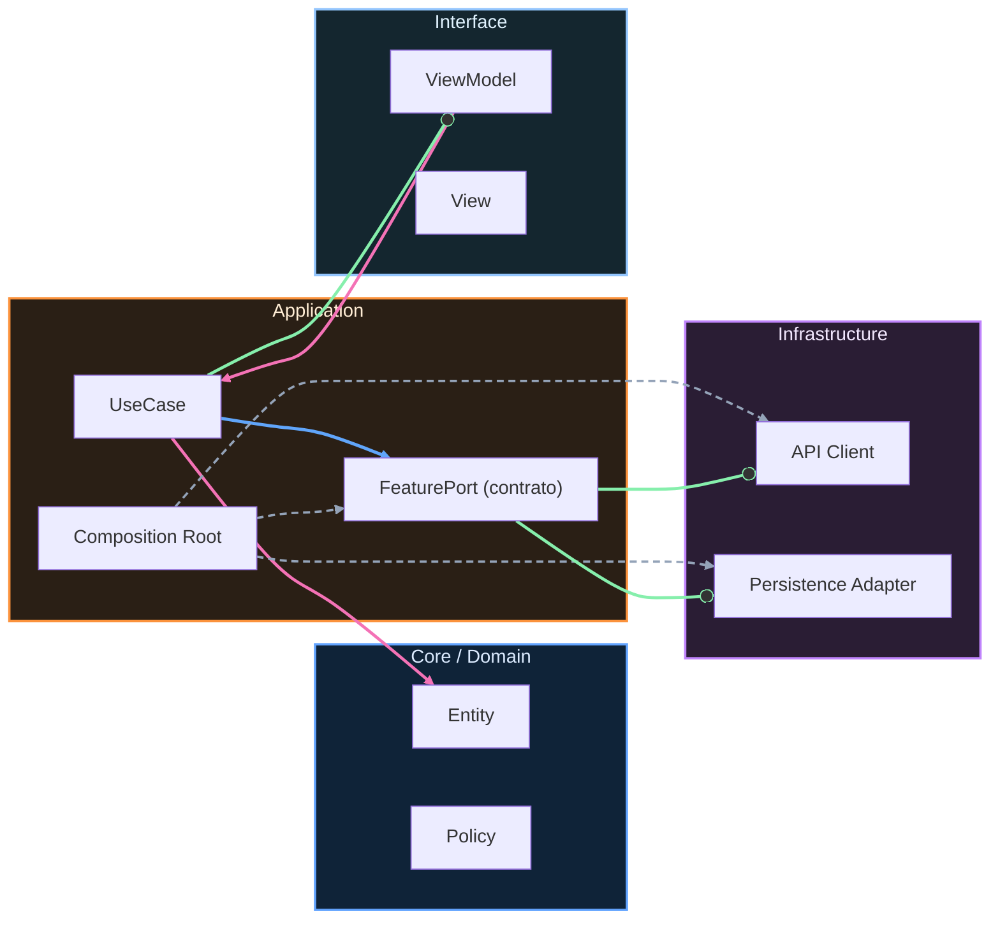

# Nivel Maestría · 05 · Coordinación de release, rollback y comunicación técnica en migraciones Android

Cuando una migración transversal entra en fase de despliegue, ya no estás resolviendo solo un problema de código. Estás gestionando riesgo en producción, expectativas de negocio y coordinación entre equipos que no siempre tienen la misma velocidad ni las mismas prioridades. Si esta parte falla, la arquitectura puede estar bien diseñada y aun así terminar en incidentes evitables.

En esta lección vamos a trabajar ese tramo final, el que más cuesta cuando no hay un marco claro. La idea no es dramatizar releases, sino quitarles azar. Un release deja de ser una apuesta cuando puedes responder tres preguntas con datos: qué se activa exactamente, cómo detectas degradación temprano y cómo vuelves atrás sin romper confianza ni perder trazabilidad.

Imagina que ya tienes `ProfileReadContractV2` desplegado y parte del tráfico de checkout usándolo con éxito. Todo parece estable en staging, pero en producción aparece una combinación de usuario y dispositivo que dispara un fallback inesperado. Si no preparaste el release para ese escenario, te quedas en modo reactivo. Empiezan mensajes urgentes, decisiones contradictorias y cambios apresurados. El coste real no es solo técnico; también es organizativo.

El objetivo de un release maduro es absorber ese tipo de sorpresa sin caos. Por eso conviene tratar la activación de la migración como una capacidad controlada, no como un cambio binario. En Android, una forma limpia de expresarlo es delegar la estrategia de activación en una política de rollout que puedas ajustar sin recompilar la app.

```kotlin
package com.stackmyarchitecture.core.release

data class MigrationRolloutState(
    val contractName: String,
    val targetVersion: String,
    val enabledPercent: Int,
    val rollbackEnabled: Boolean
)

interface RolloutPolicy {
    fun shouldUseNewPath(userHash: Int, state: MigrationRolloutState): Boolean
}

class PercentageRolloutPolicy : RolloutPolicy {
    override fun shouldUseNewPath(userHash: Int, state: MigrationRolloutState): Boolean {
        if (state.rollbackEnabled) return false
        val bucket = userHash % 100
        return bucket < state.enabledPercent
    }
}
```

Esta decisión resuelve un problema muy concreto. En lugar de activar la migración para todo el mundo a la vez, puedes mover el porcentaje de exposición según la salud observada. Si aparecen señales de riesgo, no necesitas inventar una solución en caliente. Ya tienes una palanca explícita para reducir exposición o desactivar el camino nuevo.

Ahora bien, esta palanca solo sirve de verdad cuando está conectada a observabilidad útil. Si miras métricas demasiado tarde o demasiado agregadas, el incidente ya explotó cuando te das cuenta. Por eso tiene sentido medir por versión de contrato y por ruta de ejecución, no únicamente por pantalla o feature.

```kotlin
package com.stackmyarchitecture.core.observability

interface ReleaseTelemetry {
    fun trackRouteSelection(contract: String, version: String, selectedNewPath: Boolean)
    fun trackMigrationError(contract: String, version: String, errorType: String)
    fun trackRollbackTrigger(contract: String, version: String, reason: String)
}
```

Con esta instrumentación, cuando subes de 25% a 50% de tráfico no estás “probando suerte”. Estás observando si la tasa de error y la latencia se mantienen dentro del umbral acordado. Si no se mantienen, el rollback deja de ser un debate emocional y pasa a ser una respuesta operativa prevista.

Una pieza que suele olvidarse es la comunicación técnica durante la ventana de release. No basta con decir “hemos desplegado”. Lo que realmente ayuda al equipo es comunicar el estado de la hipótesis. Qué esperábamos ver, qué vimos, qué decisión tomamos y por qué. Esa narrativa corta evita rumores internos y reduce fricción entre negocio, QA y desarrollo.

Cuando esta comunicación está bien hecha, incluso un rollback se vive como señal de control y no como fracaso. El mensaje implícito es claro: el sistema de seguridad funcionó, detectamos desviación y protegimos al usuario sin improvisar.

En términos de código, esto se traduce en separar la decisión de ruta de la lógica de negocio. El caso de uso no debería decidir porcentaje ni rollback. Debería pedir una capacidad y dejar que la política de release resuelva qué implementación concreta se utiliza en ese instante.

```kotlin
package com.stackmyarchitecture.checkout.application

class ResolvePurchaseProfileUseCase(
    private val profileGateway: CheckoutProfileGateway
) {
    suspend fun execute(userId: String): PurchaseProfileResult {
        val profile = profileGateway.readProfile(userId)
            ?: return PurchaseProfileResult.NotAvailable

        return PurchaseProfileResult.Available(
            userId = profile.userId,
            riskTier = profile.riskTier,
            kycCompleted = profile.kycCompleted
        )
    }
}

sealed interface PurchaseProfileResult {
    data object NotAvailable : PurchaseProfileResult
    data class Available(
        val userId: String,
        val riskTier: String,
        val kycCompleted: Boolean
    ) : PurchaseProfileResult
}
```

Esta separación te protege de un error bastante común: contaminar lógica de dominio con decisiones temporales de operación. La migración es temporal; el dominio debería permanecer legible cuando la migración termine y el código de transición desaparezca.

Otro tema clave es la cadencia de decisión durante el rollout. Si cambias porcentaje sin una ventana de observación razonable, no sabes si la mejora o el problema tiene relación causal con tu ajuste. Acabas reaccionando al ruido en vez de a la señal. En equipos maduros, cada cambio de exposición respeta una ventana mínima de observación y un criterio de salida acordado antes del release.

Cuando llega el momento de retirar la versión vieja, la operación también debería ser explícita. Retirar no es borrar archivos de un tirón. Es cerrar una fase con evidencia: adopción completa, estabilidad sostenida y ausencia de consumidores legacy. Solo entonces tiene sentido simplificar código y eliminar adaptadores.

En Android, ese cierre se nota enseguida en la mantenibilidad. Bajan condicionales de transición, desaparecen flags ya inútiles y las rutas de depuración vuelven a ser cortas. El sistema respira mejor porque dejó de cargar dos formas de resolver el mismo problema.

Con esta lección cerramos una parte central de Maestría: no solo diseñar migraciones, sino operarlas con calma incluso cuando hay presión real. En la siguiente, llevaremos esta misma lógica a un caso de escalado organizativo: cómo sostener consistencia técnica cuando varios equipos evolucionan contextos distintos en paralelo durante varios trimestres.

<!-- auto-gapfix:layered-mermaid -->
## Diagrama de arquitectura por capas



La lectura del diagrama sigue esta semantica:
1. `-->` dependencia directa en runtime.
2. `-.->` wiring o configuracion.
3. `==>` contrato o abstraccion.
4. `--o` salida o propagacion de resultado.
