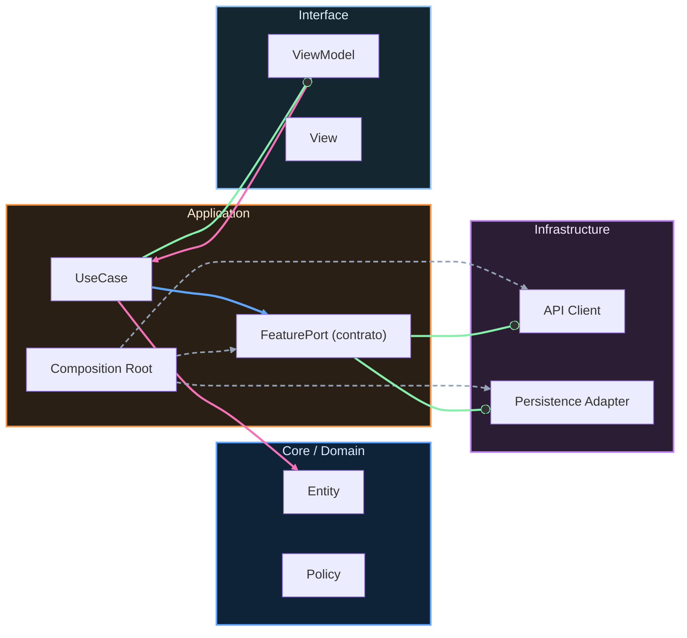

# Nivel Maestría · 06 · Evolución multi‑equipo y gobernanza trimestral en Android

Cuando un producto Android entra en una etapa donde varios equipos empujan cambios al mismo tiempo, la arquitectura deja de ser solo una cuestión de diseño técnico y pasa a ser una cuestión de coordinación. La sensación típica en ese momento es conocida: cada equipo “va bien” dentro de su propio backlog, pero el sistema completo empieza a perder coherencia. No porque la gente trabaje mal, sino porque falta un marco común para decidir qué se puede mover en paralelo y qué necesita sincronización explícita.

Esta lección aterriza ese punto. No vamos a hablar de gobernanza como burocracia, sino como mecanismo para sostener velocidad sin sacrificar estabilidad. La idea central es simple: si la arquitectura define límites, la gobernanza define cómo evolucionan esos límites con el tiempo.

Piensa en tres equipos trabajando durante el mismo trimestre. Uno está migrando contratos de perfil, otro evoluciona checkout y el tercero cambia rutas de navegación para soporte de deep links nuevos. Si cada uno optimiza su tramo sin mirar dependencias activas, lo que aparece en producción es una mezcla difícil de depurar: incompatibilidades suaves, fallos intermitentes y rollback parciales que no terminan de limpiar el estado.

El antídoto real no es parar todo y coordinar cada mínimo cambio. El antídoto es acordar un ritmo de integración con reglas claras de compatibilidad temporal. Eso permite que cada equipo mantenga autonomía diaria, pero dentro de un carril compartido que evita sorpresas sistémicas.

Una forma práctica de materializar ese carril es definir un calendario de ventanas técnicas por trimestre. No es un calendario para “reuniones infinitas”, sino para decisiones críticas que sí necesitan convergencia. En esas ventanas se acuerda qué contratos entran en convivencia dual, qué features quedan protegidas por freeze parcial y qué métricas habilitan la siguiente fase.

```kotlin
package com.stackmyarchitecture.governance

data class QuarterlyArchitectureWindow(
    val quarter: String,
    val migrationName: String,
    val compatibilityStart: String,
    val compatibilityEnd: String,
    val owningTeam: String
)

data class MigrationDecision(
    val migrationName: String,
    val proceedToNextPhase: Boolean,
    val rationale: String,
    val approvedBy: String
)
```

Este modelo no intenta reemplazar herramientas de gestión. Lo que hace es capturar decisiones de arquitectura con un lenguaje consistente. Eso resuelve un problema de fondo: cuando semanas después alguien pregunta por qué se mantuvo compatibilidad de una versión antigua, no depende de memoria oral. Hay trazabilidad explícita.

Otro problema habitual en escalado multi‑equipo es que cada squad usa métricas distintas para declarar “éxito”. Un equipo mira crash rate, otro mira latencia y otro solo mira si pasó CI. El resultado es que no existe una definición compartida de “listo para avanzar”. Por eso conviene acordar un contrato de salud técnica transversal.

```kotlin
package com.stackmyarchitecture.governance

data class MigrationHealthSnapshot(
    val migrationName: String,
    val adoptionPercent: Double,
    val errorRateP95: Double,
    val latencyP95Ms: Long,
    val rollbackCount: Int
)

interface MigrationGate {
    fun canAdvance(snapshot: MigrationHealthSnapshot): Boolean
}

class ConservativeMigrationGate : MigrationGate {
    override fun canAdvance(snapshot: MigrationHealthSnapshot): Boolean {
        return snapshot.adoptionPercent >= 0.95 &&
            snapshot.errorRateP95 <= 0.01 &&
            snapshot.latencyP95Ms <= 350 &&
            snapshot.rollbackCount == 0
    }
}
```

Aquí la decisión importante no es el número exacto de cada umbral. Lo importante es que todos los equipos juegan con la misma regla para pasar de fase. Eso evita discusiones estériles en momentos de presión y convierte la evolución en un proceso verificable.

Cuando este marco no existe, la deuda aparece en un lugar muy concreto: excepciones eternas. Un equipo pide mantener una compatibilidad “solo una semana más”, otro también, y sin darte cuenta acabas con una arquitectura que arrastra decisiones temporales durante meses. Por eso una gobernanza sana no solo aprueba excepciones; también fija fecha de retiro y owner de salida.

En Android esto importa especialmente porque el ecosistema de dispositivos y versiones añade variabilidad real. Si no pones límites temporales a las excepciones, cada release hereda complejidad acumulada y el coste de pruebas se dispara. El equipo siente que cada entrega pesa más que la anterior, aunque el alcance funcional sea parecido.

La comunicación entre equipos también cambia cuando la gobernanza está madura. Deja de ser “aviso informal por chat” y pasa a ser una narrativa técnica breve y repetible: estado actual, riesgo principal, decisión tomada y próxima señal esperada. Esa estructura corta evita malentendidos y, sobre todo, reduce dependencia de personas concretas para mantener contexto.

Para que esto no quede en documento, conviene conectar la gobernanza con los pipelines. Si una migración está fuera de ventana o incumple gate acordado, el sistema de calidad debería advertirlo temprano. No para bloquear por bloquear, sino para evitar que la inconsistencia se descubra cuando ya hay usuarios afectados.

Cuando miras este enfoque en perspectiva, aparece una ventaja clara: el trimestre deja de ser una sucesión de incendios técnicos y se convierte en una secuencia de decisiones con criterio acumulativo. Cada equipo mantiene ritmo, pero el producto conserva coherencia.

Con esta lección cerramos la parte de Maestría orientada a evolución organizativa. En la siguiente vamos a consolidar todo el recorrido del curso en una guía de operación final: cómo preparar una defensa técnica sólida del proyecto Android, conectando arquitectura, rendimiento, calidad y decisiones de negocio sin caer en discurso abstracto.

<!-- auto-gapfix:layered-mermaid -->
## Diagrama de arquitectura por capas


```mermaid
flowchart LR
  subgraph CORE["Core / Domain"]
    direction TB
    ENT[Entity]
    POL[Policy]
  end

  subgraph APP["Application"]
    direction TB
    BOOT[Composition Root]
    UC[UseCase]
    PORT["FeaturePort (contrato)"]
  end

  subgraph UI["Interface"]
    direction TB
    VM[ViewModel]
    VIEW[View]
  end

  subgraph INFRA["Infrastructure"]
    direction TB
    API[API Client]
    STORE[Persistence Adapter]
  end

  VM --> UC
  UC --> ENT
  UC ==> PORT
  BOOT -.-> PORT
  BOOT -.-> API
  BOOT -.-> STORE
  PORT --o API
  PORT --o STORE
  UC --o VM

  style CORE fill:#0f2338,stroke:#63a4ff,color:#dbeafe,stroke-width:2px
  style APP fill:#2a1f15,stroke:#fb923c,color:#ffedd5,stroke-width:2px
  style UI fill:#14262f,stroke:#93c5fd,color:#e0f2fe,stroke-width:2px
  style INFRA fill:#2a1d34,stroke:#c084fc,color:#f3e8ff,stroke-width:2px

  linkStyle 0 stroke:#f472b6,stroke-width:2.6px
  linkStyle 1 stroke:#f472b6,stroke-width:2.6px
  linkStyle 2 stroke:#60a5fa,stroke-width:2.8px
  linkStyle 3 stroke:#94a3b8,stroke-width:2px,stroke-dasharray:6 4
  linkStyle 4 stroke:#94a3b8,stroke-width:2px,stroke-dasharray:6 4
  linkStyle 5 stroke:#94a3b8,stroke-width:2px,stroke-dasharray:6 4
  linkStyle 6 stroke:#86efac,stroke-width:2.6px
  linkStyle 7 stroke:#86efac,stroke-width:2.6px
  linkStyle 8 stroke:#86efac,stroke-width:2.6px
```

---

## Ejercicio guiado

**Objetivo**: Redactar un RFC de una página para proponer un cambio transversal en tu proyecto.

**Pasos**:
1. Elige un cambio que afecte a más de un módulo o dominio de tu proyecto (por ejemplo: migrar de un sistema de navegación a otro, cambiar la política de caché, o introducir un nuevo contrato de autenticación).
2. Escribe el RFC siguiendo esta estructura mínima: (a) Título y autor, (b) Problema que resuelve, (c) Propuesta concreta, (d) Alternativas descartadas y por qué, (e) Impacto en equipos/módulos consumidores, (f) Criterio de aceptación y fecha límite de decisión.
3. Mantén cada sección en no más de 3-4 frases.
4. Comparte el RFC con al menos una persona (compañero, mentor o comunidad) y recoge una pregunta o comentario.
5. Condición de éxito: el RFC cabe en una página A4, cualquier lector puede entender el cambio propuesto sin preguntar contexto adicional y existe una fecha de decisión explícita.

<details>
<summary>Solución de referencia</summary>

```markdown
# RFC-001 · Migración de navegación a Navigation Compose
**Autor**: [tu nombre] · **Fecha límite de decisión**: 2026-04-01

## Problema
El sistema de navegación actual con FragmentManager genera acoplamiento entre pantallas
y dificulta las pruebas de flujos completos. Cada nueva pantalla requiere cambios en
múltiples ficheros no relacionados.

## Propuesta
Migrar a Navigation Compose con un único NavHost en la raíz de la app. Cada feature
expone su grafo de navegación como función interna y lo registra en el grafo global
mediante una interfaz `FeatureNavGraph`.

## Alternativas descartadas
- Mantener FragmentManager: deuda creciente que bloquea adopción de Compose.
- Migración big-bang: riesgo de bloquear features en vuelo durante semanas.

## Impacto en consumidores
Los módulos `auth`, `forms` y `profile` deben exponer su `NavGraph` nuevo.
Ventana de convivencia estimada: 3 sprints con adaptador de compatibilidad.

## Criterio de aceptación
100 % de pantallas críticas migradas, tests de navegación en verde, sin regresión
de tiempo de arranque medida en benchmark.
```

**Resultado esperado**: El alumno tiene un documento de una página que puede presentar en una reunión de 10 minutos y que genera conversación técnica de calidad en lugar de debate de opiniones.

</details>

La lectura del diagrama sigue esta semántica:
1. `-->` dependencia directa en runtime.
2. `-.->` wiring o configuración.
3. `==>` contrato o abstracción.
4. `--o` salida o propagación de resultado.
