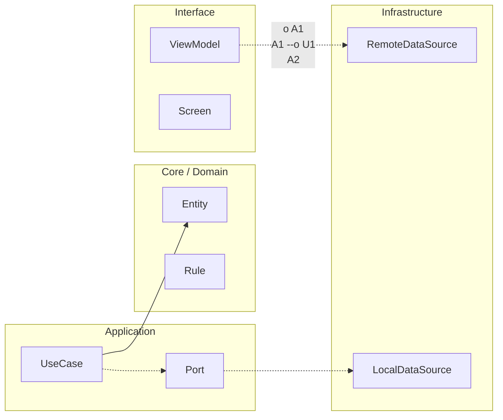

# Nivel Maestría · 07 · Defensa técnica del proyecto Android

Llegar al final de un curso técnico no significa solo tener código funcionando. Significa poder explicar por qué ese código existe así y no de otra forma. Esa diferencia es importante porque, en el mundo real, las decisiones se aprueban cuando se entienden. Si no sabes defender lo que construiste, el sistema puede estar bien hecho y aun así perder credibilidad.

Esta lección está pensada para ese momento exacto. No vamos a preparar una presentación “bonita”. Vamos a preparar una conversación técnica sólida, de las que tienes con un lead, con un arquitecto o con un equipo de producto cuando hay que decidir si una arquitectura está lista para escalar.

La trampa más común en una defensa es contar solo componentes: “tenemos Hilt, Room, WorkManager, tests...”. Eso describe herramientas, pero no demuestra criterio. Lo que de verdad convence es conectar cada elección con un problema concreto. Elegimos Room porque necesitábamos continuidad de experiencia sin red estable. Elegimos WorkManager porque ciertas tareas debían sobrevivir reinicios y no podían depender de que la app siguiera abierta. Elegimos contratos internos porque varios equipos necesitaban evolucionar en paralelo sin romperse entre sí.

Cuando explicas así, la conversación cambia. Ya no suena a checklist de tecnologías. Suena a diseño orientado a contexto.

Para ayudarte a estructurar esa conversación de forma natural, conviene tener un “mapa mental de defensa” en código y en arquitectura. Por ejemplo, si alguien te pregunta cómo protegiste coherencia entre UI y datos en escenarios de latencia alta, puedes enseñar cómo el `ViewModel` no depende del framework de red y cómo el repositorio centraliza la estrategia offline-first.

```kotlin
package com.stackmyarchitecture.tasks.application

class ObserveTasksUseCase(
    private val repository: TasksRepository
) {
    fun execute(): kotlinx.coroutines.flow.Flow<List<TaskItem>> {
        return repository.observeTasks()
    }
}

interface TasksRepository {
    fun observeTasks(): kotlinx.coroutines.flow.Flow<List<TaskItem>>
    suspend fun refreshIfNeeded()
}

data class TaskItem(
    val id: String,
    val title: String,
    val completed: Boolean
)
```

Este fragmento parece simple, y justo por eso es potente para una defensa. Muestra que el caso de uso expresa intención del dominio y evita contaminarse con detalles de Retrofit, Room o DataStore. Esa separación no es estética. Te permite cambiar infraestructura sin romper comportamiento observable de la capa de aplicación.

Después suele aparecer una pregunta clave: cómo se comporta este diseño cuando algo falla en producción. Aquí es donde mucha gente se queda sin narrativa porque su arquitectura no está conectada con operación. En tu caso, sí lo está: puedes explicar que la app tiene telemetría para migraciones, quality gates en CI y estrategia de rollback, de modo que la fiabilidad no depende de heroicidad individual.

```kotlin
package com.stackmyarchitecture.core.reliability

data class ReliabilitySignal(
    val feature: String,
    val errorRate: Double,
    val p95LatencyMs: Long
)

interface ReliabilityEvaluator {
    fun isHealthy(signal: ReliabilitySignal): Boolean
}

class DefaultReliabilityEvaluator : ReliabilityEvaluator {
    override fun isHealthy(signal: ReliabilitySignal): Boolean {
        return signal.errorRate <= 0.01 && signal.p95LatencyMs <= 400
    }
}
```

Otra parte que marca diferencia en una defensa profesional es reconocer trade-offs sin ponerte a la defensiva. Si alguien te pregunta por qué mantuviste convivencia entre contratos `v1` y `v2`, la respuesta madura no es “porque era más fácil”. La respuesta madura es que priorizaste continuidad de entrega entre equipos, aceptando complejidad temporal y retirándola con una política explícita de sunset. Eso demuestra control del coste técnico a lo largo del tiempo.

También ayuda mucho hablar del impacto en personas, no solo en código. Una arquitectura buena no solo compila; reduce fricción de colaboración. Cuando delimitaste bounded contexts y ownership técnico, no solo ordenaste paquetes. Diste a cada equipo autonomía real para evolucionar su dominio sin arrastrar a todos en cada cambio.

En una entrevista o revisión interna, este punto suele ser decisivo porque conecta tecnología con productividad de organización.

Si quieres llevar esta defensa a nivel semisenior sólido, cuida especialmente el cierre de tu relato. No termines con “todo funciona”. Termina con qué evidencia te permite afirmar que funciona de forma sostenible. En tu proyecto, esa evidencia está en tests de UI y de integración, en métricas de rendimiento con Macrobenchmark y Baseline Profiles, en reglas de calidad en CI y en decisiones de arquitectura trazables.

Cuando presentas así, el mensaje final queda claro: no construiste una demo, construiste un sistema que puede evolucionar.

Con esta lección cerramos la secuencia principal de Maestría. Lo que sigue es aplicar este mismo criterio en tu proyecto final, defendiendo decisiones de manera honesta, técnica y conectada con el problema real de producto que quieres resolver.

<!-- auto-gapfix:layered-mermaid -->
## Diagrama de arquitectura por capas



La lectura del diagrama sigue esta semantica:
1. `-->` dependencia directa en runtime.
2. `-.->` contrato o abstraccion.
3. `-.o` wiring o composicion.
4. `--o` salida o propagacion de resultado.
