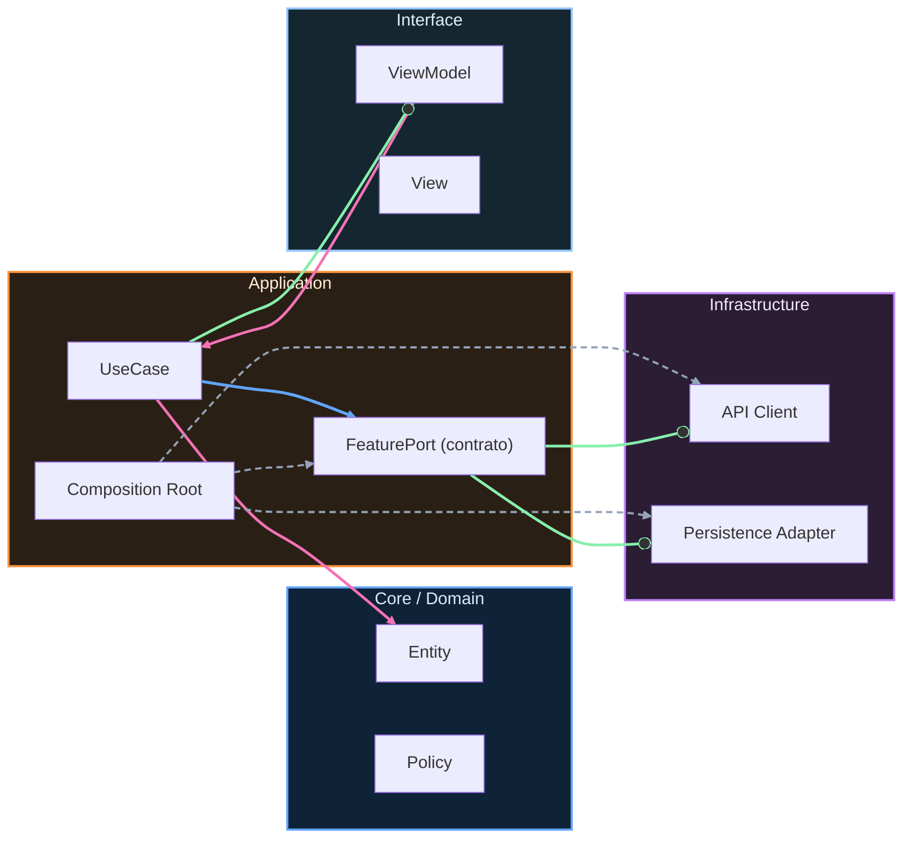

# Nivel Maestría · 08 · Cierre del proyecto final y publicación en Play Store

Este es el punto en el que una app deja de ser “proyecto de curso” y empieza a comportarse como producto real. La diferencia no está en que tenga más pantallas o más efectos visuales. La diferencia está en que puedes publicarla con confianza, mantenerla viva sin sufrir cada release y explicar con evidencia por qué merece estar en producción.

Cuando alguien llega aquí, suele tener una mezcla rara de orgullo y miedo. Orgullo porque ha construido muchísimo. Miedo porque publicar en Play Store se siente como cruzar una frontera donde cualquier error se vuelve público. Ese miedo es normal. Y justo por eso el cierre no se hace corriendo: se hace con un criterio que te permita avanzar sin autoengañarte.

Antes de pensar en el botón de “Publicar”, conviene mirar la app con ojos de operación. No preguntarte si “funciona en mi móvil”, sino si se comporta bien en escenarios imperfectos. Red lenta, proceso reiniciado, permisos denegados, payload inesperado, usuario que vuelve tras semanas sin abrir la app. Si la arquitectura que has trabajado durante el curso está bien aplicada, estos escenarios no deberían sentirse como caos, sino como casos previstos por diseño.

En Android, ese cierre técnico suele apoyarse en una configuración de release donde firma, versión y reglas de calidad están alineadas con CI. No es un detalle administrativo. Es la garantía de que el artefacto que pruebas es el mismo que llega a producción.

```kotlin
android {
    defaultConfig {
        applicationId = "com.stackmyarchitecture.app"
        minSdk = 26
        targetSdk = 36
        versionCode = 108
        versionName = "1.8.0"
    }

    buildTypes {
        release {
            isMinifyEnabled = true
            isShrinkResources = true
            proguardFiles(
                getDefaultProguardFile("proguard-android-optimize.txt"),
                "proguard-rules.pro"
            )
        }
    }
}
```

Este bloque parece de infraestructura, pero resuelve problemas muy concretos del mundo real. `versionCode` te permite evolucionar entregas sin ambigüedad para Play. `isMinifyEnabled` y `isShrinkResources` reducen peso y superficie de ataque. Las reglas de ProGuard evitan que una optimización agresiva rompa rutas críticas sin que te enteres.

Hay otra decisión que marca madurez: no confundir “build exitoso” con “release saludable”. Una app puede compilar perfecto y, aun así, degradar rendimiento o accesibilidad. Por eso en cierre final no basta con pasar unit tests. Necesitas señales que cubran comportamiento real: pruebas de UI, métricas de startup, trazas de error, y confirmación de que la experiencia principal sigue fluida.

Cuando este control se conecta con pipeline, el equipo deja de depender de heroísmo manual. La calidad deja de ser “si alguien se acuerda” y pasa a ser parte de la definición de terminado.

```yaml
name: android-release-health

on:
  pull_request:
    branches: ["main"]

jobs:
  quality:
    runs-on: ubuntu-latest
    steps:
      - uses: actions/checkout@v4
      - uses: actions/setup-java@v4
        with:
          distribution: temurin
          java-version: 17
      - run: ./gradlew testDebugUnitTest connectedDebugAndroidTest
      - run: ./gradlew :benchmark:connectedCheck
      - run: ./gradlew lint
```

Este pipeline no existe para “hacer más lento el merge”. Existe para evitar que una regresión evidente llegue a usuarios por falta de visibilidad temprana. Si una pantalla clave empeora en tiempo de arranque o una interacción esencial deja de responder en test UI, quieres descubrirlo en PR, no en reseñas de una estrella.

La publicación en Play Store también exige una narrativa de producto, no solo técnica. Ficha, capturas, política de privacidad, clasificación de contenido y notas de versión no son trámites menores. Son parte de la confianza que transmites al usuario. Si prometes una cosa en la ficha y la app hace otra, el problema no es marketing: es coherencia de producto.

En este punto ayuda mucho que tu release tenga un alcance explícito y honesto. Mejor una nota de versión corta y clara que una promesa amplia que no puedes sostener. La credibilidad se construye con entregas que dicen lo que hacen y hacen lo que dicen.

Cuando llega el momento de activar producción, la mejor práctica no es “publicar a todo el mundo y esperar”. Es empezar con despliegue gradual y observar. Esa observación tiene sentido porque durante el curso ya trabajaste señales de fiabilidad. Si algo se desvía, puedes frenar expansión, corregir y retomar sin convertir un error puntual en incidente masivo.

En términos humanos, este cierre también es importante para ti como desarrollador. Defender una publicación no es recitar herramientas, es mostrar criterio bajo incertidumbre. Es poder explicar por qué tu app puede evolucionar sin romperse, cómo detectas problemas antes de que escalen y qué decisiones tomas cuando hay tensión entre velocidad y estabilidad.

Ese es el verdadero salto de nivel.

Con esta lección cerramos formalmente el recorrido de Maestría. A partir de aquí, tu proyecto final ya no se evalúa por “cantidad de tecnología usada”, sino por claridad de diseño, calidad operativa y capacidad de sostener evolución real en producción Android.

<!-- auto-gapfix:layered-mermaid -->
## Diagrama de arquitectura por capas



La lectura del diagrama sigue esta semantica:
1. `-->` dependencia directa en runtime.
2. `-.->` wiring o configuracion.
3. `==>` contrato o abstraccion.
4. `--o` salida o propagacion de resultado.
