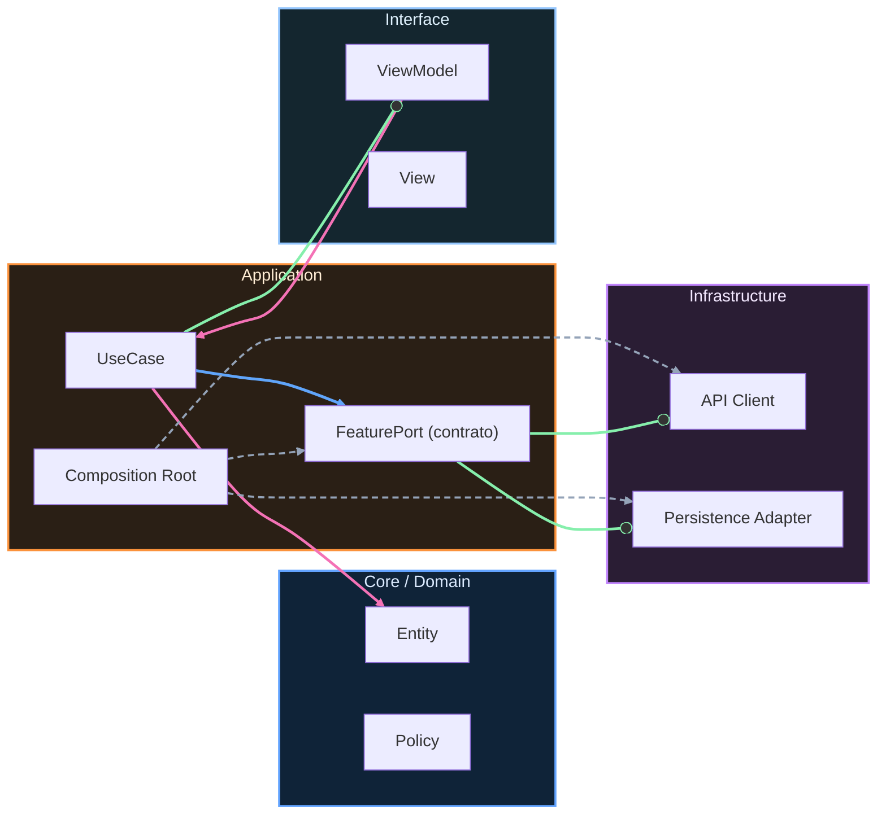

# Nivel Maestría · 09 · Rúbrica final y entrevista técnica Android

Cuando una persona termina de construir una app sólida, el siguiente reto no es técnico en el sentido clásico. El siguiente reto es demostrar criterio bajo conversación real. Eso pasa en una defensa interna, en una revisión de arquitectura o en una entrevista técnica. En todos esos contextos hay una presión parecida: no basta con que el proyecto exista, hay que ser capaz de explicarlo con claridad cuando te hacen preguntas incómodas.

Esta lección está diseñada para ese momento. No vamos a memorizar respuestas “perfectas”. Vamos a entrenar una forma de pensar y comunicar que se sostenga incluso si cambian las preguntas.

En Android hay una pregunta que aparece siempre, aunque esté formulada de maneras distintas. ¿Cómo sabes que tu arquitectura va a aguantar evolución sin volverse frágil? Si respondes solo con nombres de herramientas, la conversación se queda en superficie. Si respondes conectando decisiones con riesgos concretos, la conversación sube de nivel.

Por ejemplo, cuando explicas por qué separaste casos de uso, repositorios y estrategia de persistencia, no lo cuentas como dogma. Lo cuentas como una forma de evitar que un cambio de red afecte pantallas de forma impredecible. Cuando justificas WorkManager, no dices “porque es recomendado”, dices que necesitabas tareas confiables aunque el proceso se cierre. Cuando justificas contratos internos versionados, dices que querías permitir evolución paralela entre equipos sin bloquear releases.

Ese tipo de explicación demuestra madurez porque traduce arquitectura en impacto real.

Para ayudarte a entrenar esa narrativa, puedes convertir la evaluación final en una simulación de decisiones. Imagina que te preguntan qué harías si tras un release sube el error rate solo en dispositivos de gama media y en un flujo que recién migraste de contrato. Tu respuesta debería mostrar prioridades claras: contener impacto primero, diagnosticar con trazas concretas después, y solo entonces abrir hipótesis de corrección.

```kotlin
package com.stackmyarchitecture.interview

data class IncidentContext(
    val feature: String,
    val releaseVersion: String,
    val affectedSegment: String,
    val errorRate: Double
)

sealed interface IncidentDecision {
    data class Rollback(val reason: String) : IncidentDecision
    data class KeepAndMonitor(val reason: String) : IncidentDecision
    data class ProgressivePause(val reason: String) : IncidentDecision
}

class IncidentDecisionUseCase {
    fun decide(context: IncidentContext): IncidentDecision {
        if (context.errorRate >= 0.03) {
            return IncidentDecision.Rollback(
                reason = "Error rate crítico para ${context.feature} en ${context.affectedSegment}"
            )
        }

        if (context.errorRate >= 0.01) {
            return IncidentDecision.ProgressivePause(
                reason = "Desviación moderada, detener expansión y observar señales"
            )
        }

        return IncidentDecision.KeepAndMonitor(
            reason = "Comportamiento dentro del rango esperado"
        )
    }
}
```

Este código no existe para “acertar” un número mágico de error rate. Existe para mostrar que sabes convertir incertidumbre en una regla operativa explícita. En una conversación técnica, eso pesa mucho más que improvisar opiniones en tiempo real.

Otro punto que suele diferenciar perfiles junior de semisenior es cómo hablan de trade-offs. Un perfil junior intenta defender que su solución es perfecta. Un perfil más maduro explica qué gana y qué paga. Si mantuviste convivencia temporal entre `v1` y `v2`, reconoces que añadiste complejidad transitoria para evitar bloqueo inter-equipo, y explicas cómo y cuándo la retiras. Esa honestidad técnica transmite control, no debilidad.

También conviene entrenar respuestas sobre producto, no solo sobre ingeniería. Si te preguntan por qué priorizaste accesibilidad o rendimiento antes de una feature nueva, puedes explicar que una app con mala respuesta o sin soporte básico de accesibilidad destruye valor del producto aunque “tenga funcionalidades”. Eso conecta decisiones técnicas con experiencia de usuario y negocio.

En la parte final de la entrevista, suele aparecer la pregunta abierta: ¿qué mejorarías en los próximos tres meses? Aquí es donde se ve si sabes priorizar. Una respuesta fuerte no intenta arreglar todo. Elige pocos frentes con alta palanca y los justifica con señales observables.

Con esto cerramos tu preparación para defensa final del curso. Si llegaste hasta aquí y puedes sostener esta conversación con serenidad, ya no estás solo implementando Android. Estás diseñando y operando sistemas con criterio profesional.

<!-- auto-gapfix:layered-mermaid -->
## Diagrama de arquitectura por capas



La lectura del diagrama sigue esta semantica:
1. `-->` dependencia directa en runtime.
2. `-.->` wiring o configuracion.
3. `==>` contrato o abstraccion.
4. `--o` salida o propagacion de resultado.
