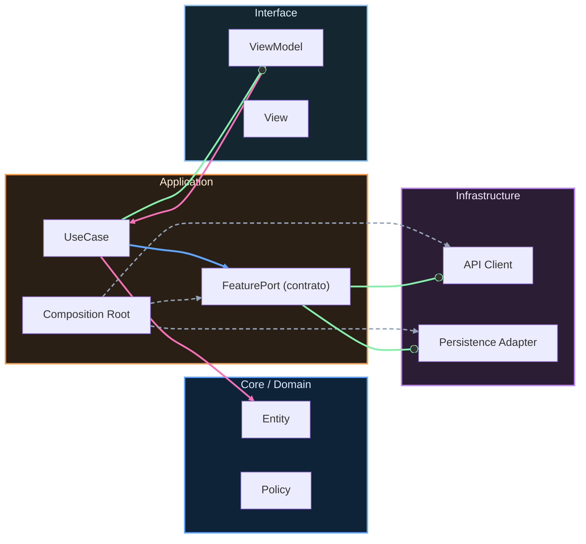

# Nivel Maestría · 09 · Rúbrica final y entrevista técnica Android

Cuando una persona termina de construir una app sólida, el siguiente reto no es técnico en el sentido clásico. El siguiente reto es demostrar criterio bajo conversación real. Eso pasa en una defensa interna, en una revisión de arquitectura o en una entrevista técnica. En todos esos contextos hay una presión parecida: no basta con que el proyecto exista, hay que ser capaz de explicarlo con claridad cuando te hacen preguntas incómodas.

Esta lección está diseñada para ese momento. No vamos a memorizar respuestas “perfectas”. Vamos a entrenar una forma de pensar y comunicar que se sostenga incluso si cambian las preguntas.

En Android hay una pregunta que aparece siempre, aunque esté formulada de maneras distintas. ¿Cómo sabes que tu arquitectura va a aguantar evolución sin volverse frágil? Si respondes solo con nombres de herramientas, la conversación se queda en superficie. Si respondes conectando decisiones con riesgos concretos, la conversación sube de nivel.

Por ejemplo, cuando explicas por qué separaste casos de uso, repositorios y estrategia de persistencia, no lo cuentas como dogma. Lo cuentas como una forma de evitar que un cambio de red afecte pantallas de forma impredecible. Cuando justificas WorkManager, no dices “porque es recomendado”, dices que necesitabas tareas confiables aunque el proceso se cierre. Cuando justificas contratos internos versionados, dices que querías permitir evolución paralela entre equipos sin bloquear releases.

Ese tipo de explicación demuestra madurez porque traduce arquitectura en impacto real.

Para ayudarte a entrenar esa narrativa, puedes convertir la evaluación final en una simulación de decisiones. Imagina que te preguntan qué harías si tras un release sube el error rate solo en dispositivos de gama media y en un flujo que recién migraste de contrato. Tu respuesta debería mostrar prioridades claras: contener impacto primero, diagnosticar con trazas concretas después, y solo entonces abrir hipótesis de corrección.

```kotlin
package com.stackmyarchitecture.interview

data class IncidentContext(
    val feature: String,
    val releaseVersion: String,
    val affectedSegment: String,
    val errorRate: Double
)

sealed interface IncidentDecision {
    data class Rollback(val reason: String) : IncidentDecision
    data class KeepAndMonitor(val reason: String) : IncidentDecision
    data class ProgressivePause(val reason: String) : IncidentDecision
}

class IncidentDecisionUseCase {
    fun decide(context: IncidentContext): IncidentDecision {
        if (context.errorRate >= 0.03) {
            return IncidentDecision.Rollback(
                reason = "Error rate crítico para ${context.feature} en ${context.affectedSegment}"
            )
        }

        if (context.errorRate >= 0.01) {
            return IncidentDecision.ProgressivePause(
                reason = "Desviación moderada, detener expansión y observar señales"
            )
        }

        return IncidentDecision.KeepAndMonitor(
            reason = "Comportamiento dentro del rango esperado"
        )
    }
}
```

Este código no existe para “acertar” un número mágico de error rate. Existe para mostrar que sabes convertir incertidumbre en una regla operativa explícita. En una conversación técnica, eso pesa mucho más que improvisar opiniones en tiempo real.

Otro punto que suele diferenciar perfiles junior de semisenior es cómo hablan de trade-offs. Un perfil junior intenta defender que su solución es perfecta. Un perfil más maduro explica qué gana y qué paga. Si mantuviste convivencia temporal entre `v1` y `v2`, reconoces que añadiste complejidad transitoria para evitar bloqueo inter-equipo, y explicas cómo y cuándo la retiras. Esa honestidad técnica transmite control, no debilidad.

También conviene entrenar respuestas sobre producto, no solo sobre ingeniería. Si te preguntan por qué priorizaste accesibilidad o rendimiento antes de una feature nueva, puedes explicar que una app con mala respuesta o sin soporte básico de accesibilidad destruye valor del producto aunque “tenga funcionalidades”. Eso conecta decisiones técnicas con experiencia de usuario y negocio.

En la parte final de la entrevista, suele aparecer la pregunta abierta: ¿qué mejorarías en los próximos tres meses? Aquí es donde se ve si sabes priorizar. Una respuesta fuerte no intenta arreglar todo. Elige pocos frentes con alta palanca y los justifica con señales observables.

Con esto cerramos tu preparación para defensa final del curso. Si llegaste hasta aquí y puedes sostener esta conversación con serenidad, ya no estás solo implementando Android. Estás diseñando y operando sistemas con criterio profesional.

---

## Ejercicio guiado

**Objetivo**: Autoevaluar el proyecto Android contra los criterios de la rúbrica identificando al menos dos fortalezas, dos áreas de mejora y un plan de acción concreto para la siguiente semana.

**Pasos**:
1. Revisa el proyecto y asígna una puntuación de 1 a 10 en cada dimensión: separación de capas, cobertura de tests, observabilidad, estrategia offline-first y calidad de contratos entre dominios.
2. Identifica las dos dimensiones con puntuación más alta (fortalezas) y las dos con puntuación más baja (áreas de mejora).
3. Para cada área de mejora escribe una tarea concreta y ejecutable en 1–3 días (no "mejorar tests" sino "añadir test de integración para `TasksSyncOrchestrator` cubriendo el caso `PENDING → FAILED`").
4. Condición de éxito: el plan de acción es lo suficientemente específico para abrir tickets de trabajo a partir de él; las fortalezas están respaldadas por evidencia observable (código, tests o métricas).

<details>
<summary>Solución de referencia</summary>

```
Autoevaluación del proyecto Android - Sprint de cierre

──────────────────────────────────────────────────────────
DIMENSIÓN                         PUNTUACIÓN   EVIDENCIA
──────────────────────────────────────────────────────────
Separación de capas (UI/Data)         9/10     UI no depende de Retrofit ni Room directamente.
                                               ViewModel recibe repositorio por constructor.

Cobertura de tests                    6/10     Tests de ViewModel y repositorio presentes.
                                               Faltan tests de integración de sync y UI tests
                                               para estado de error con testTag.

Observabilidad                        7/10     AppLogger inyectado con FakeLogger en tests.
                                               Faltan metadatos de version y API level en logs
                                               de sincronización.

Estrategia offline-first              8/10     Room es fuente de verdad. WorkManager programa sync.
                                               Falta manejo explícito del estado FAILED en UI.

Contratos entre dominios              5/10     Se usa repositorio como contrato interno, pero no
                                               hay separación de módulos V1/V2 para evolución.
──────────────────────────────────────────────────────────

FORTALEZAS:
1. Separación de capas (9/10): la arquitectura por feature con UDF está bien implementada
   y la pantalla no conoce infraestructura de datos.
2. Offline-first (8/10): Room como single source of truth con WorkManager garantiza que
   el usuario siempre ve algo útil aunque no tenga red.

ÁREAS DE MEJORA:
1. Cobertura de tests (6/10)
2. Contratos entre dominios (5/10)

PLAN DE ACCIÓN (próximos 7 días):

Tarea 1 (día 1-2): Escribir test de integración para `TasksSyncOrchestrator` que cubra:
  - Escenario PENDING → SYNCED con fake de API exitosa
  - Escenario PENDING → FAILED con fake de API lanzando IOException
  Archivo: TasksSyncOrchestratorIntegrationTest.kt

Tarea 2 (día 3): Añadir `testTag("tasks_retry_button")` al botón de reintento en
  `TasksErrorContent` y escribir el test de UI que verifica el click con `performClick()`.

Tarea 3 (día 4-5): Extraer `TasksRepositoryContract` a un paquete `.contract` independiente
  del módulo de data para preparar el terreno de versionado V1/V2 en futuros sprints.
```

```kotlin
// Snippet que ilustra la Tarea 1 del plan de acción
class TasksSyncOrchestratorIntegrationTest {

    @Test
    fun whenApiSucceeds_thenPendingTasksMovesToSynced() = runTest {
        val fakeDao    = FakeTasksDao(initialState = listOf(taskPending))
        val fakeRemote = FakeTasksRemoteDataSource(shouldFail = false)
        val orchestrator = TasksSyncOrchestrator(dao = fakeDao, remote = fakeRemote, clock = { 9000L })

        orchestrator.syncPendingTasks()

        val result = fakeDao.getBySyncState(SyncState.SYNCED)
        assertEquals(1, result.size)
        assertEquals("task-1", result.first().id)
    }
}
```

**Resultado esperado**: la autoevaluación identifica puntos de mejora concretos; las tareas del plan de acción son lo suficientemente específicas para abrirse como tickets en Jira o GitHub Issues; las fortalezas están avaladas por evidencia visible en el código del proyecto.

</details>

<!-- auto-gapfix:layered-mermaid -->
## Diagrama de arquitectura por capas


```mermaid
flowchart LR
  subgraph CORE["Core / Domain"]
    direction TB
    ENT[Entity]
    POL[Policy]
  end

  subgraph APP["Application"]
    direction TB
    BOOT[Composition Root]
    UC[UseCase]
    PORT["FeaturePort (contrato)"]
  end

  subgraph UI["Interface"]
    direction TB
    VM[ViewModel]
    VIEW[View]
  end

  subgraph INFRA["Infrastructure"]
    direction TB
    API[API Client]
    STORE[Persistence Adapter]
  end

  VM --> UC
  UC --> ENT
  UC ==> PORT
  BOOT -.-> PORT
  BOOT -.-> API
  BOOT -.-> STORE
  PORT --o API
  PORT --o STORE
  UC --o VM

  style CORE fill:#0f2338,stroke:#63a4ff,color:#dbeafe,stroke-width:2px
  style APP fill:#2a1f15,stroke:#fb923c,color:#ffedd5,stroke-width:2px
  style UI fill:#14262f,stroke:#93c5fd,color:#e0f2fe,stroke-width:2px
  style INFRA fill:#2a1d34,stroke:#c084fc,color:#f3e8ff,stroke-width:2px

  linkStyle 0 stroke:#f472b6,stroke-width:2.6px
  linkStyle 1 stroke:#f472b6,stroke-width:2.6px
  linkStyle 2 stroke:#60a5fa,stroke-width:2.8px
  linkStyle 3 stroke:#94a3b8,stroke-width:2px,stroke-dasharray:6 4
  linkStyle 4 stroke:#94a3b8,stroke-width:2px,stroke-dasharray:6 4
  linkStyle 5 stroke:#94a3b8,stroke-width:2px,stroke-dasharray:6 4
  linkStyle 6 stroke:#86efac,stroke-width:2.6px
  linkStyle 7 stroke:#86efac,stroke-width:2.6px
  linkStyle 8 stroke:#86efac,stroke-width:2.6px
```

La lectura del diagrama sigue esta semántica:
1. `-->` dependencia directa en runtime.
2. `-.->` wiring o configuración.
3. `==>` contrato o abstracción.
4. `--o` salida o propagación de resultado.
