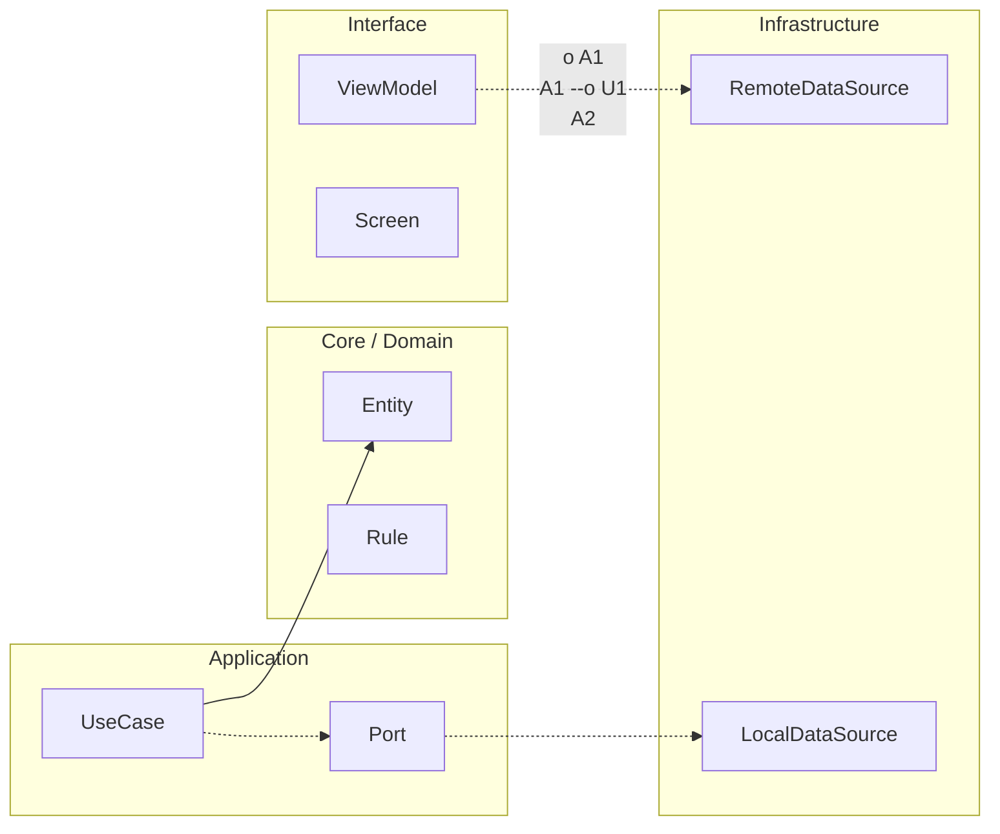

# Nivel Maestría · 10 · Plan de 90 días después del curso

Terminar el curso es un hito potente, pero no es la meta final. La diferencia entre alguien que “hizo un curso” y alguien que realmente cambia su nivel profesional suele aparecer en los tres meses siguientes. Ahí se decide si todo lo aprendido se integra en tu forma de trabajar o se queda como material que te gustó pero no transformó tu práctica diaria.

Esta lección no está pensada para añadir más teoría. Está pensada para que conviertas tu aprendizaje en trayectoria. Lo importante ahora es sostener ritmo, no intensidad heroica. En Android, la constancia gana por goleada frente a los picos de motivación.

Cuando una persona sale de un recorrido técnico largo, el riesgo más común es intentar mejorar todo al mismo tiempo. Se quiere rehacer arquitectura, subir cobertura al máximo, optimizar rendimiento, preparar entrevistas y además publicar una app nueva. Ese impulso nace de buenas intenciones, pero casi siempre termina en frustración porque no hay foco real.

La alternativa madura es elegir una dirección principal por trimestre y construir evidencia acumulativa. Si tu objetivo es consolidarte como perfil Android semisenior, necesitas una secuencia de decisiones que te hagan más confiable en tres frentes: diseño, operación y comunicación técnica.

En diseño, el objetivo no es inventar arquitectura nueva en cada proyecto. Es demostrar que sabes aplicar criterios estables aunque cambie el contexto. Si una app pequeña necesita una solución simple, no la sobre‑diseñas. Si una app crece y aparecen equipos múltiples, introduces contratos y gobernanza sin dramatizar. Esa flexibilidad con criterio es señal de madurez.

En operación, tu ventaja no viene de “no tener errores”. Viene de cómo respondes cuando aparecen. Si puedes detectar degradación pronto, contener impacto y explicar qué pasó con datos claros, estás jugando en un nivel profesional real.

En comunicación, el salto clave es dejar de describir herramientas y empezar a defender decisiones. Si en una revisión te preguntan por qué mantuviste convivencia entre dos contratos durante semanas, tu respuesta tiene que conectar riesgo, continuidad y plan de retiro. Esa forma de argumentar es la que te abre puertas en equipos exigentes.

Para aterrizar esta continuidad, puedes mantener un registro técnico ligero donde cada semana dejes una decisión relevante y su resultado. No para burocracia, sino para construir memoria de aprendizaje aplicada.

```kotlin
package com.stackmyarchitecture.growth

data class WeeklyDecisionLog(
    val weekId: String,
    val context: String,
    val decision: String,
    val expectedOutcome: String,
    val observedOutcome: String,
    val nextAdjustment: String
)

class DecisionRetrospective {
    fun summarize(log: WeeklyDecisionLog): String {
        return "${log.weekId}: ${log.decision} -> ${log.observedOutcome}. Ajuste: ${log.nextAdjustment}"
    }
}
```

Este ejemplo parece sencillo, y precisamente por eso funciona. Te obliga a pensar como profesional que aprende de resultados, no como alguien que solo acumula contenido. Con el tiempo, ese historial se vuelve oro para entrevistas y para tu propio crecimiento, porque te permite hablar de experiencia concreta en lugar de opiniones genéricas.

Durante estos 90 días también conviene cuidar un aspecto que suele ignorarse: la calidad de tus entregas pequeñas. No hace falta construir una app gigantesca para demostrar nivel. A veces una mejora bien cerrada en observabilidad, en accesibilidad o en estrategia de sincronización dice más de tu criterio que una funcionalidad grande sin control de calidad.

Si conectas este plan con todo lo que trabajaste en el curso, verás que no necesitas empezar de cero. Ya tienes base en arquitectura Android, en persistencia offline‑first, en testing, en rendimiento, en operación y en defensa técnica. Ahora toca convertir esa base en hábito profesional.

Con esta lección cerramos el recorrido formativo y abrimos el tramo de consolidación real. Lo que pase en los próximos 90 días no depende de aprender más rápido, sino de aplicar mejor, de forma sostenida, lo que ya sabes hacer.

<!-- auto-gapfix:layered-mermaid -->
## Diagrama de arquitectura por capas



La lectura del diagrama sigue esta semantica:
1. `-->` dependencia directa en runtime.
2. `-.->` contrato o abstraccion.
3. `-.o` wiring o composicion.
4. `--o` salida o propagacion de resultado.
