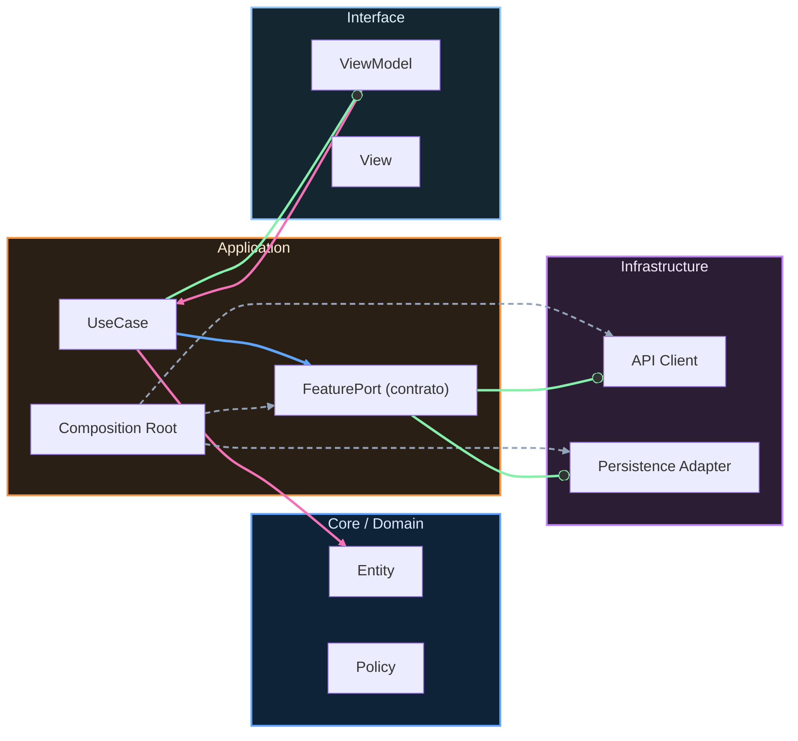

# Nivel Maestría · 10 · Plan de 90 días después del curso

Terminar el curso es un hito potente, pero no es la meta final. La diferencia entre alguien que “hizo un curso” y alguien que realmente cambia su nivel profesional suele aparecer en los tres meses siguientes. Ahí se decide si todo lo aprendido se integra en tu forma de trabajar o se queda como material que te gustó pero no transformó tu práctica diaria.

Esta lección no está pensada para añadir más teoría. Está pensada para que conviertas tu aprendizaje en trayectoria. Lo importante ahora es sostener ritmo, no intensidad heroica. En Android, la constancia gana por goleada frente a los picos de motivación.

Cuando una persona sale de un recorrido técnico largo, el riesgo más común es intentar mejorar todo al mismo tiempo. Se quiere rehacer arquitectura, subir cobertura al máximo, optimizar rendimiento, preparar entrevistas y además publicar una app nueva. Ese impulso nace de buenas intenciones, pero casi siempre termina en frustración porque no hay foco real.

La alternativa madura es elegir una dirección principal por trimestre y construir evidencia acumulativa. Si tu objetivo es consolidarte como perfil Android semisenior, necesitas una secuencia de decisiones que te hagan más confiable en tres frentes: diseño, operación y comunicación técnica.

En diseño, el objetivo no es inventar arquitectura nueva en cada proyecto. Es demostrar que sabes aplicar criterios estables aunque cambie el contexto. Si una app pequeña necesita una solución simple, no la sobre‑diseñas. Si una app crece y aparecen equipos múltiples, introduces contratos y gobernanza sin dramatizar. Esa flexibilidad con criterio es señal de madurez.

En operación, tu ventaja no viene de “no tener errores”. Viene de cómo respondes cuando aparecen. Si puedes detectar degradación pronto, contener impacto y explicar qué pasó con datos claros, estás jugando en un nivel profesional real.

En comunicación, el salto clave es dejar de describir herramientas y empezar a defender decisiones. Si en una revisión te preguntan por qué mantuviste convivencia entre dos contratos durante semanas, tu respuesta tiene que conectar riesgo, continuidad y plan de retiro. Esa forma de argumentar es la que te abre puertas en equipos exigentes.

Para aterrizar esta continuidad, puedes mantener un registro técnico ligero donde cada semana dejes una decisión relevante y su resultado. No para burocracia, sino para construir memoria de aprendizaje aplicada.

```kotlin
package com.stackmyarchitecture.growth

data class WeeklyDecisionLog(
    val weekId: String,
    val context: String,
    val decision: String,
    val expectedOutcome: String,
    val observedOutcome: String,
    val nextAdjustment: String
)

class DecisionRetrospective {
    fun summarize(log: WeeklyDecisionLog): String {
        return "${log.weekId}: ${log.decision} -> ${log.observedOutcome}. Ajuste: ${log.nextAdjustment}"
    }
}
```

Este ejemplo parece sencillo, y precisamente por eso funciona. Te obliga a pensar como profesional que aprende de resultados, no como alguien que solo acumula contenido. Con el tiempo, ese historial se vuelve oro para entrevistas y para tu propio crecimiento, porque te permite hablar de experiencia concreta en lugar de opiniones genéricas.

Durante estos 90 días también conviene cuidar un aspecto que suele ignorarse: la calidad de tus entregas pequeñas. No hace falta construir una app gigantesca para demostrar nivel. A veces una mejora bien cerrada en observabilidad, en accesibilidad o en estrategia de sincronización dice más de tu criterio que una funcionalidad grande sin control de calidad.

Si conectas este plan con todo lo que trabajaste en el curso, verás que no necesitas empezar de cero. Ya tienes base en arquitectura Android, en persistencia offline‑first, en testing, en rendimiento, en operación y en defensa técnica. Ahora toca convertir esa base en hábito profesional.

Con esta lección cerramos el recorrido formativo y abrimos el tramo de consolidación real. Lo que pase en los próximos 90 días no depende de aprender más rápido, sino de aplicar mejor, de forma sostenida, lo que ya sabes hacer.

<!-- auto-gapfix:layered-mermaid -->
## Diagrama de arquitectura por capas


```mermaid
flowchart LR
  subgraph CORE["Core / Domain"]
    direction TB
    ENT[Entity]
    POL[Policy]
  end

  subgraph APP["Application"]
    direction TB
    BOOT[Composition Root]
    UC[UseCase]
    PORT["FeaturePort (contrato)"]
  end

  subgraph UI["Interface"]
    direction TB
    VM[ViewModel]
    VIEW[View]
  end

  subgraph INFRA["Infrastructure"]
    direction TB
    API[API Client]
    STORE[Persistence Adapter]
  end

  VM --> UC
  UC --> ENT
  UC ==> PORT
  BOOT -.-> PORT
  BOOT -.-> API
  BOOT -.-> STORE
  PORT --o API
  PORT --o STORE
  UC --o VM

  style CORE fill:#0f2338,stroke:#63a4ff,color:#dbeafe,stroke-width:2px
  style APP fill:#2a1f15,stroke:#fb923c,color:#ffedd5,stroke-width:2px
  style UI fill:#14262f,stroke:#93c5fd,color:#e0f2fe,stroke-width:2px
  style INFRA fill:#2a1d34,stroke:#c084fc,color:#f3e8ff,stroke-width:2px

  linkStyle 0 stroke:#f472b6,stroke-width:2.6px
  linkStyle 1 stroke:#f472b6,stroke-width:2.6px
  linkStyle 2 stroke:#60a5fa,stroke-width:2.8px
  linkStyle 3 stroke:#94a3b8,stroke-width:2px,stroke-dasharray:6 4
  linkStyle 4 stroke:#94a3b8,stroke-width:2px,stroke-dasharray:6 4
  linkStyle 5 stroke:#94a3b8,stroke-width:2px,stroke-dasharray:6 4
  linkStyle 6 stroke:#86efac,stroke-width:2.6px
  linkStyle 7 stroke:#86efac,stroke-width:2.6px
  linkStyle 8 stroke:#86efac,stroke-width:2.6px
```

---

## Ejercicio guiado

**Objetivo**: Redactar tu plan personal de 90 días con 3 metas medibles y sus criterios de éxito.

**Pasos**:
1. Define 3 metas para los próximos 90 días. Cada meta debe ser específica y alcanzable en ese plazo (no "mejorar arquitectura", sino "refactorizar el módulo de autenticación para usar contratos versionados").
2. Para cada meta, escribe: (a) qué vas a hacer exactamente, (b) cómo sabrás que lo lograste (criterio de éxito medible), (c) cuándo lo harás (semana o fecha aproximada).
3. Distribuye las metas en tres bloques de 30 días: mes 1 de consolidación, mes 2 de aplicación y mes 3 de visibilidad.
4. Añade un mecanismo de revisión: una fecha concreta en la que revisarás el progreso (por ejemplo, último viernes de cada mes).
5. Condición de éxito: tienes 3 metas escritas con criterio medible, distribuidas en el tiempo y con una fecha de revisión concreta.

<details>
<summary>Solución de referencia</summary>

```markdown
# Mi plan de 90 días · Android

## Mes 1 (días 1-30): Consolidación
**Meta**: Instrumentar un SLO en el flujo de sincronización offline de mi proyecto.
- Qué: añadir telemetría de tasa de éxito de sincronización y configurar alerta cuando baje del 95 %.
- Criterio de éxito: dashboard con datos reales durante 2 semanas sin intervención manual.
- Cuándo: semana 3.

## Mes 2 (días 31-60): Aplicación
**Meta**: Separar el módulo monolítico `app` en al menos 2 bounded contexts con contratos explícitos.
- Qué: crear módulos `feature-auth` y `feature-forms` con interfaces de contrato propias.
- Criterio de éxito: ningún módulo feature importa clases internas de otro módulo feature.
- Cuándo: semana 7.

## Mes 3 (días 61-90): Visibilidad
**Meta**: Publicar una entrada técnica (blog, hilo o charla interna) sobre la decisión de arquitectura más relevante que tomé.
- Qué: redactar explicación de por qué usé contratos versionados y qué problema resolvió.
- Criterio de éxito: publicado y compartido con al menos 10 personas del sector.
- Cuándo: semana 12.

## Revisión mensual
Último viernes de cada mes: revisar progreso contra criterios y ajustar si es necesario.
```

**Resultado esperado**: El alumno tiene un plan concreto y accionable que puede empezar a ejecutar la semana siguiente sin necesidad de más planificación.

</details>

La lectura del diagrama sigue esta semántica:
1. `-->` dependencia directa en runtime.
2. `-.->` wiring o configuración.
3. `==>` contrato o abstracción.
4. `--o` salida o propagación de resultado.
