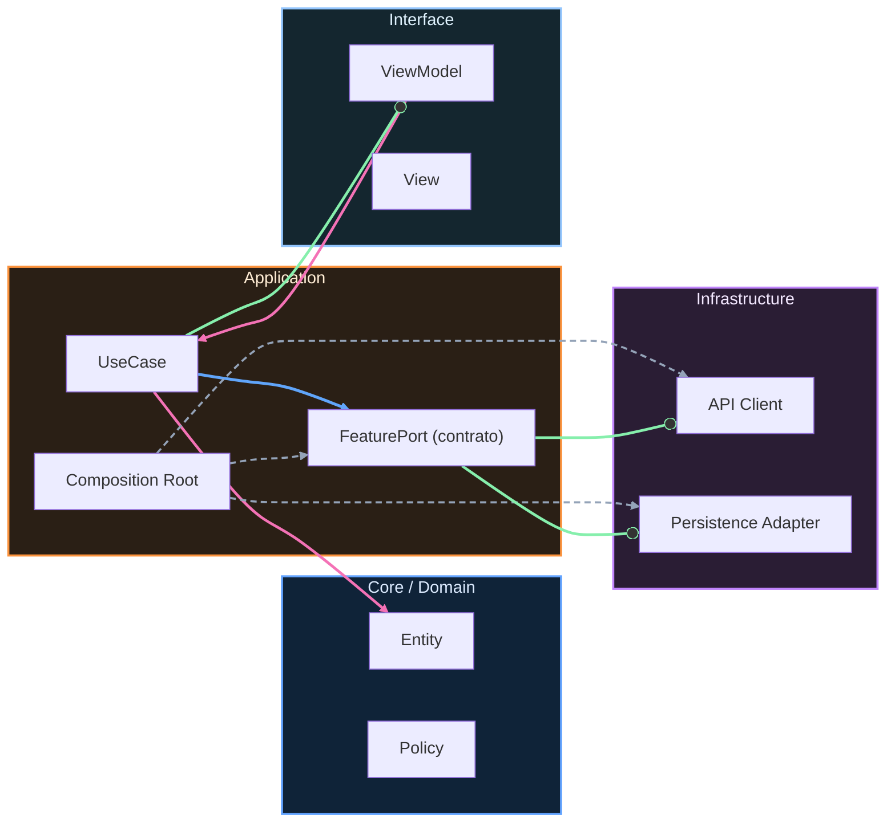

# Nivel Maestría · 11 · Epílogo profesional y siguientes retos

Llegados a este punto, lo más fácil sería cerrar con una frase épica y dar el curso por terminado. Pero en ingeniería de software casi nunca existe un “final final”. Lo que sí existe es un cambio de etapa. Ya no estás en la fase de aprender piezas sueltas. Estás en la fase de sostener sistemas reales con criterio, calma y responsabilidad.

Ese cambio se nota en cosas muy concretas. Antes, cuando algo fallaba, la pregunta era “qué archivo toco para que funcione”. Ahora la pregunta madura es “qué decisión tomó el sistema para llegar aquí y cómo reduzco este riesgo para que no se repita”. Esa forma de pensar es la que separa a alguien que programa de alguien que diseña y opera producto.

Durante el recorrido construiste una base fuerte en Android moderno. Empezaste con fundamentos, levantaste arquitectura limpia sin convertirla en religión, aprendiste a trabajar offline-first, a pensar en fiabilidad, a medir rendimiento, a proteger calidad con pipelines y a defender decisiones sin esconder trade-offs. Lo importante no es haber visto todos esos temas, sino haberlos conectado en un mismo hilo.

Ese hilo, en una frase, es este: diseñar para evolucionar.

En la práctica profesional, casi todo gira alrededor de esa capacidad. Una feature nueva puede salir rápido. Lo difícil es que salga rápido sin hipotecar el trimestre siguiente. Un incidente se puede apagar con esfuerzo. Lo difícil es que el sistema aprenda de ese incidente. Un equipo puede entregar mucho en dos semanas. Lo difícil es mantener ese ritmo durante meses sin romperse por dentro.

Si te preguntas cómo saber que realmente consolidaste este nivel, mira tu forma de decidir bajo presión. Si cuando aparece conflicto entre roadmap y fiabilidad eres capaz de proponer una salida concreta, con señales observables y plan de rollback, ya estás actuando como perfil profesional sólido. Si además puedes explicarlo con claridad a gente no técnica sin perder precisión, has dado un salto que vale más que memorizar cien APIs.

De aquí en adelante, tu crecimiento no depende de “hacer proyectos cada vez más grandes”. Depende de elegir bien qué problema abordar y cómo documentar el aprendizaje que deja. Un proyecto pequeño bien operado puede enseñarte más que una app enorme sin disciplina técnica.

Por eso conviene cerrar esta etapa con una práctica sencilla que te acompañe en cada nuevo reto. Cada vez que tomes una decisión importante, registra contexto, hipótesis y resultado. No para llenar plantillas, sino para entrenar pensamiento arquitectónico continuo.

```kotlin
package com.stackmyarchitecture.journey

data class EngineeringReflection(
    val context: String,
    val decision: String,
    val expectedImpact: String,
    val realImpact: String,
    val lessonLearned: String
)

class ReflectionFormatter {
    fun toNarrative(reflection: EngineeringReflection): String {
        return "En ${reflection.context} decidimos ${reflection.decision}. " +
            "Esperábamos ${reflection.expectedImpact}, ocurrió ${reflection.realImpact}, " +
            "y la lección clave fue ${reflection.lessonLearned}."
    }
}
```

Este fragmento no pretende convertirse en una librería de producción. Sirve para recordarte algo esencial: el aprendizaje técnico real aparece cuando conviertes decisiones en conocimiento reutilizable.

Con este epílogo cerramos el curso como recorrido formativo, pero abrimos tu etapa de práctica consciente. Si mantienes esta forma de trabajar, no solo vas a construir mejores apps Android. Vas a construir mejor criterio, y ese criterio es lo que más valor tiene cuando la tecnología cambia, porque te permite adaptarte sin perder dirección.

<!-- auto-gapfix:layered-mermaid -->
## Diagrama de arquitectura por capas



La lectura del diagrama sigue esta semantica:
1. `-->` dependencia directa en runtime.
2. `-.->` wiring o configuracion.
3. `==>` contrato o abstraccion.
4. `--o` salida o propagacion de resultado.
