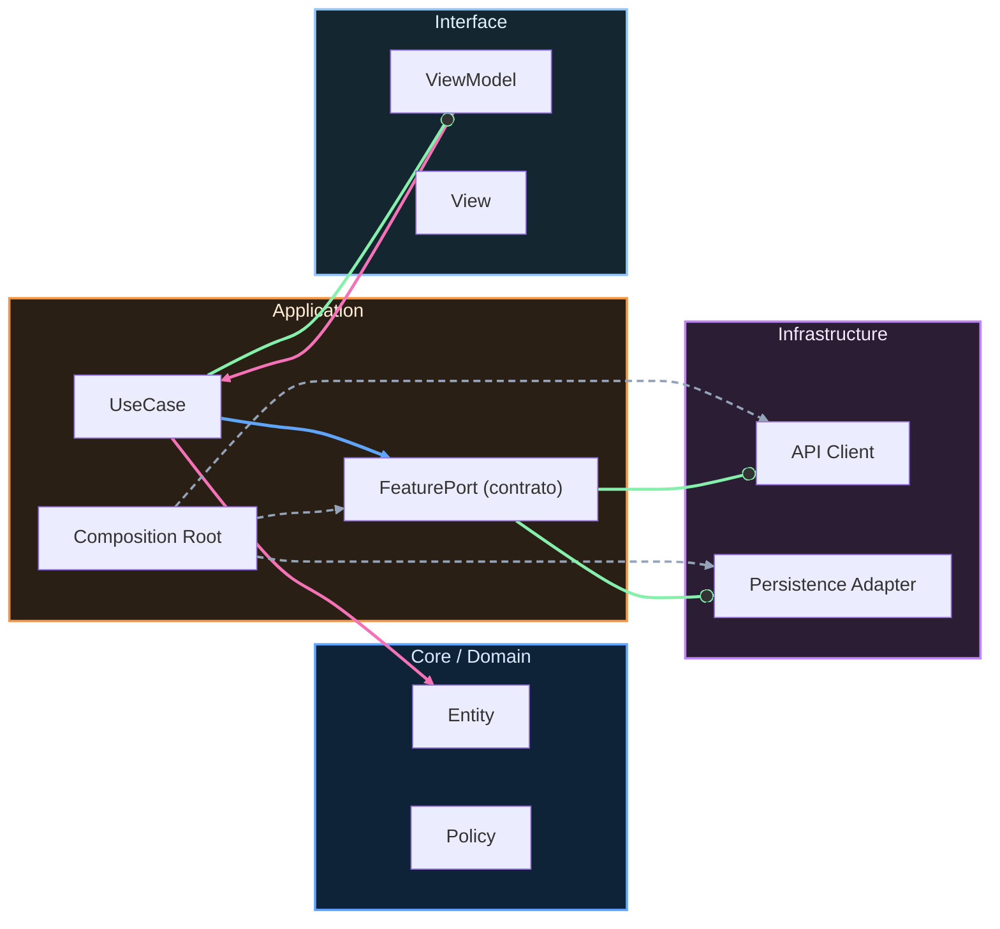

# Nivel Maestría · 13 · Operación a largo plazo y deuda técnica en Android

Hay un momento en la vida de cualquier app en el que el problema principal deja de ser construir features nuevas y pasa a ser mantener sano todo lo que ya existe. Es una transición silenciosa, pero muy importante. Si no se gestiona bien, el equipo siente que trabaja más y avanza menos. Si se gestiona con criterio, la app puede crecer durante años sin volverse inmanejable.

Esta lección está centrada en ese reto: cómo operar un sistema Android en el largo plazo sin que la deuda técnica te secuestre la capacidad de entrega. No vamos a tratar la deuda como una palabra abstracta. La vamos a tratar como algo observable que afecta tiempos de desarrollo, calidad de releases y estrés del equipo.

Una señal temprana de deuda mal gestionada es que cada cambio pequeño pide demasiadas validaciones cruzadas. El código compila, los tests pasan, pero nadie está tranquilo porque hay zonas del sistema que “siempre dan miedo”. Ahí el problema no es la complejidad del producto, sino la falta de estrategia para mantener el sistema legible.

En Android ese riesgo se amplifica cuando conviven varias capas de evolución al mismo tiempo. Cambios de SDK objetivo, ajustes de rendimiento para nuevos dispositivos, migraciones de contratos internos, adaptación de librerías y deuda de UI histórica. Todo eso puede convivir bien, pero solo si tienes una política explícita de mantenimiento continuo.

Una forma práctica de empezar es tratar cada deuda importante como un activo de riesgo, no como una tarea suelta que se empuja al backlog indefinidamente. Cuando modelas la deuda así, puedes decidir con más claridad cuándo conviene invertir en estabilización y cuándo conviene priorizar roadmap.

```kotlin
package com.stackmyarchitecture.maintenance

data class TechnicalDebtItem(
    val id: String,
    val context: String,
    val riskScore: Int,
    val impactArea: String,
    val mitigationPlan: String
)

class DebtPrioritizationPolicy {
    fun shouldPrioritizeNow(item: TechnicalDebtItem): Boolean {
        return item.riskScore >= 8
    }
}
```

Este modelo no busca crear burocracia. Lo que resuelve es un problema real de conversación dentro del equipo. En vez de discutir con sensaciones, puedes hablar con un marco común de riesgo e impacto. Cuando la deuda se expresa así, la priorización deja de ser política informal y se vuelve una decisión técnica defendible.

Otro punto crítico en operación a largo plazo es evitar que la deuda se “esconda” dentro de cambios funcionales. Si cada PR mezcla feature y refactor profundo sin delimitación clara, el equipo pierde trazabilidad y aumenta el riesgo de regresión silenciosa. No porque la gente sea poco cuidadosa, sino porque el alcance se vuelve opaco.

La alternativa madura es mantener cambios evolutivos pequeños y frecuentes. En vez de esperar a una gran reestructuración trimestral, haces mejoras continuas de bajo riesgo que mantienen el sistema respirando. Esta forma de trabajar parece menos heroica, pero en la práctica es mucho más sostenible.

También conviene recordar que deuda técnica no significa solo código antiguo. Puede ser deuda de observabilidad, deuda de pruebas, deuda de pipeline o deuda de documentación de decisiones. Una app puede tener arquitectura limpia y aun así sufrir mucho si, por ejemplo, nadie sabe interpretar señales operativas cuando hay una degradación en producción.

```kotlin
package com.stackmyarchitecture.maintenance

data class MaintenanceHealth(
    val flakyTestsRatio: Double,
    val averageBuildMinutes: Double,
    val openCriticalDebts: Int,
    val incidentRecurrenceRate: Double
)

class MaintenanceEvaluator {
    fun isSustainable(health: MaintenanceHealth): Boolean {
        return health.flakyTestsRatio <= 0.05 &&
            health.averageBuildMinutes <= 12.0 &&
            health.openCriticalDebts <= 3 &&
            health.incidentRecurrenceRate <= 0.10
    }
}
```

Este segundo bloque sirve para conectar mantenimiento con señales de operación, no con intuición. Si sube el ratio de tests inestables o se dispara el tiempo medio de build, no es solo una molestia de desarrollo. Es una pérdida directa de capacidad de entrega. Hacer visible esa relación ayuda mucho a proteger tiempo de estabilización cuando realmente hace falta.

Una conversación que aparece mucho en equipos Android es esta: “si paramos para pagar deuda, ¿no frenamos negocio?”. La respuesta más útil no es sí o no. Es entender que no pagar deuda crítica también frena negocio, solo que de forma diferida y más cara. El objetivo no es dejar de construir producto, sino equilibrar inversión para que el producto siga siendo construible.

Cuando ese equilibrio está bien llevado, pasa algo interesante. El equipo no solo entrega más estable; también mejora su clima de trabajo. Menos incertidumbre, menos urgencias artificiales, menos retrabajo. Y eso, a largo plazo, tiene tanto impacto como cualquier optimización técnica.

Con esta lección cerramos la parte de Maestría enfocada en sostenibilidad operacional. Si aplicas este enfoque, tu app no dependerá de momentos de brillantez puntual para mantenerse viva. Dependerá de un sistema de decisiones que funciona incluso cuando hay presión, cambios y crecimiento continuo.

---

## Ejercicio guiado

**Objetivo**: Crear un backlog priorizado de deuda técnica con al menos cuatro ítems, ordenados por `riskScore`, que sea presentable en un planning de sprint.

**Pasos**:
1. Identifica cuatro deudas técnicas reales o verosímiles de un proyecto Android (puedes basarte en el proyecto del curso): faltan tests, acoplamiento directo, sin observabilidad en un módulo, migración de librería pendiente.
2. Modela cada deuda como `TechnicalDebtItem` con `id`, `context`, `riskScore`, `impactArea` y `mitigationPlan`.
3. Ordena la lista por `riskScore` descendente y aplica `DebtPrioritizationPolicy` para marcar cuáles requieren atención inmediata (score ≥ 8).
4. Condición de éxito: el backlog puede ser leído en una reunión de planning en menos de 5 minutos; los ítems con `shouldPrioritizeNow = true` tienen un plan de mitigación ejecutable en 1–3 días.

<details>
<summary>Solución de referencia</summary>

```kotlin
data class TechnicalDebtItem(
    val id: String,
    val context: String,
    val riskScore: Int,
    val impactArea: String,
    val mitigationPlan: String
)

class DebtPrioritizationPolicy {
    fun shouldPrioritizeNow(item: TechnicalDebtItem): Boolean = item.riskScore >= 8
}

fun main() {
    val policy = DebtPrioritizationPolicy()

    // 2. Cuatro deudas técnicas modeladas
    val backlog = listOf(
        TechnicalDebtItem(
            id             = "DEBT-001",
            context        = "ConflictResolver sin tests; 2 bugs en producción por conflictos de timestamp",
            riskScore      = 9,
            impactArea     = "Integridad de datos en sincronización offline-first",
            mitigationPlan = "Añadir 4 tests unitarios para ConflictResolver cubriendo KeepLocal, " +
                             "KeepRemote, ManualReview y caso nulo. ETA: 1 día."
        ),
        TechnicalDebtItem(
            id             = "DEBT-002",
            context        = "TasksViewModel depende de TasksRepositoryImpl directamente en un flujo legado",
            riskScore      = 8,
            impactArea     = "Testabilidad y separación de capas en feature Tasks",
            mitigationPlan = "Sustituir referencia directa por interfaz TasksRepository. " +
                             "Actualizar módulo Hilt. ETA: 2 días."
        ),
        TechnicalDebtItem(
            id             = "DEBT-003",
            context        = "Módulo de catálogo sin observabilidad: ningún log en operaciones de red",
            riskScore      = 6,
            impactArea     = "Diagnóstico y trazabilidad en CatalogRemoteDataSource",
            mitigationPlan = "Inyectar AppLogger e instrumentar fetchCatalog() con operationId. ETA: 1 día."
        ),
        TechnicalDebtItem(
            id             = "DEBT-004",
            context        = "Librería Gson usada en módulo de red; migración pendiente a Moshi/Kotlinx",
            riskScore      = 4,
            impactArea     = "Mantenibilidad y alineación con estándar del proyecto",
            mitigationPlan = "Migrar DTOs de catálogo a anotaciones Moshi. Validar en staging. ETA: 3 días."
        )
    ).sortedByDescending { it.riskScore }

    // 3. Backlog priorizado con marcas de urgencia
    println("=== Backlog de Deuda Técnica ===\n")
    backlog.forEach { item ->
        val urgente = if (policy.shouldPrioritizeNow(item)) "🔴 URGENTE" else "🟡 PLANIFICABLE"
        println("[$urgente] ${item.id} (riskScore=${item.riskScore})")
        println("  Contexto   : ${item.context}")
        println("  Área       : ${item.impactArea}")
        println("  Plan       : ${item.mitigationPlan}")
        println()
    }
}

// Salida esperada (ordenada por riskScore desc):
// [🔴 URGENTE] DEBT-001 (riskScore=9) - ConflictResolver sin tests
// [🔴 URGENTE] DEBT-002 (riskScore=8) - Acoplamiento directo en ViewModel
// [🟡 PLANIFICABLE] DEBT-003 (riskScore=6) - Sin observabilidad en catálogo
// [🟡 PLANIFICABLE] DEBT-004 (riskScore=4) - Migración de Gson a Moshi
```

**Resultado esperado**: el backlog ordenado identifica visualmente qué deudas requieren atención inmediata (score ≥ 8) y cuáles pueden planificarse en sprints futuros; el plan de mitigación de cada deuda urgente es lo suficientemente concreto para asignarse como tarea en el sprint actual.

</details>

<!-- auto-gapfix:layered-mermaid -->
## Diagrama de arquitectura por capas



La lectura del diagrama sigue esta semántica:
1. `-->` dependencia directa en runtime.
2. `-.->` wiring o configuración.
3. `==>` contrato o abstracción.
4. `--o` salida o propagación de resultado.
