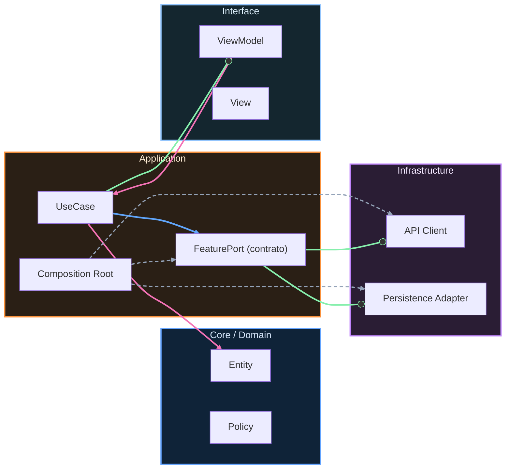

# Nivel Maestría · 14 · Tu primer año en un equipo Android real

Después de cerrar un curso completo, llega una etapa que casi nunca se enseña bien: cómo vivir el primer año dentro de un equipo de producto sin perder el criterio que acabas de construir. Porque una cosa es aprender en un entorno guiado y otra muy distinta es tomar decisiones cuando hay deadlines, dependencias cruzadas y prioridades que cambian de una semana a otra.

Esta lección nace para conectar esos dos mundos. No para asustarte, sino para ayudarte a entrar con una ventaja real: entender cómo seguir creciendo sin romperte por el camino.

En los primeros meses suele pasar algo curioso. Técnicamente ya puedes construir muchas cosas, pero te das cuenta de que el mayor reto no siempre es el código. El reto es saber cuándo profundizar, cuándo simplificar y cuándo pedir contexto antes de tocar una pieza sensible. Eso no te hace menos capaz. Te hace más profesional.

Uno de los errores más comunes al empezar es intentar demostrar nivel con complejidad. Se tiende a introducir capas o patrones que no resuelven un problema inmediato, solo porque suenan avanzados. El resultado suele ser el contrario al esperado: PRs difíciles de revisar y un equipo que percibe riesgo donde tú querías mostrar criterio.

La alternativa madura es mucho más potente y, además, más difícil: entregar soluciones claras que resuelvan el problema actual y dejen la puerta abierta a evolución. Esa combinación de pragmatismo y visión es lo que de verdad construye reputación técnica en un equipo.

Cuando estés frente a una tarea nueva, te ayudará pensarla como una decisión de sistema, no solo como una implementación local. Qué contrato toca, qué señales de observabilidad necesitas, qué riesgo operativo introduces, cómo vas a validar que no rompiste una ruta crítica. Esa mirada es la continuación natural de todo lo que trabajaste en Maestría.

```kotlin
package com.stackmyarchitecture.growth

data class DeliveryDecision(
    val taskId: String,
    val scope: String,
    val riskLevel: String,
    val validationPlan: String,
    val rollbackPlan: String
)

class DeliveryDecisionWriter {
    fun summarize(decision: DeliveryDecision): String {
        return "${decision.taskId}: ${decision.scope}. " +
            "Riesgo ${decision.riskLevel}. " +
            "Validación: ${decision.validationPlan}. " +
            "Rollback: ${decision.rollbackPlan}."
    }
}
```

Este tipo de registro, aunque sea corto, te obliga a hacer algo valiosísimo en tu primer año: pensar antes de ejecutar. No para ralentizarte, sino para que tus cambios sean predecibles y defendibles.

Otra parte clave de esta etapa es aprender a pedir ayuda de forma útil. Pedir ayuda no es decir “no me sale”. Pedir ayuda bien es llegar con contexto, hipótesis y evidencia. Cuando haces eso, el tiempo de los demás se respeta y la conversación sube de nivel. Además, aprendes más rápido porque recibes feedback de calidad.

También te vas a encontrar con código legado que no diseñaste tú y que, a veces, parecerá incoherente. Aquí la respuesta profesional no es criticarlo sin más ni intentar reescribirlo entero. La respuesta es entender por qué llegó a ese estado y mejorar de forma incremental, dejando el sistema mejor de lo que estaba antes de tu cambio.

Si mantienes este enfoque durante tu primer año, vas a notar un cambio profundo. Dejarás de medir tu progreso por cuántas tecnologías conoces y empezarás a medirlo por cuánta confianza generas en el equipo cuando entregas. Esa confianza, en Android y en cualquier stack, es una moneda muy valiosa.

Esta lección cierra la ruta extendida del curso con una idea simple: crecer como ingeniero no es correr más, es decidir mejor de forma sostenida.

<!-- auto-gapfix:layered-mermaid -->
## Diagrama de arquitectura por capas



La lectura del diagrama sigue esta semantica:
1. `-->` dependencia directa en runtime.
2. `-.->` wiring o configuracion.
3. `==>` contrato o abstraccion.
4. `--o` salida o propagacion de resultado.
