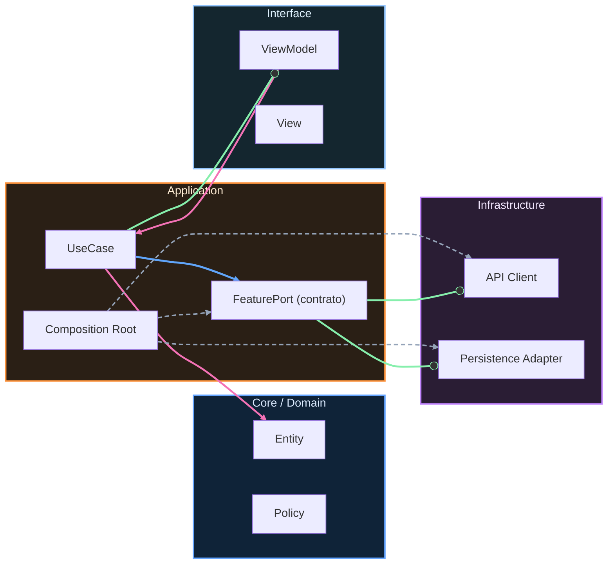

# Nivel Maestría · 15 · Mapa de carrera Android: de junior a senior con criterio

Cuando alguien empieza en Android suele pensar que crecer profesionalmente significa aprender más librerías o dominar más APIs. Con el tiempo descubres que eso ayuda, pero no es lo que realmente te hace avanzar de nivel. Lo que te hace avanzar es cómo decides, cómo colaboras y cómo respondes cuando el sistema se vuelve incierto.

Esta lección existe para cerrar el curso con una brújula de carrera realista. No para que te compares con nadie, sino para que tengas claridad sobre qué señales indican que estás evolucionando bien.

En una etapa inicial, el foco principal está en ejecutar tareas con calidad y pedir contexto cuando algo no encaja. Aquí se construyen hábitos muy importantes: escribir código legible, testear lo esencial, no esconder errores y entender impacto de los cambios antes de abrir un PR. Puede parecer básico, pero es justo lo que sostiene todo lo demás.

Cuando pasas a una etapa intermedia, el salto no es solo técnico, es sistémico. Empiezas a pensar en dependencias entre piezas, en contratos entre features y en cómo evitar que una decisión local rompa el producto global. Este punto marca la diferencia entre “resuelvo tickets” y “construyo producto de forma sostenible”.

En etapa senior, la responsabilidad cambia otra vez. Ya no se trata solo de escribir buen código tú; se trata de crear condiciones para que el equipo completo entregue bien bajo presión. Eso incluye gobernanza de calidad, manejo de incidentes, decisiones de release y priorización entre roadmap y fiabilidad sin caer en extremos.

```kotlin
package com.stackmyarchitecture.career

data class CareerSignal(
    val technicalDepth: Int,
    val systemThinking: Int,
    val deliveryReliability: Int,
    val mentoringImpact: Int
)

class CareerProgressEvaluator {
    fun summarize(signal: CareerSignal): String {
        val global = (signal.technicalDepth + signal.systemThinking + signal.deliveryReliability + signal.mentoringImpact) / 4
        return "Progreso global estimado: $global/10"
    }
}
```

Este ejemplo no pretende etiquetarte con un número. Sirve para recordar que la carrera técnica no es un eje único. Puedes tener mucha profundidad técnica y aún necesitar crecer en comunicación o en impacto de equipo. Mirar la evolución con varias dimensiones te evita caer en diagnósticos simplistas.

También es importante cuidar algo que casi nadie te dice al principio: tu reputación técnica se construye en los momentos incómodos. Cuando hay un bug difícil, cuando hay desacuerdo de arquitectura, cuando hay presión de release. En esos escenarios, la gente observa no solo si aciertas, sino cómo piensas y cómo colaboras.

Si mantienes una práctica constante de decisiones explícitas, aprendizaje observable y comunicación clara, el crecimiento se vuelve acumulativo. No depende de “tener suerte” con un proyecto brillante. Depende de mostrar criterio de forma sostenida.

Con esta lección cerramos de forma completa la ruta de Maestría. A partir de aquí, tu evolución profesional ya no necesita una guía lineal. Necesita práctica consciente, feedback honesto y decisiones cada vez más claras en sistemas reales.

<!-- auto-gapfix:layered-mermaid -->
## Diagrama de arquitectura por capas



La lectura del diagrama sigue esta semantica:
1. `-->` dependencia directa en runtime.
2. `-.->` wiring o configuracion.
3. `==>` contrato o abstraccion.
4. `--o` salida o propagacion de resultado.
