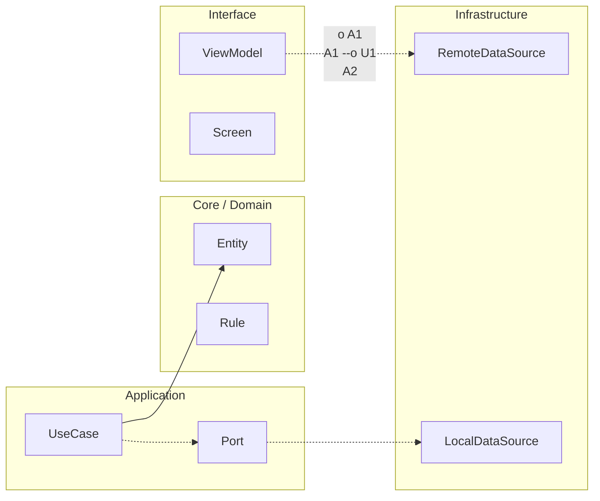

# Nivel Maestría · 16 · Cierre definitivo del recorrido Android

En algún momento hay que cerrar, no porque ya no haya más que aprender, sino porque ya tienes una base suficientemente sólida para aprender de forma autónoma en escenarios reales. Este módulo marca ese punto. No como ceremonia simbólica, sino como transición consciente entre formación guiada y práctica profesional sostenida.

Si miras todo el trayecto, el cambio más importante no es que ahora conozcas más APIs de Android. El cambio importante es que puedes pensar en capas, en riesgos, en operación y en evolución al mismo tiempo, sin perder claridad. Antes la pregunta era “cómo implemento esto”. Ahora la pregunta es “qué decisión conviene para este contexto y qué coste arrastra en el futuro”.

Esa diferencia parece pequeña cuando se escribe, pero en un equipo real cambia por completo tu impacto. Cuando sabes leer el sistema completo, tus PRs no solo resuelven tareas; también reducen incertidumbre para el resto del equipo. Esa capacidad es la que convierte a un desarrollador en una pieza de confianza.

También llegas a este cierre con una ventaja que no siempre se ve al principio: aprendiste a conectar técnica con producto. Cuando hablas de arquitectura, no la presentas como ideología. La explicas como una herramienta para proteger experiencia de usuario, velocidad de entrega y estabilidad operativa. Esa forma de argumentar es la que más valor tiene cuando hay presión de negocio.

```kotlin
package com.stackmyarchitecture.closure

data class ProfessionalReadiness(
    val architectureClarity: Int,
    val testingDiscipline: Int,
    val operationalThinking: Int,
    val communicationQuality: Int
)

class ReadinessNarrative {
    fun build(readiness: ProfessionalReadiness): String {
        val score = (readiness.architectureClarity + readiness.testingDiscipline + readiness.operationalThinking + readiness.communicationQuality) / 4
        return "Preparación profesional estimada: $score/10, con foco en evolución sostenible del producto."
    }
}
```

Este código no busca calificarte como si esto fuera un examen. Lo que propone es una mirada equilibrada de crecimiento. Si solo mides habilidad de implementación y olvidas operación o comunicación, te faltará una parte clave del trabajo real. Cuando integras esas dimensiones, tu progreso se vuelve más estable y más transferible entre proyectos.

A partir de aquí, la práctica diaria será tu mejor mentor. Cada bug que investigues, cada refactor que no rompa nada, cada decisión que puedas defender con datos y cada trade-off que expliques con honestidad va a consolidar lo que construiste en este curso.

Con este cierre, el recorrido queda completo. Lo siguiente no es “otro módulo”, lo siguiente es tu etapa de aplicación real en producto, donde ya tienes criterio para decidir mejor y crear software Android que siga siendo mantenible cuando el contexto cambie.

<!-- auto-gapfix:layered-mermaid -->
## Diagrama de arquitectura por capas



La lectura del diagrama sigue esta semantica:
1. `-->` dependencia directa en runtime.
2. `-.->` contrato o abstraccion.
3. `-.o` wiring o composicion.
4. `--o` salida o propagacion de resultado.
