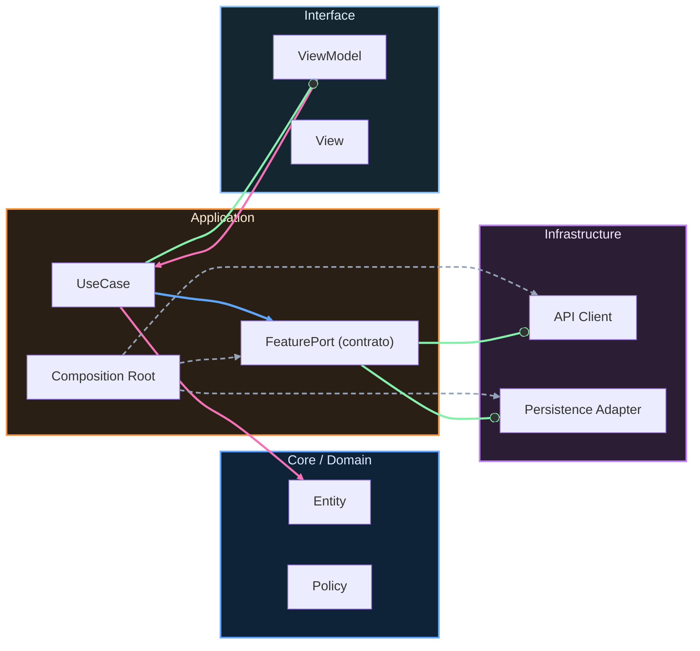

# Nivel Maestría · 16 · Cierre definitivo del recorrido Android

En algún momento hay que cerrar, no porque ya no haya más que aprender, sino porque ya tienes una base suficientemente sólida para aprender de forma autónoma en escenarios reales. Este módulo marca ese punto. No como ceremonia simbólica, sino como transición consciente entre formación guiada y práctica profesional sostenida.

Si miras todo el trayecto, el cambio más importante no es que ahora conozcas más APIs de Android. El cambio importante es que puedes pensar en capas, en riesgos, en operación y en evolución al mismo tiempo, sin perder claridad. Antes la pregunta era “cómo implemento esto”. Ahora la pregunta es “qué decisión conviene para este contexto y qué coste arrastra en el futuro”.

Esa diferencia parece pequeña cuando se escribe, pero en un equipo real cambia por completo tu impacto. Cuando sabes leer el sistema completo, tus PRs no solo resuelven tareas; también reducen incertidumbre para el resto del equipo. Esa capacidad es la que convierte a un desarrollador en una pieza de confianza.

También llegas a este cierre con una ventaja que no siempre se ve al principio: aprendiste a conectar técnica con producto. Cuando hablas de arquitectura, no la presentas como ideología. La explicas como una herramienta para proteger experiencia de usuario, velocidad de entrega y estabilidad operativa. Esa forma de argumentar es la que más valor tiene cuando hay presión de negocio.

```kotlin
package com.stackmyarchitecture.closure

data class ProfessionalReadiness(
    val architectureClarity: Int,
    val testingDiscipline: Int,
    val operationalThinking: Int,
    val communicationQuality: Int
)

class ReadinessNarrative {
    fun build(readiness: ProfessionalReadiness): String {
        val score = (readiness.architectureClarity + readiness.testingDiscipline + readiness.operationalThinking + readiness.communicationQuality) / 4
        return "Preparación profesional estimada: $score/10, con foco en evolución sostenible del producto."
    }
}
```

Este código no busca calificarte como si esto fuera un examen. Lo que propone es una mirada equilibrada de crecimiento. Si solo mides habilidad de implementación y olvidas operación o comunicación, te faltará una parte clave del trabajo real. Cuando integras esas dimensiones, tu progreso se vuelve más estable y más transferible entre proyectos.

A partir de aquí, la práctica diaria será tu mejor mentor. Cada bug que investigues, cada refactor que no rompa nada, cada decisión que puedas defender con datos y cada trade-off que expliques con honestidad va a consolidar lo que construiste en este curso.

Con este cierre, el recorrido queda completo. Lo siguiente no es “otro módulo”, lo siguiente es tu etapa de aplicación real en producto, donde ya tienes criterio para decidir mejor y crear software Android que siga siendo mantenible cuando el contexto cambie.

<!-- auto-gapfix:layered-mermaid -->
## Diagrama de arquitectura por capas


```mermaid
flowchart LR
  subgraph CORE["Core / Domain"]
    direction TB
    ENT[Entity]
    POL[Policy]
  end

  subgraph APP["Application"]
    direction TB
    BOOT[Composition Root]
    UC[UseCase]
    PORT["FeaturePort (contrato)"]
  end

  subgraph UI["Interface"]
    direction TB
    VM[ViewModel]
    VIEW[View]
  end

  subgraph INFRA["Infrastructure"]
    direction TB
    API[API Client]
    STORE[Persistence Adapter]
  end

  VM --> UC
  UC --> ENT
  UC ==> PORT
  BOOT -.-> PORT
  BOOT -.-> API
  BOOT -.-> STORE
  PORT --o API
  PORT --o STORE
  UC --o VM

  style CORE fill:#0f2338,stroke:#63a4ff,color:#dbeafe,stroke-width:2px
  style APP fill:#2a1f15,stroke:#fb923c,color:#ffedd5,stroke-width:2px
  style UI fill:#14262f,stroke:#93c5fd,color:#e0f2fe,stroke-width:2px
  style INFRA fill:#2a1d34,stroke:#c084fc,color:#f3e8ff,stroke-width:2px

  linkStyle 0 stroke:#f472b6,stroke-width:2.6px
  linkStyle 1 stroke:#f472b6,stroke-width:2.6px
  linkStyle 2 stroke:#60a5fa,stroke-width:2.8px
  linkStyle 3 stroke:#94a3b8,stroke-width:2px,stroke-dasharray:6 4
  linkStyle 4 stroke:#94a3b8,stroke-width:2px,stroke-dasharray:6 4
  linkStyle 5 stroke:#94a3b8,stroke-width:2px,stroke-dasharray:6 4
  linkStyle 6 stroke:#86efac,stroke-width:2.6px
  linkStyle 7 stroke:#86efac,stroke-width:2.6px
  linkStyle 8 stroke:#86efac,stroke-width:2.6px
```

---

## Ejercicio guiado

**Objetivo**: Escribir una carta de cierre al "yo del primer día": qué le dirías y qué aprendiste en el recorrido.

**Pasos**:
1. Recuerda cómo llegaste al inicio de este curso: qué sabías, qué no sabías, qué miedos o dudas tenías sobre Android o sobre tu nivel técnico.
2. Escribe la carta en primera persona, dirigida a ese "tú del primer día". Mínimo 3 párrafos.
3. En el primer párrafo: dile qué es lo más importante que vas a aprender (sin spoilers técnicos, solo la actitud o el cambio de mentalidad).
4. En el segundo párrafo: nombra el momento más difícil del recorrido y qué aprendiste de él.
5. En el tercer párrafo: dile en qué punto estás ahora y qué sigue después de cerrar el curso.
6. Condición de éxito: la carta tiene al menos 3 párrafos completos, es honesta (no solo positiva), y podrías leerla en voz alta sin sentir que estás mintiendo.

<details>
<summary>Solución de referencia</summary>

**Ejemplo de carta**:

"Hola. Sé que ahora mismo estás mirando la estructura del proyecto y pensando que nunca vas a entender para qué sirven todas esas capas. No te preocupes: tampoco las entenderás al principio. Lo que vas a aprender no es a memorizar patrones. Es a hacerte la pregunta correcta antes de tocar código: ¿qué problema estoy resolviendo y qué coste arrastra esta decisión en el futuro?

Lo más difícil del recorrido fue aceptar que a veces la solución correcta es la más simple, no la más elegante. Hubo un momento en que añadí una capa de abstracción que nadie pedía y que ralentizó tres sprints. Fue incómodo reconocerlo. Pero esa incomodidad me enseñó algo que no olvidaré: el código que diseñas para el ego técnico suele ser el código que el equipo odia mantener.

Ahora sé pensar en capas, en riesgos y en evolución al mismo tiempo. No soy el mejor, pero soy alguien en quien un equipo puede confiar para tomar una decisión difícil con datos y defenderla con calma. Eso es lo que sigue: aplicar esto en un proyecto real, con presión real, y seguir aprendiendo de los errores que todavía no sé que voy a cometer."

**Resultado esperado**: El alumno cierra el curso con una pieza escrita que refleja crecimiento real, no solo conocimiento acumulado. La carta puede convertirse en el primer párrafo de un perfil profesional o de una charla técnica futura.

</details>

La lectura del diagrama sigue esta semántica:
1. `-->` dependencia directa en runtime.
2. `-.->` wiring o configuración.
3. `==>` contrato o abstracción.
4. `--o` salida o propagación de resultado.
