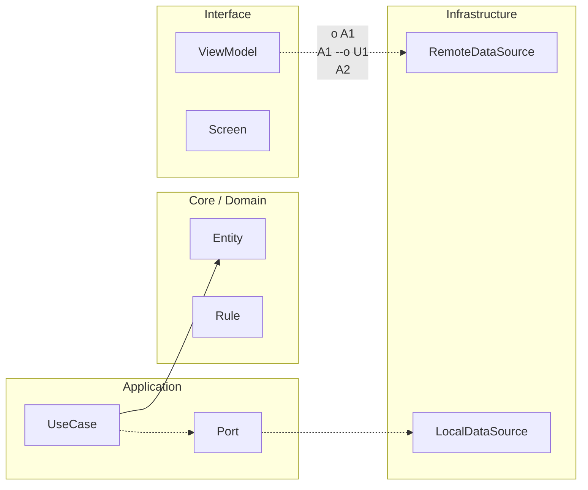

# Proyecto final integrador · RuralGO FieldOps

Este proyecto final no es un ejercicio suelto al final del curso. Es la prueba de que puedes diseñar, construir, validar, publicar y mantener una app Android real con criterio técnico. La meta no es “terminar pantallas”; la meta es demostrar que entiendes cómo sostener producto en condiciones reales.

RuralGO FieldOps simula una app de operación de campo. El usuario necesita gestionar tareas, registrar incidencias, trabajar sin conexión y sincronizar cambios cuando vuelve la red. Ese tipo de contexto obliga a aplicar casi todo lo aprendido: arquitectura, estado, persistencia, concurrencia, pruebas, observabilidad, rendimiento, release y mantenimiento.

El proyecto se construye por versiones. En Junior nace la versión funcional inicial. En Midlevel se vuelve robusto con sincronización y calidad técnica más fuerte. En Senior incorpora operación real, resiliencia y estrategia de release. En Maestría se evalúa su gobernanza a escala, su mantenibilidad y la defensa de decisiones técnicas.

## Problema de negocio

Un equipo territorial necesita ejecutar tareas diarias en campo con conectividad inestable. Si la app depende siempre de internet, se rompe la operación. Si no hay trazabilidad, no se puede auditar ni mejorar. Si no hay release seguro, cada despliegue se convierte en riesgo operativo.

## Alcance funcional obligatorio

La app debe incluir login, listado y detalle de tareas, creación/edición de incidencias, filtros, estado de sincronización y preferencias del usuario. Debe soportar trabajo offline con continuidad de flujo y sincronización diferida cuando haya red.

## Alcance técnico obligatorio

La app debe usar Kotlin moderno, Compose, Navigation Compose, UDF con ViewModel por pantalla, repositorios, Room, DataStore, WorkManager, Coroutines/Flow lifecycle-aware, Hilt, tests unitarios/instrumentados/UI, macrobenchmark y baseline profiles.

## Restricciones de implementación

No se aprueba una solución que funcione solo “en demo feliz”. Debe soportar errores de red, reintentos razonables, estados de carga claros, feedback de fallo útil y criterios de rollback/release documentados.

## Entregable final esperado

```kotlin
package com.stackmyarchitecture.finalproject

data class FinalSubmission(
    val repositoryUrl: String,
    val ciPipelineUrl: String,
    val testReportUrl: String,
    val benchmarkReportUrl: String,
    val releaseNotesUrl: String,
    val technicalDefenseUrl: String
)

class SubmissionValidator {
    fun isComplete(submission: FinalSubmission): Boolean {
        return submission.repositoryUrl.isNotBlank() &&
            submission.ciPipelineUrl.isNotBlank() &&
            submission.testReportUrl.isNotBlank() &&
            submission.benchmarkReportUrl.isNotBlank() &&
            submission.releaseNotesUrl.isNotBlank() &&
            submission.technicalDefenseUrl.isNotBlank()
    }
}
```

Este bloque de código representa una idea simple pero decisiva: un proyecto profesional no se valida por intuición. Se valida por evidencias concretas de ejecución, calidad, rendimiento y capacidad de defender decisiones.


<!-- auto-gapfix:layered-mermaid -->
## Diagrama de arquitectura por capas



La lectura del diagrama sigue esta semantica:
1. `-->` dependencia directa en runtime.
2. `-.->` contrato o abstraccion.
3. `-.o` wiring o composicion.
4. `--o` salida o propagacion de resultado.
