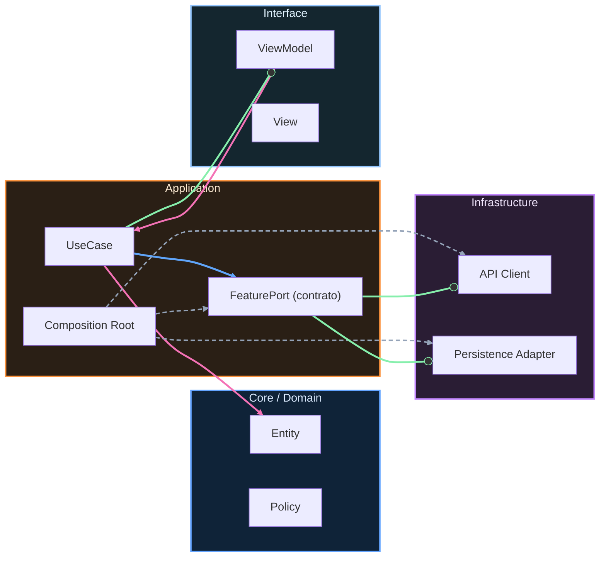

# Brief del proyecto final

Este archivo existe para mantener compatibilidad con el plan de implementación y con las referencias pedagógicas que usan el nombre `00-brief.md`.

El contenido oficial del proyecto final está en [`00-brief-ruralgo-fieldops.md`](00-brief-ruralgo-fieldops.md). Ese documento define el alcance funcional, técnico y operativo de RuralGO FieldOps como producto vivo transversal del curso.

<!-- auto-gapfix:layered-mermaid -->
## Diagrama de arquitectura por capas

La lectura del diagrama sigue esta semantica:
1. `-->` dependencia directa en runtime.
2. `-.->` wiring o configuracion.
3. `==>` contrato o abstraccion.
4. `--o` salida o propagacion de resultado.
