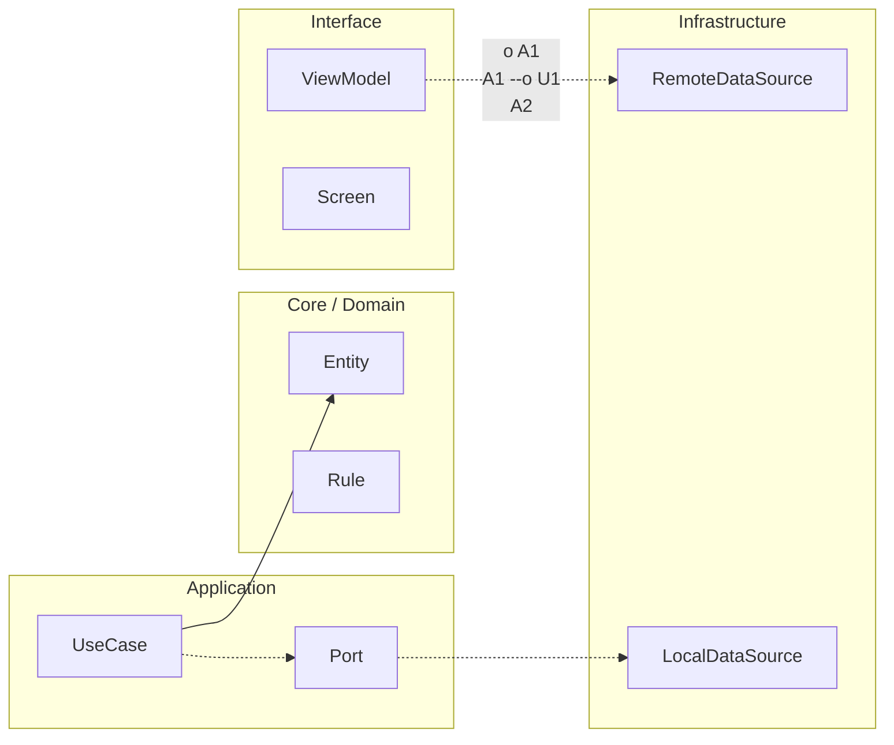

# Rúbrica de empleabilidad técnica · Proyecto final

Esta rúbrica convierte el cierre del curso en una evaluación profesional real. No está pensada para castigar, sino para evitar autoengaños. Si una app se ve bien pero no resiste un incidente, no está lista. Si una app tiene tests pero no protege flujos críticos, tampoco está lista. Si una app funciona en local pero no tiene estrategia de release, sigue incompleta.

La puntuación total es de 100 puntos y hay una regla de corte: no se aprueba con menos de 70 puntos, y además no se aprueba si alguna dimensión crítica queda en cero.

## Dimensiones evaluadas

La primera dimensión es fundamentos de implementación y claridad técnica. Aquí se evalúa si el código es entendible, si los nombres son expresivos, si el flujo principal se puede seguir sin adivinar intención y si las decisiones de estructura tienen sentido para el problema que se está resolviendo.

La segunda dimensión es arquitectura y mantenibilidad. Aquí importa que la separación de responsabilidades exista de verdad y no solo en el discurso. Se busca que UI, estado, casos de uso y datos no estén mezclados de forma caótica, y que el sistema se pueda cambiar sin romper módulos ajenos.

La tercera dimensión es testing y confiabilidad. Se espera cobertura razonable de flujos críticos, pruebas que realmente fallen cuando hay regresión, y un nivel de confianza suficiente para hacer cambios sin miedo constante.

La cuarta dimensión es operación y release. Se mide si el equipo sabe lanzar con control, observar salud, reaccionar ante errores y sostener la app cuando aparece fricción en producción.

La quinta dimensión es rendimiento móvil. Aquí no se pide perfección extrema, pero sí decisiones basadas en medición mínima reproducible y no en intuición.

La sexta dimensión es trabajo profesional. Se evalúa cómo se documentan decisiones, cómo se comunican trade-offs y cómo se defiende técnicamente lo construido.

La séptima dimensión es publicación y cierre de producto. Se verifica que el producto no quede en modo “demo eterna” y que exista un cierre real de release.

```kotlin
package com.stackmyarchitecture.finalproject.evaluation

data class EmployabilityRubric(
    val implementationClarity: Int,
    val architectureMaintainability: Int,
    val testingReliability: Int,
    val operationsRelease: Int,
    val performanceEvidence: Int,
    val professionalCommunication: Int,
    val publicationClosure: Int
)

class EmployabilityResultCalculator {
    fun total(rubric: EmployabilityRubric): Int {
        return rubric.implementationClarity +
            rubric.architectureMaintainability +
            rubric.testingReliability +
            rubric.operationsRelease +
            rubric.performanceEvidence +
            rubric.professionalCommunication +
            rubric.publicationClosure
    }

    fun isApproved(rubric: EmployabilityRubric): Boolean {
        val totalScore = total(rubric)
        val hasCriticalZero = rubric.architectureMaintainability == 0 ||
            rubric.testingReliability == 0 ||
            rubric.operationsRelease == 0

        return totalScore >= 70 && !hasCriticalZero
    }
}
```

Ese código resume la intención pedagógica de este cierre. No basta con sumar puntos por piezas sueltas. Hay dimensiones que sostienen todo el sistema y, si faltan, no existe readiness profesional real.


<!-- auto-gapfix:layered-mermaid -->
## Diagrama de arquitectura por capas



La lectura del diagrama sigue esta semantica:
1. `-->` dependencia directa en runtime.
2. `-.->` contrato o abstraccion.
3. `-.o` wiring o composicion.
4. `--o` salida o propagacion de resultado.
