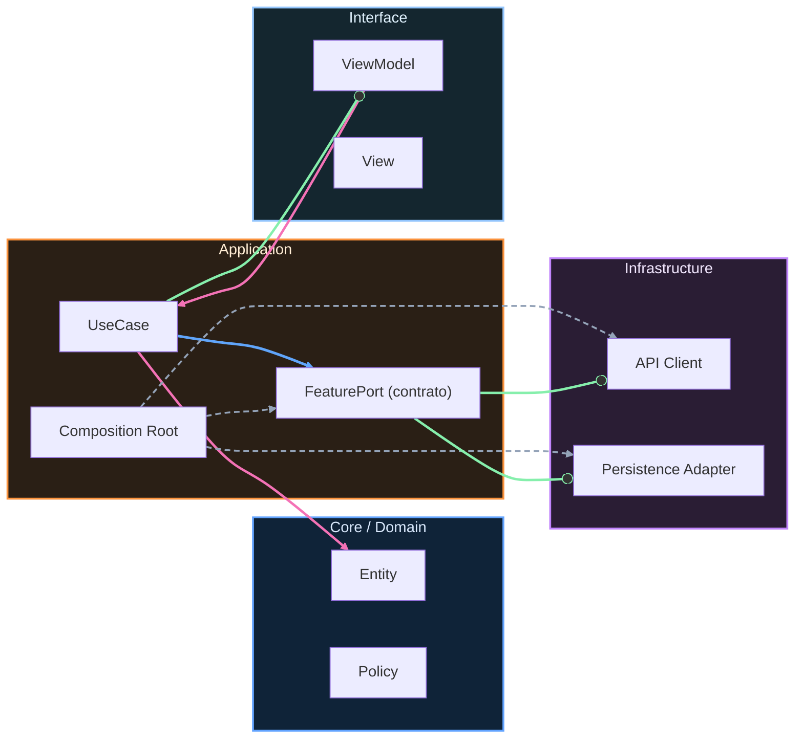

# Evidencias obligatorias de aprendizaje y calidad

Este documento define qué se considera evidencia válida de aprendizaje en el proyecto final. No es burocracia. Es una protección contra el autoengaño técnico. Si una capacidad no se puede demostrar, todavía no está consolidada.

La evidencia mínima obligatoria se organiza por familias para que el alumno pueda validar su progreso sin ambigüedad.

La primera familia es evidencia de implementación. Aquí se espera repositorio funcional, estructura de proyecto coherente y una app instalable que recorra los casos principales sin depender de estados artificiales.

La segunda familia es evidencia de testing. Debe existir ejecución real de pruebas unitarias, instrumentadas y UI sobre flujos críticos. La evidencia no es “tengo tests escritos”; la evidencia es “los tests pasan y detectan regresión cuando corresponde”.

La tercera familia es evidencia de rendimiento. Debe incluir al menos una medición de referencia de macrobenchmark y un baseline profile aplicado para justificar decisiones de performance con señales concretas.

La cuarta familia es evidencia operativa. Debe quedar trazabilidad de errores y eventos relevantes, una estrategia de release y rollback, y una mínima práctica de incident response con runbook operativo.

La quinta familia es evidencia de producto y publicación. Debe existir una versión candidata para distribución controlada, notas de release comprensibles y una justificación clara del estado de salida.

```kotlin
package com.stackmyarchitecture.finalproject.evidence

data class EvidencePack(
    val implementationProof: Boolean,
    val testingProof: Boolean,
    val performanceProof: Boolean,
    val operationsProof: Boolean,
    val releaseProof: Boolean
)

class EvidenceGate {
    fun isReadyForFinalDefense(pack: EvidencePack): Boolean {
        return pack.implementationProof &&
            pack.testingProof &&
            pack.performanceProof &&
            pack.operationsProof &&
            pack.releaseProof
    }
}
```

Este validador expresa el criterio de fondo: la preparación profesional no se aprueba por una buena demo aislada. Se aprueba cuando implementación, calidad, rendimiento, operación y release conviven en el mismo sistema y con evidencia verificable.


<!-- auto-gapfix:layered-mermaid -->
## Diagrama de arquitectura por capas



La lectura del diagrama sigue esta semantica:
1. `-->` dependencia directa en runtime.
2. `-.->` wiring o configuracion.
3. `==>` contrato o abstraccion.
4. `--o` salida o propagacion de resultado.
