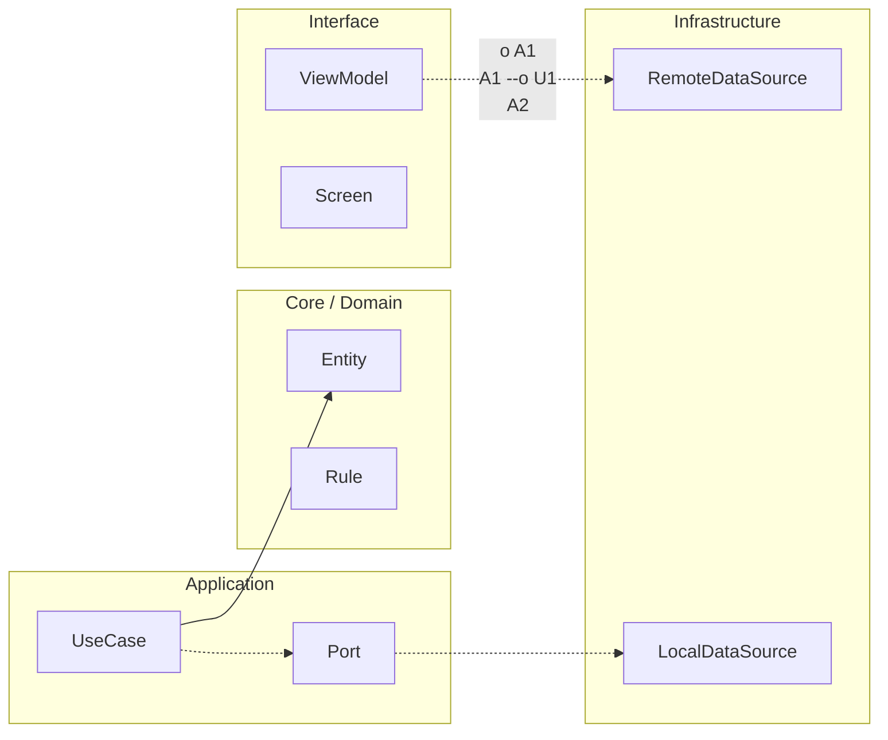

# Operación Senior del proyecto final

Este documento aterriza la fase Senior sobre RuralGO FieldOps en una práctica medible. La intención no es que el alumno memorice términos de operación, sino que aprenda a sostener una app cuando deja de estar en entorno cómodo.

En esta fase la versión objetivo es v3.0. Eso implica que el sistema ya no se evalúa solo por funcionalidad, sino por su comportamiento durante release, degradación y recuperación. Aquí aparecen tres artefactos obligatorios: estrategia de despliegue controlado, runbook de incidente y objetivo de fiabilidad mínimo con presupuesto de error.

El runbook no debe ser un texto genérico. Debe describir señales de alerta, hipótesis iniciales, mitigaciones posibles, criterio de rollback y validación posterior. Si una incidencia ocurre y nadie puede ejecutar ese runbook, el artefacto no cumple su función.

El SLO mínimo esperado en esta fase es práctico, no académico. Por ejemplo, éxito de sincronización de tareas e incidencias por encima de un umbral acordado durante una ventana temporal concreta. Ese objetivo se acompaña de un error budget, porque la fiabilidad no se gobierna con promesas, se gobierna con límites explícitos.

```kotlin
package com.stackmyarchitecture.finalproject.senior

data class ReliabilityObjective(
    val metricName: String,
    val target: Double,
    val windowDays: Int,
    val errorBudget: Double
)

data class IncidentRunbook(
    val incidentType: String,
    val detectionSignal: String,
    val firstMitigation: String,
    val rollbackCondition: String,
    val recoveryValidation: String
)

class SeniorOperationGate {
    fun isReadyForSenior(
        objective: ReliabilityObjective,
        runbook: IncidentRunbook,
        hasReleaseStrategy: Boolean
    ): Boolean {
        return objective.target > 0.0 &&
            objective.errorBudget >= 0.0 &&
            runbook.incidentType.isNotBlank() &&
            runbook.rollbackCondition.isNotBlank() &&
            hasReleaseStrategy
    }
}
```

Este validador expresa la idea central del bloque Senior: no hay cierre real si la app no tiene una forma explícita de prevenir, detectar y recuperar bajo presión.


<!-- auto-gapfix:layered-mermaid -->
## Diagrama de arquitectura por capas



La lectura del diagrama sigue esta semantica:
1. `-->` dependencia directa en runtime.
2. `-.->` contrato o abstraccion.
3. `-.o` wiring o composicion.
4. `--o` salida o propagacion de resultado.
