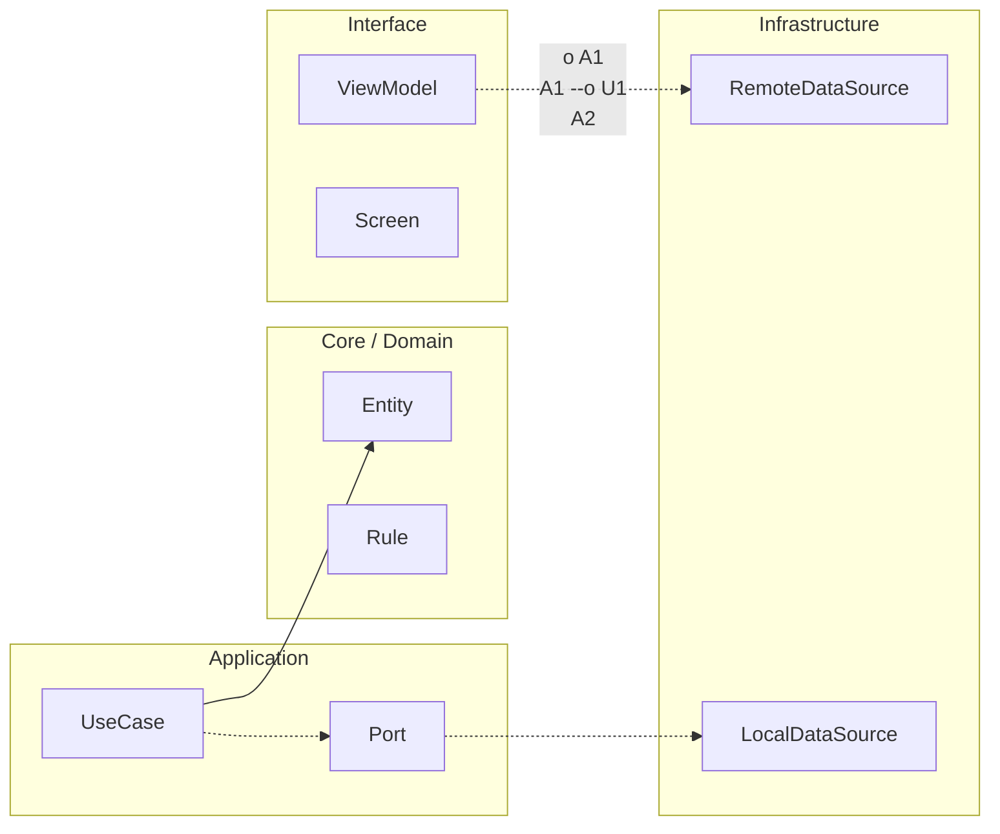

# Gobernanza Maestría del proyecto final

En Maestría, RuralGO FieldOps entra en versión v4.0. La diferencia respecto a Senior es que ahora no solo se sostiene operación; se sostiene evolución entre decisiones, equipos y tiempo.

El foco de este bloque es transformar arquitectura en gobernanza ejecutable. Eso significa contratos internos versionados, reglas de dependencia vivas y decisiones técnicas trazables que puedan auditarse sin depender de conversaciones informales.

La defensa técnica de v4.0 debe responder tres preguntas con evidencia. Qué decisión se tomó, por qué era la mejor en ese contexto y qué señal confirmó o contradijo su impacto. Si una de esas tres piezas falta, no hay aprendizaje de maestría, solo opinión técnica.

```kotlin
package com.stackmyarchitecture.finalproject.mastery

data class ArchitectureDecisionRecord(
    val id: String,
    val context: String,
    val decision: String,
    val consequence: String,
    val validationSignal: String
)

data class GovernanceState(
    val contractVersioningEnabled: Boolean,
    val dependencyRulesEnabled: Boolean,
    val adrsLinkedToFeatures: Boolean
)

class MasteryGovernanceGate {
    fun isReadyForMastery(
        state: GovernanceState,
        decisions: List<ArchitectureDecisionRecord>
    ): Boolean {
        val hasTraceableDecisions = decisions.all {
            it.id.isNotBlank() &&
                it.context.isNotBlank() &&
                it.decision.isNotBlank() &&
                it.validationSignal.isNotBlank()
        }

        return state.contractVersioningEnabled &&
            state.dependencyRulesEnabled &&
            state.adrsLinkedToFeatures &&
            hasTraceableDecisions
    }
}
```

Este criterio evita una maestría superficial. La app puede estar estable, pero si no puede evolucionar con gobernanza clara, el costo futuro termina rompiendo la velocidad del equipo.


<!-- auto-gapfix:layered-mermaid -->
## Diagrama de arquitectura por capas



La lectura del diagrama sigue esta semantica:
1. `-->` dependencia directa en runtime.
2. `-.->` contrato o abstraccion.
3. `-.o` wiring o composicion.
4. `--o` salida o propagacion de resultado.
